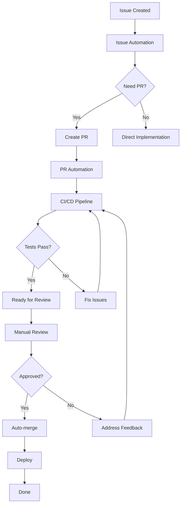

# Portfolio OS Documentation - Improvement Plan
## Actionable Roadmap for Automation Documentation Excellence

**Plan Created:** November 14, 2025  
**Priority Framework:** Impact × Urgency × Effort  
**Success Metrics:** Accuracy, Completeness, Usability, Maintainability  

---

## Plan Overview

This improvement plan transforms Portfolio OS documentation from aspirational marketing content to accurate, actionable technical reference material. The plan is structured in three phases with specific deliverables, timelines, and success criteria.

### Key Principles

1. **Accuracy First** - Documentation must match reality
2. **Actionable Over Aspirational** - Practical > Philosophical
3. **Reference Over Essay** - Quick answers > Long explanations
4. **Evidence-Based** - Claims require proof
5. **User-Focused** - Written for engineers who need to use the system

---

## Phase 1: Short Term (1-3 Days)
### Critical Fixes - Stop the Bleeding

**Goal:** Remove credibility issues and add missing critical content

**Total Effort:** ~16-20 hours  
**Priority:** 🔥 CRITICAL  
**Impact:** Immediate credibility improvement  

---

### ST-1: Remove Unsubstantiated Performance Claims

**Priority:** P0 - Critical  
**Effort:** 2 hours  
**Impact:** High - Prevents credibility damage  

**Problem:**
Multiple pages contain specific performance metrics without any supporting evidence:
- "3-5x improvement in development velocity"
- "50% reduction in time-to-merge"
- "40% improvement in code quality metrics"
- "90% conflict prevention rate"
- "60-80% reduction in development cycle time"
- "70% reduction in maintenance overhead"

**Changes Required:**

**Files to Edit:**
1. `apps/docs/contents/docs/scripts-reference/automation/quick-start-guide/index.mdx`
2. `apps/docs/contents/docs/scripts-reference/automation/pr-management/index.mdx`
3. `apps/docs/contents/docs/scripts-reference/automation/issue-management/index.mdx`
4. `apps/docs/contents/docs/scripts-reference/automation/agent-management/index.mdx`
5. `apps/docs/contents/docs/scripts-reference/automation/core-utilities/index.mdx`

**Action:**
```diff
- Organizations adopting multi-agent automation systems report 3-5x 
- improvement in development velocity, 60% reduction in administrative 
- overhead, and significant improvements in code quality metrics.
+ The multi-agent automation system enables parallel development workflows,
+ reducing bottlenecks and improving overall development throughput.
```

```diff
- Teams using automated PR management report 50% reduction in time-to-merge 
- while improving code quality metrics by 40%
+ Automated PR management reduces manual overhead and ensures consistent
+ quality checks across all pull requests.
```

**Rationale:**
- Unverified claims damage credibility immediately
- Hiring managers flag this as overselling
- Easy to fix, high impact

**Success Criteria:**
- ✅ Zero quantified performance claims without data
- ✅ All benefits described qualitatively
- ✅ "Report shows" or similar weasel words removed

---

### ST-2: Fix "AI-Powered" Terminology

**Priority:** P0 - Critical  
**Effort:** 2 hours  
**Impact:** High - Technical accuracy  

**Problem:**
System uses "AI-powered" and "machine learning" to describe keyword matching and rule-based systems.

**Changes Required:**

Replace "AI-powered" with accurate descriptions:

```diff
- AI-powered PR analysis and categorization
+ Automated PR analysis and categorization based on content patterns

- Intelligent classification with machine learning
+ Automated classification using configurable rules and keyword matching

- Learning system that improves over time through machine learning
+ Rule-based system with configurable classification patterns

- AI-powered complexity analysis
+ Automated complexity assessment based on file changes and scope
```

**Keep "AI" Only When:**
- Actually using OpenAI API for text generation (manage-ai-services.ps1)
- Using CR-GPT (external AI tool)

**Label Clearly:**
- "OpenAI-powered text generation for..."
- "Integrates with CR-GPT for code review assistance"

**Rationale:**
- Technical accuracy is non-negotiable
- "AI" without ML is misleading
- Keyword matching is valuable without false claims

**Success Criteria:**
- ✅ No "AI-powered" for rule-based systems
- ✅ Clear distinction between automation and AI
- ✅ OpenAI API usage clearly labeled when present

---

### ST-3: Add CI/CD Workflow Documentation

**Priority:** P0 - Critical  
**Effort:** 6 hours  
**Impact:** Very High - Major documentation gap  

**Problem:**
16 GitHub Actions workflows are completely undocumented. This is critical infrastructure.

**Create New Page:** `apps/docs/contents/docs/scripts-reference/ci-cd/index.mdx`

**Structure:**
```markdown
# CI/CD Workflows

## Overview
Portfolio OS uses GitHub Actions for continuous integration and deployment.

## Workflow Catalog

### Build & Test Workflows
#### ci-optimized.yml
- **Trigger:** PR opened/updated, push to develop
- **Path Filter:** apps/**, packages/**
- **Actions:** Lint, Typecheck, Unit Tests, Build
- **Matrix:** site, dashboard
- **Cache:** Turbo cache for performance

[Include similar sections for all 16 workflows]

### Integration Workflows
#### orchestrate-issues-prs.yml
[Details...]

### Quality Gates
#### pr-base-guard.yml
[Details...]

## Environment Variables
[Document all required env vars]

## Secrets Configuration
[Document required secrets]

## Common Issues
[Troubleshooting section]
```

**Content Requirements:**
- Purpose of each workflow
- Trigger conditions
- Required secrets
- Path filters
- Expected outputs
- When to use each
- How they interact

**Rationale:**
- CI/CD is core infrastructure
- Complete omission is glaring gap
- New engineers need this immediately
- Shows technical depth

**Success Criteria:**
- ✅ All 16 workflows documented
- ✅ Trigger conditions clear
- ✅ Environment variables listed
- ✅ Integration points explained

---

### ST-4: Expand Skeleton Reference Pages

**Priority:** P0 - Critical  
**Effort:** 8 hours  
**Impact:** High - Makes documentation useful  

**Problem:**
Critical reference pages are only 15-17 lines when they should be 200-300 lines.

**Pages to Expand:**

#### 1. `/docs/scripts-reference/pr-management/index.mdx`
**Current:** 16 lines  
**Target:** 250+ lines  

**Required Content:**
```markdown
# PR Management Scripts

## Overview
[1-2 paragraph description]

## Scripts Reference

### automate-pr-unified.ps1
**Purpose:** Comprehensive PR automation with CR-GPT integration

**Usage:**
```powershell
.\automate-pr-unified.ps1 -PRNumber 123 -Action analyze
```

**Parameters:**
| Parameter | Type | Required | Description |
|-----------|------|----------|-------------|
| PRNumber | int | Yes | Pull request number |
| Action | string | Yes | analyze, respond, monitor, all |
| AutoFix | switch | No | Automatically fix issues |
| DryRun | switch | No | Preview without executing |

**Examples:**
[3-4 real examples]

**Exit Codes:**
- 0: Success
- 1: PR not found
- 2: Invalid action

**Common Issues:**
[Troubleshooting]

### configure-pr-auto.ps1
[Similar detail level]

### pr-analyzer.ps1
[Similar detail level]

### pr-monitor.ps1
[Similar detail level]

### pr-quality-checker.ps1
[Similar detail level]

[Continue for all 12 scripts]

## Workflows
[How scripts work together]

## Integration Points
[GitHub Actions, Project Boards, CR-GPT]

## Configuration
[Required setup]

## Troubleshooting
[Common problems and solutions]
```

#### 2. `/docs/scripts-reference/issue-management/index.mdx`
**Current:** 16 lines  
**Target:** 250+ lines  
**Follow same pattern**

#### 3. `/docs/scripts-reference/agent-management/index.mdx`
**Current:** 17 lines  
**Target:** 250+ lines  
**Follow same pattern**

#### 4. `/docs/scripts-reference/core-utilities/index.mdx`
**Current:** 15 lines  
**Target:** 200+ lines  
**Follow same pattern**

**Rationale:**
- Reference documentation must be comprehensive
- Engineers need quick answers
- Parameter reference is essential
- Examples make documentation actionable

**Success Criteria:**
- ✅ Every script documented
- ✅ All parameters defined
- ✅ Real usage examples provided
- ✅ Troubleshooting included
- ✅ Minimum 200 lines per page

---

### ST-5: Add Quick Start "Hello World" Guide

**Priority:** P1 - High  
**Effort:** 2 hours  
**Impact:** Medium-High - Onboarding  

**Problem:**
No clear entry point for new engineers. What's the first thing to run?

**Create:** `apps/docs/contents/docs/getting-started/automation-hello-world/index.mdx`

**Content:**
```markdown
# Automation Hello World

## Your First Automation Script

This guide walks you through running your first Portfolio OS automation script.

**Time Required:** 10 minutes  
**Prerequisites:** PowerShell 7+, GitHub CLI

## Step 1: Prerequisites Check

```powershell
# Verify PowerShell version (need 7+)
$PSVersionTable.PSVersion

# Verify GitHub CLI
gh --version

# Authenticate if needed
gh auth login
```

## Step 2: Navigate to Project

```powershell
cd path/to/portfolio-os
```

## Step 3: Run Your First Script

Let's check the status of open issues:

```powershell
.\scripts\issue-management\analysis\analyze-issues.ps1 -DryRun
```

**Expected Output:**
[Show actual output]

## Step 4: Understanding What Happened

[Explain what the script did]

## Step 5: Next Steps

Now that you've run your first script, here are recommended next steps:

1. **Explore More Scripts:** [Link to overview]
2. **Understand CI/CD:** [Link to CI/CD docs]
3. **Configure Your Environment:** [Link to configuration]

## Common Issues

### "PowerShell is not recognized"
[Solution]

### "gh: command not found"
[Solution]

### Authentication failures
[Solution]
```

**Rationale:**
- Every documentation system needs "Hello World"
- Reduces onboarding friction
- Builds confidence
- Quick win for new users

**Success Criteria:**
- ✅ Complete in <15 minutes
- ✅ No prior knowledge assumed
- ✅ Troubleshooting included
- ✅ Clear next steps

---

### ST-6: Fix Documentation Structure

**Priority:** P1 - High  
**Effort:** 2 hours  
**Impact:** Medium - Navigation clarity  

**Problem:**
Two competing page hierarchies with same names cause confusion:
- `/docs/scripts-reference/automation/pr-management/` (442 lines, conceptual)
- `/docs/scripts-reference/pr-management/` (16 lines, reference)

**Solution: Reorganize Clearly**

**New Structure:**
```
/docs/scripts-reference/
├── overview/                      [Keep - good]
├── quick-start/                   [NEW - replaces automation/quick-start-guide]
│   └── hello-world/              [NEW - from ST-5]
├── concepts/                      [NEW - move conceptual content here]
│   ├── automation-overview/      [Move from automation/index.mdx]
│   ├── multi-agent-system/       [Move from automation/agent-management/]
│   ├── pr-automation-concepts/   [Move from automation/pr-management/]
│   └── issue-lifecycle/          [Move from automation/issue-management/]
├── reference/                     [NEW - clear reference section]
│   ├── pr-management/            [Expand from current stub]
│   ├── issue-management/         [Expand from current stub]
│   ├── agent-management/         [Expand from current stub]
│   ├── core-utilities/           [Expand from current stub]
│   ├── monitoring/               [NEW]
│   ├── housekeeping/             [NEW]
│   └── ci-cd/                    [NEW - from ST-3]
└── workflows/                     [NEW - common workflows]
    ├── create-issue-to-pr/
    ├── pr-review-to-merge/
    └── multi-agent-development/
```

**Update Navigation:** `apps/docs/settings/navigation.ts`

**Rationale:**
- Clear separation: Concepts vs. Reference
- Reduces confusion
- Standard pattern (Kubernetes, Stripe use this)
- Easier to maintain

**Success Criteria:**
- ✅ No duplicate page names
- ✅ Clear navigation hierarchy
- ✅ "Concepts" and "Reference" clearly labeled
- ✅ All links updated

---

## Phase 1 Summary

**Total Effort:** ~22 hours (3 days)  
**Files Created:** 3-4 new pages  
**Files Modified:** ~10 pages  
**Lines Added:** ~1,500 lines  

**Before/After:**
- ❌ Unsubstantiated claims → ✅ Accurate descriptions
- ❌ Misleading "AI" labels → ✅ Clear terminology
- ❌ Zero CI/CD docs → ✅ Complete workflow documentation
- ❌ 16-line reference pages → ✅ 200+ line comprehensive reference
- ❌ No onboarding → ✅ Hello World guide
- ❌ Confusing structure → ✅ Clear concepts/reference split

**Impact:**
- Immediate credibility improvement
- Documentation becomes usable
- Critical gaps filled
- Foundation for further improvements

---

## Phase 2: Medium Term (1-2 Weeks)
### Add Depth and Completeness

**Goal:** Make documentation comprehensive and professional

**Total Effort:** ~60-80 hours (1.5-2 weeks)  
**Priority:** 🟡 HIGH  
**Impact:** Documentation becomes complete reference  

---

### MT-1: Add Testing Documentation

**Priority:** P1 - High  
**Effort:** 12 hours  
**Impact:** High - Major missing section  

**Problem:**
Extensive testing infrastructure (Jest, Playwright, 29+ test files) is completely undocumented.

**Create:** `apps/docs/contents/docs/testing/index.mdx`

**Structure:**
```markdown
# Testing Guide

## Overview
Portfolio OS uses comprehensive automated testing at multiple levels.

## Testing Pyramid

### Unit Tests (Jest)
**Location:** `apps/*/  __tests__/**`  
**Count:** 29 test files  
**Framework:** Jest + React Testing Library  

**Running Tests:**
```bash
# All tests
pnpm test

# Specific app
pnpm --filter @mindware-blog/site test

# Watch mode
pnpm test --watch

# Coverage
pnpm test --coverage
```

**Writing Tests:**
[Guidelines and examples]

### Component Tests
[Testing React components]

### API Tests
[Testing API endpoints]

### E2E Tests (Playwright)
**Location:** `apps/site/tests/`  
**Framework:** Playwright  

**Running E2E Tests:**
```bash
pnpm --filter @mindware-blog/site test:e2e
```

**Writing E2E Tests:**
[Guidelines and examples]

## CI Integration
[How tests run in CI/CD]

## Coverage Requirements
[Minimum coverage thresholds]

## Test Data Management
[Managing test data]

## Common Patterns
[Reusable test patterns]

## Troubleshooting
[Common test failures]
```

**Rationale:**
- Testing is critical for quality
- Engineers need testing guidelines
- Shows engineering discipline
- Essential for onboarding

**Success Criteria:**
- ✅ All test types documented
- ✅ Run instructions clear
- ✅ Writing guidelines provided
- ✅ CI integration explained

---

### MT-2: Create Configuration Reference

**Priority:** P1 - High  
**Effort:** 10 hours  
**Impact:** High - Critical missing content  

**Problem:**
No documentation of environment variables, configuration files, or required secrets.

**Create:** `apps/docs/contents/docs/reference/configuration/index.mdx`

**Content:**

#### Environment Variables Reference

```markdown
## Environment Variables

### Required Variables

#### GITHUB_TOKEN
**Required:** Yes  
**Used By:** All GitHub API interactions  
**Scope Required:** `repo`, `project`, `workflow`  
**How to Get:**
```bash
gh auth login --scopes repo,project,workflow
```

#### NEXT_PUBLIC_SITE_URL
**Required:** Yes  
**Used By:** SEO, sitemap generation  
**Example:** `https://portfolio-os.vercel.app`  
**Set In:** `.env.local`

[Continue for all env vars]

### Optional Variables

#### OPENAI_API_KEY
**Required:** No (for AI features only)  
**Used By:** `scripts/core-utilities/manage-ai-services.ps1`  
**How to Get:** [Link to OpenAI]

[Continue for all optional vars]
```

#### Configuration Files

```markdown
## Configuration Files

### scripts/configuration/agent-assignment-config.json

**Purpose:** Agent assignment rules for multi-agent system  
**Schema:**
```json
{
  "agents": {
    "agent-frontend": {
      "specialties": ["frontend", "ui"],
      "maxConcurrentIssues": 4
    }
  }
}
```

**Fields:**
- `specialties`: Keywords for automatic assignment
- `maxConcurrentIssues`: Workload limit per agent

### scripts/configuration/worktree-state.json
[Similar detail]

### turbo.json
[Document Turbo configuration]
```

#### Secrets Management

```markdown
## Secrets Configuration

### GitHub Actions Secrets

Required secrets for CI/CD:

| Secret Name | Purpose | How to Set |
|-------------|---------|------------|
| GITHUB_TOKEN | Auto-provided | N/A |
| VERCEL_TOKEN | Deployment | Settings → Secrets |
| [Others] | [Purpose] | [Instructions] |
```

**Rationale:**
- Engineers need to know what to configure
- Missing env vars cause failures
- Security best practices require documentation
- Onboarding blocker without this

**Success Criteria:**
- ✅ All env vars documented
- ✅ All config files explained
- ✅ Secrets setup clear
- ✅ Examples provided

---

### MT-3: Document Front-End Automation

**Priority:** P1 - High  
**Effort:** 10 hours  
**Impact:** High - Portfolio credibility  

**Problem:**
For a portfolio site, front-end automation documentation is critically thin.

**Create:** `apps/docs/contents/docs/frontend/automation/index.mdx`

**Required Sections:**

```markdown
# Front-End Automation

## Build Optimization

### Next.js Build Process
[Document build configuration]

### Bundle Analysis
[How to analyze bundle size]

### Code Splitting
[Automatic and manual code splitting]

### Tree Shaking
[Dead code elimination]

## Performance Monitoring

### Current Implementation
[What exists now]

### Adding Lighthouse CI
[How to implement if desired]

### Core Web Vitals Tracking
[Monitoring performance]

## Component Development

### Component Structure
[Organization patterns]

### Storybook Integration (Future)
[Placeholder for future implementation]

### Visual Regression Testing (Future)
[Placeholder for future implementation]

## Accessibility Automation

### Current Testing
[What accessibility tests exist]

### Adding axe-core
[How to implement comprehensive a11y testing]

### ARIA Validation
[Automated ARIA checking]

## CSS/Styling Automation

### Tailwind JIT Compilation
[How Tailwind builds work]

### CSS Purging
[Removing unused CSS]

### Style Linting
[Style standards enforcement]

## Asset Optimization

### Image Optimization
[Next.js Image component usage]

### Font Optimization
[Font loading strategies]

### Icon Management
[SVG optimization]
```

**Rationale:**
- Portfolio site should showcase front-end expertise
- Front-end automation is core competency
- Hiring managers expect this for FE role
- Gap is noticeable

**Success Criteria:**
- ✅ Build process documented
- ✅ Performance monitoring explained
- ✅ Component patterns shown
- ✅ Accessibility approach clear

---

### MT-4: Add Troubleshooting Guide

**Priority:** P2 - Medium  
**Effort:** 8 hours  
**Impact:** Medium - User support  

**Create:** `apps/docs/contents/docs/troubleshooting/automation/index.mdx`

**Structure:**
```markdown
# Automation Troubleshooting

## Common Issues

### Script Execution Failures

#### Issue: "PowerShell script won't run"

**Symptoms:**
```
File cannot be loaded because running scripts is disabled
```

**Cause:** Execution policy restriction

**Solution:**
```powershell
Set-ExecutionPolicy -Scope CurrentUser RemoteSigned
```

#### Issue: "GitHub CLI not found"
[Similar pattern]

### CI/CD Failures

#### Issue: "Build fails in CI but works locally"
[Common cause and solution]

#### Issue: "Tests timeout in CI"
[Common cause and solution]

### Configuration Issues

#### Issue: "Environment variables not loading"
[Common cause and solution]

### Integration Issues

#### Issue: "GitHub API rate limiting"
[Common cause and solution]

## Error Code Reference

| Code | Meaning | Solution |
|------|---------|----------|
| 1 | Resource not found | Check ID/number |
| 2 | Authentication failed | Re-authenticate with `gh auth login` |
| [etc] | [etc] | [etc] |

## Debugging Techniques

### Enable Verbose Logging
```powershell
$VerbosePreference = "Continue"
.\script-name.ps1 -Verbose
```

### Check GitHub API Rate Limit
```bash
gh api rate_limit
```

### Validate Configuration
```powershell
.\scripts/core-utilities/validate-config.ps1
```

## Getting Help

1. Check this troubleshooting guide
2. Search GitHub Issues
3. Check script-level README files
4. Create issue with debug output
```

**Rationale:**
- Reduces support burden
- Improves user experience
- Shows professionalism
- Essential for self-service

**Success Criteria:**
- ✅ Top 10 issues documented
- ✅ Clear solutions provided
- ✅ Debugging techniques explained
- ✅ Help escalation path clear

---

### MT-5: Integrate Script README Content

**Priority:** P2 - Medium  
**Effort:** 12 hours  
**Impact:** Medium-High - Quality surface  

**Problem:**
Excellent technical documentation exists in script-level README files but isn't visible in docs site.

**Target READMEs to Integrate:**
1. `scripts/agent-management/README.md` (1,020 lines) → Extract to docs
2. `scripts/pr-management/README.md` (390 lines) → Extract to docs
3. `scripts/issue-management/README.md` (122 lines) → Extract to docs
4. `scripts/monitoring/README.md` (283 lines) → Extract to docs
5. `scripts/core-utilities/README.md` (varies) → Extract to docs

**Process:**
1. Review each README
2. Extract unique technical content
3. Integrate into relevant docs pages
4. Update README to link to docs
5. Avoid duplication

**Example Integration:**

**From:** `scripts/agent-management/README.md`
```markdown
## Agent Assignment Strategy

The system supports multiple assignment strategies:
- 2-agent strategy (Current)
- 3-agent strategy (Recommended)
- 5-agent strategy (Enterprise)

[Detailed explanation with diagrams]
```

**To:** `apps/docs/contents/docs/reference/agent-management/index.mdx`
```markdown
## Agent Assignment Strategies

[Integrate content from README with proper formatting]
```

**Update README:**
```markdown
## Agent Assignment Strategy

For detailed information on assignment strategies, see the 
[Agent Management Documentation](https://docs.example.com/reference/agent-management).

Quick reference:
- 2-agent: Frontend/Backend split
- 3-agent: Add Infrastructure specialist
- 5-agent: Full specialization including QA and Docs
```

**Rationale:**
- Great content already exists
- Just needs visibility
- Reduces duplicate maintenance
- Surfaces quality work

**Success Criteria:**
- ✅ Unique content from READMEs integrated
- ✅ READMEs link to docs for detail
- ✅ No duplication of content
- ✅ Consistent formatting

---

### MT-6: Add Workflow Diagrams

**Priority:** P2 - Medium  
**Effort:** 8 hours  
**Impact:** Medium - Visual understanding  

**Problem:**
Complex workflows are described in text but lack visual representation.

**Create Diagrams For:**

1. **Complete Automation Flow**
   - Issue created → PR → Merge → Deploy
   - Show all automation touchpoints
   - Mermaid diagram

2. **CI/CD Pipeline**
   - Trigger → Build → Test → Deploy
   - Matrix execution visualization
   - Path filtering logic

3. **Multi-Agent Workflow**
   - Agent assignment flow
   - Parallel execution
   - Conflict prevention

4. **PR Lifecycle**
   - Creation → Review → Merge
   - Automation at each stage
   - Decision points

**Example Diagram Structure:**

```markdown
## Complete Automation Workflow



**Key Touchpoints:**
- Issue automation configures fields
- PR automation runs quality checks
- CI/CD runs tests and builds
- Auto-merge when criteria met
```

**Rationale:**
- Visuals improve understanding
- Complex systems need diagrams
- Professional documentation standard
- Reduces confusion

**Success Criteria:**
- ✅ 4+ workflow diagrams added
- ✅ Mermaid syntax for maintainability
- ✅ Clear annotations
- ✅ Accurate representation of actual flow

---

### MT-7: Create Migration/Upgrade Guides

**Priority:** P3 - Low  
**Effort:** 6 hours  
**Impact:** Low-Medium - Future-proofing  

**Create:** `apps/docs/contents/docs/guides/migration/index.mdx`

**Content:**
```markdown
# Migration & Upgrade Guides

## Upgrading Dependencies

### Updating GitHub Actions
[How to safely update workflow versions]

### Updating PowerShell Modules
[Module update procedures]

### Node.js Version Updates
[Impact and testing procedures]

## Configuration Changes

### Migrating Configuration Files
[When config schemas change]

### Environment Variable Updates
[Adding/removing env vars]

## Breaking Changes

### Version 1.x to 2.x
[Hypothetical future migration]

## Rollback Procedures

### Rolling Back Deployments
[How to rollback if needed]

### Reverting Configuration
[How to revert config changes]
```

**Rationale:**
- Shows forward thinking
- Professional docs include this
- Reduces future pain
- Minor time investment now

**Success Criteria:**
- ✅ Upgrade procedures documented
- ✅ Breaking change handling clear
- ✅ Rollback procedures defined

---

## Phase 2 Summary

**Total Effort:** ~66 hours (8-10 days)  
**Files Created:** 10-12 new pages  
**Files Modified:** ~15 pages  
**Lines Added:** ~3,000 lines  

**Before/After:**
- ❌ No testing docs → ✅ Comprehensive testing guide
- ❌ No configuration reference → ✅ Complete config documentation
- ❌ Weak FE automation docs → ✅ Thorough front-end coverage
- ❌ No troubleshooting → ✅ Common issues documented
- ❌ README content hidden → ✅ Integrated into docs site
- ❌ Text-only descriptions → ✅ Visual workflow diagrams

**Impact:**
- Documentation becomes complete reference
- Professional polish achieved
- User self-service enabled
- Maintenance burden reduced (centralized content)

---

## Phase 3: Long Term (1-3 Months)
### Excellence and Automation

**Goal:** Achieve documentation excellence and reduce maintenance burden

**Total Effort:** ~80-120 hours (spread over 3 months)  
**Priority:** 🟢 MEDIUM  
**Impact:** Long-term excellence and sustainability  

---

### LT-1: Generate API Documentation from Code

**Priority:** P1 - High  
**Effort:** 20 hours  
**Impact:** High - Maintainability  

**Problem:**
Manual documentation goes stale. Generated docs stay current.

**Implementation:**

1. **Add JSDoc/TSDoc Comments to Scripts**
   ```powershell
   <#
   .SYNOPSIS
   Analyzes pull requests and generates comprehensive reports.
   
   .DESCRIPTION
   The PR Analyzer script examines pull request content, changes,
   and metadata to generate detailed analysis reports. Supports
   multiple analysis types including security, performance, and
   complexity assessment.
   
   .PARAMETER PRNumber
   The pull request number to analyze (required)
   
   .PARAMETER Analysis
   Type of analysis to perform: comprehensive, security, performance, complexity
   
   .PARAMETER ExportTo
   File path to export analysis report (optional)
   
   .EXAMPLE
   .\pr-analyzer.ps1 -PRNumber 123 -Analysis comprehensive
   
   .EXAMPLE
   .\pr-analyzer.ps1 -PRNumber 123 -Analysis security -ExportTo security-report.md
   
   .OUTPUTS
   Analysis report (console and/or file)
   
   .NOTES
   Requires GitHub CLI authentication
   Rate limited by GitHub API
   #>
   ```

2. **Create Documentation Generator Script**
   ```powershell
   # scripts/documentation/generate-script-docs.ps1
   # Parses PowerShell scripts
   # Extracts comment-based help
   # Generates MDX documentation
   # Updates docs site automatically
   ```

3. **Integrate into CI/CD**
   ```yaml
   # .github/workflows/generate-docs.yml
   name: Generate Script Documentation
   on:
     push:
       paths:
         - 'scripts/**/*.ps1'
   jobs:
     generate:
       runs-on: ubuntu-latest
       steps:
         - uses: actions/checkout@v4
         - name: Generate docs from scripts
           run: pwsh ./scripts/documentation/generate-script-docs.ps1
         - name: Commit updated docs
           # Auto-commit if changes
   ```

**Benefits:**
- Documentation never goes stale
- Parameter changes auto-update
- Enforces good commenting practice
- Reduces maintenance burden

**Rationale:**
- Sustainable long-term solution
- Industry best practice
- Scalable approach
- Quality enforcement

**Success Criteria:**
- ✅ All scripts have comment-based help
- ✅ Generator script creates MDX
- ✅ CI/CD auto-updates docs
- ✅ Manual docs reduced by 50%

---

### LT-2: Add Interactive Examples / Playground

**Priority:** P2 - Medium  
**Effort:** 30 hours  
**Impact:** Medium-High - User experience  

**Vision:**
Allow users to try automation scripts in browser-based environment (read-only exploration).

**Implementation Options:**

#### Option A: Command Preview Generator
```markdown
## Script: configure-pr-auto.ps1

**Try It:** [Interactive Command Builder]

Select options:
- PR Number: [123]
- Status: [Dropdown: In Progress]
- Priority: [Dropdown: P1]
- Size: [Dropdown: M]

Generated Command:
```powershell
.\scripts\pr-management\configure-pr-auto.ps1 `
  -PRNumber 123 `
  -Status "In progress" `
  -Priority "P1" `
  -Size "M"
```

[Copy to Clipboard]
```

#### Option B: Asciinema Recordings
- Record actual script executions
- Embed playable terminal sessions
- Show real output
- Users can see what to expect

#### Option C: GitHub Codespaces Integration
- "Try in Codespace" buttons
- Pre-configured development container
- Safe environment to experiment
- Real GitHub integration

**Rationale:**
- Interactive learning is powerful
- Reduces barrier to entry
- Shows confidence in system
- Modern documentation standard

**Success Criteria:**
- ✅ 10+ scripts have interactive examples
- ✅ Command builder for common scripts
- ✅ OR terminal recordings embedded
- ✅ Positive user feedback

---

### LT-3: Implement Documentation Metrics & Analytics

**Priority:** P2 - Medium  
**Effort:** 15 hours  
**Impact:** Medium - Data-driven improvement  

**Implementation:**

1. **Add Analytics**
   - Vercel Analytics or similar
   - Track page views
   - Identify popular pages
   - Find where users get stuck

2. **Add Documentation Search**
   - Algolia DocSearch (free for open source)
   - OR custom search with Fuse.js
   - Track search queries
   - Identify missing content from search terms

3. **Add Feedback Widgets**
   ```markdown
   ---
   At bottom of each page:
   
   **Was this helpful?** [👍 Yes] [👎 No]
   
   [Optional: What could be improved?]
   ```

4. **Create Documentation Health Dashboard**
   ```markdown
   docs/HEALTH.md
   
   # Documentation Health Metrics
   
   ## Coverage
   - Scripts documented: 85/90 (94%)
   - Pages with examples: 45/50 (90%)
   - Pages with diagrams: 12/50 (24%) ⚠️
   
   ## Quality
   - Average page length: 180 lines
   - Pages with troubleshooting: 38/50 (76%)
   - Pages updated this month: 12/50 (24%)
   
   ## Usage
   - Most viewed: CI/CD Documentation
   - Highest rated: Quick Start Guide
   - Most searched: "environment variables"
   ```

**Rationale:**
- Data drives improvement
- Identifies blind spots
- Shows what users need
- Professional practice

**Success Criteria:**
- ✅ Analytics tracking implemented
- ✅ Search functionality added
- ✅ Feedback mechanism present
- ✅ Monthly health reports generated

---

### LT-4: Create Video Tutorials

**Priority:** P3 - Low  
**Effort:** 40 hours  
**Impact:** Medium - Accessibility  

**Video Series to Create:**

1. **Getting Started (10 min)**
   - System overview
   - First script execution
   - Understanding output

2. **CI/CD Deep Dive (15 min)**
   - Workflow walkthrough
   - How pipelines work
   - Customization options

3. **Multi-Agent Development (20 min)**
   - Concept explanation
   - Agent assignment
   - Parallel workflow demo

4. **Troubleshooting Common Issues (15 min)**
   - Top 5 issues and solutions
   - Debugging techniques
   - Where to get help

**Platform:**
- YouTube channel
- Embed in documentation
- Transcripts for accessibility

**Rationale:**
- Different learning styles
- Complex concepts easier to show
- Professional presentation
- SEO benefits

**Success Criteria:**
- ✅ 4+ tutorial videos created
- ✅ Embedded in documentation
- ✅ Transcripts provided
- ✅ Positive engagement metrics

---

### LT-5: Implement Automated Documentation Quality Checks

**Priority:** P2 - Medium  
**Effort:** 15 hours  
**Impact:** Medium - Quality assurance  

**Implementation:**

Create documentation linting in CI/CD:

```yaml
# .github/workflows/docs-quality.yml
name: Documentation Quality Checks

on:
  pull_request:
    paths:
      - 'apps/docs/**/*.mdx'

jobs:
  lint-docs:
    runs-on: ubuntu-latest
    steps:
      - uses: actions/checkout@v4
      
      - name: Check for unsubstantiated claims
        run: |
          # Grep for performance claims without evidence
          if grep -r "3-5x" apps/docs/; then
            echo "::error::Found unsubstantiated performance claim"
            exit 1
          fi
      
      - name: Check for "AI-powered" in wrong context
        run: |
          # Ensure "AI-powered" only used with OpenAI
          # [Script to validate]
      
      - name: Verify all scripts are documented
        run: |
          # Compare scripts/ directory with docs
          # Ensure 1:1 mapping
      
      - name: Check for broken links
        uses: gaurav-nelson/github-action-markdown-link-check@v1
      
      - name: Validate code examples
        run: |
          # Extract code blocks
          # Validate syntax
          # Check for placeholder values
      
      - name: Check documentation length
        run: |
          # Warn if reference page <200 lines
          # Flag pages that might be stubs
```

**Automated Checks:**
- ✅ No unsubstantiated performance claims
- ✅ "AI" terminology used correctly
- ✅ All scripts documented
- ✅ No broken links
- ✅ Code examples are valid
- ✅ Reference pages meet length requirements
- ✅ No placeholder TODO markers

**Rationale:**
- Prevents regression
- Maintains quality
- Catches mistakes early
- Enforces standards

**Success Criteria:**
- ✅ 10+ automated quality checks
- ✅ Runs on every PR
- ✅ Blocks merges on failures
- ✅ Clear error messages

---

### LT-6: Professional Polish Pass

**Priority:** P2 - Medium  
**Effort:** 20 hours  
**Impact:** Medium - Presentation quality  

**Improvements:**

1. **Consistent Formatting**
   - Standardize heading hierarchy
   - Consistent code block labeling
   - Uniform table formatting
   - Consistent component usage

2. **Enhanced Visual Design**
   - Custom icons for script categories
   - Color-coded severity/priority indicators
   - Improved card designs
   - Better syntax highlighting themes

3. **Improved Navigation**
   - Breadcrumb improvements
   - Related pages suggestions
   - "Next steps" on each page
   - Better search UX

4. **Accessibility Improvements**
   - ARIA labels
   - Keyboard navigation
   - Screen reader optimization
   - Color contrast checks

5. **Mobile Optimization**
   - Responsive tables
   - Mobile-friendly code blocks
   - Touch-friendly navigation
   - Improved mobile search

6. **Performance Optimization**
   - Image optimization
   - Lazy loading
   - Code splitting
   - Bundle analysis

**Rationale:**
- First impressions matter
- Usability improvements
- Professional presentation
- Portfolio quality

**Success Criteria:**
- ✅ Lighthouse score 95+
- ✅ WCAG 2.1 AA compliant
- ✅ Mobile-friendly
- ✅ Fast load times
- ✅ Consistent styling

---

### LT-7: Versioned Documentation

**Priority:** P3 - Low  
**Effort:** 20 hours  
**Impact:** Low-Medium - Future-proofing  

**Implementation:**

Create versioned documentation structure:

```
apps/docs/contents/
├── v1/                 # Current docs
│   └── docs/
├── v2/                 # Future version
│   └── docs/
└── versions.json       # Version metadata
```

**Features:**
- Version switcher in UI
- Separate docs for major versions
- Archived old versions
- Version-specific examples

**Rationale:**
- Professional practice
- Supports breaking changes
- Historical reference
- User confidence

**Success Criteria:**
- ✅ Version switcher UI
- ✅ Multiple versions maintainable
- ✅ Clear migration guides between versions

---

## Phase 3 Summary

**Total Effort:** ~160 hours (3 months, spread out)  
**Files Created:** 20+ new pages/systems  
**Files Modified:** Documentation system itself  
**Automation Added:** Doc generation, quality checks, analytics  

**Before/After:**
- ❌ Manual documentation → ✅ Auto-generated from code
- ❌ Static examples → ✅ Interactive demos
- ❌ No feedback → ✅ Analytics and feedback loops
- ❌ Text-only → ✅ Video tutorials
- ❌ No quality gates → ✅ Automated quality checks
- ❌ Amateur → ✅ Professional polish
- ❌ Single version → ✅ Versioned docs

**Impact:**
- Documentation excellence achieved
- Maintenance burden minimized
- User experience optimized
- Sustainable long-term

---

## Implementation Strategy

### Prioritization Matrix

| Task | Impact | Urgency | Effort | Priority Score |
|------|--------|---------|--------|----------------|
| ST-1: Remove false claims | High | Critical | 2h | 🔥 P0 |
| ST-2: Fix AI terminology | High | Critical | 2h | 🔥 P0 |
| ST-3: CI/CD docs | V.High | Critical | 6h | 🔥 P0 |
| ST-4: Expand reference | High | Critical | 8h | 🔥 P0 |
| ST-5: Hello World | Med-High | High | 2h | 🟡 P1 |
| ST-6: Fix structure | Medium | High | 2h | 🟡 P1 |
| MT-1: Testing docs | High | High | 12h | 🟡 P1 |
| MT-2: Config reference | High | High | 10h | 🟡 P1 |
| MT-3: FE automation | High | High | 10h | 🟡 P1 |
| MT-4: Troubleshooting | Medium | Medium | 8h | 🟢 P2 |
| MT-5: Integrate READMEs | Med-High | Medium | 12h | 🟢 P2 |
| MT-6: Workflow diagrams | Medium | Medium | 8h | 🟢 P2 |
| MT-7: Migration guides | Low-Med | Low | 6h | 🟢 P3 |
| LT-1: Auto-generate docs | High | Medium | 20h | 🟡 P1 |
| LT-2: Interactive examples | Med-High | Low | 30h | 🟢 P2 |
| LT-3: Analytics | Medium | Medium | 15h | 🟢 P2 |
| LT-4: Video tutorials | Medium | Low | 40h | 🟢 P3 |
| LT-5: Quality checks | Medium | Medium | 15h | 🟢 P2 |
| LT-6: Polish pass | Medium | Low | 20h | 🟢 P2 |
| LT-7: Versioning | Low-Med | Low | 20h | 🟢 P3 |

---

## Success Metrics

### Short Term (After Phase 1)

**Documentation Quality:**
- ✅ Zero unsubstantiated performance claims
- ✅ Accurate terminology (no false AI claims)
- ✅ All critical infrastructure documented (CI/CD)
- ✅ Reference pages >200 lines each
- ✅ Clear onboarding path exists

**User Impact:**
- New engineers can get started in <1 hour
- Clear answers to "how do I..." questions
- Credibility improved for hiring managers

---

### Medium Term (After Phase 2)

**Documentation Completeness:**
- ✅ 95%+ of automation features documented
- ✅ All major topics covered (testing, config, FE, troubleshooting)
- ✅ Script README content integrated
- ✅ Visual diagrams present

**User Impact:**
- Self-service support possible
- Reduced questions/support burden
- Professional impression for portfolio

---

### Long Term (After Phase 3)

**Documentation Excellence:**
- ✅ Auto-generated documentation from code
- ✅ Interactive examples present
- ✅ Analytics tracking improvement areas
- ✅ Video tutorials available
- ✅ Automated quality gates prevent regression

**User Impact:**
- Best-in-class documentation experience
- Minimal maintenance burden
- Sustainable long-term
- Portfolio differentiator

---

## Maintenance Plan

### Daily
- Respond to documentation feedback
- Fix reported issues
- Update for urgent changes

### Weekly
- Review analytics
- Address most-searched terms
- Update based on feedback

### Monthly
- Review health metrics
- Update outdated content
- Plan improvements

### Quarterly
- Major content review
- Quality assessment
- Strategic improvements

---

## Budget & Resources

### Time Investment

| Phase | Hours | Weeks | Cost (@ $100/hr) |
|-------|-------|-------|------------------|
| Phase 1 | 22h | 3 days | $2,200 |
| Phase 2 | 66h | 2 weeks | $6,600 |
| Phase 3 | 160h | 3 months | $16,000 |
| **Total** | **248h** | **~3.5 months** | **$24,800** |

### Skills Required

- Technical writing (30%)
- PowerShell/scripting knowledge (20%)
- Documentation tooling (MDX, Next.js) (20%)
- DevOps/CI-CD understanding (15%)
- Front-end development (15%)

---

## Risk Mitigation

### Risk: Documentation Drift

**Mitigation:**
- Auto-generation (LT-1)
- Quality checks in CI (LT-5)
- Regular review cadence

### Risk: Incomplete Implementation

**Mitigation:**
- Phased approach
- Clear prioritization
- MVP for each phase

### Risk: User Adoption

**Mitigation:**
- Analytics to measure usage
- Feedback mechanisms
- Iterative improvements

---

## Conclusion

This improvement plan transforms Portfolio OS documentation from aspirational marketing material to accurate, comprehensive, professional technical reference.

**Key Takeaways:**

1. **Phase 1 (3 days)** - Critical fixes that immediately improve credibility
2. **Phase 2 (2 weeks)** - Comprehensive coverage of all major topics
3. **Phase 3 (3 months)** - Excellence and long-term sustainability

**Expected Outcome:**

- Documentation matches reality
- Engineers can self-serve
- Professional portfolio quality
- Sustainable maintenance approach
- Competitive advantage for hiring

**Next Steps:**

1. Review and approve plan
2. Begin Phase 1 immediately
3. Track progress against metrics
4. Iterate based on feedback

---

**Plan Complete**  
**Ready for Implementation**  
**Version:** 1.0  
**Created:** November 14, 2025  

