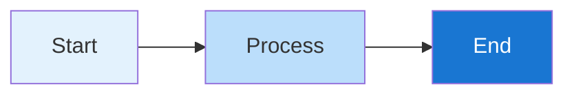
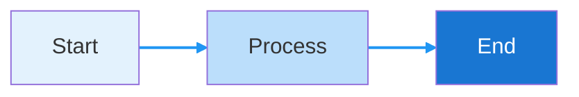

# Phase 2 Documentation UI/UX Improvements Summary

## Overview

All Phase 2 documentation pages need to be updated with:
1. **UTF-8 Encoding** - Ensure proper character encoding
2. **UI Components** - Use proper docs site components
3. **Mermaid Diagrams** - Add theme-aware styling
4. **Consistent Formatting** - Match existing docs patterns

---

## Files to Update

### ✅ Partially Complete
1. **`apps/docs/contents/docs/testing/index.mdx`** - 30% complete
   - Added: Note, CardGrid, Tabs, FileTree components
   - Remaining: More Note callouts, finish all sections

### ⏳ Needs Full Update
2. **`apps/docs/contents/docs/reference/configuration/index.mdx`**
3. **`apps/docs/contents/docs/frontend/automation/index.mdx`**
4. **`apps/docs/contents/docs/troubleshooting/automation/index.mdx`**
5. **`apps/docs/contents/docs/scripts-reference/complete-guide/index.mdx`**
6. **`apps/docs/contents/docs/workflows/diagrams/index.mdx`**
7. **`apps/docs/contents/docs/guides/migration/index.mdx`**

---

## Required Component Updates

### 1. Note Components

**Pattern from existing docs:**
```mdx
<Note type="info">
Information content here
</Note>

<Note type="warning">
Warning content here
</Note>

<Note type="success" title="Custom Title">
Success content here
</Note>
```

**Apply to:**
- Configuration warnings
- Troubleshooting tips
- Important callouts
- Success messages

---

### 2. Card Components

**Pattern:**
```mdx
<CardGrid>
  <Card title="Title" icon="icon-name">
    Description text
  </Card>
  <Card title="Another Card" icon="check-circle">
    More description
  </Card>
</CardGrid>
```

**Icons available:**
- `check-circle`
- `code`
- `play-circle`
- `accessibility`
- `git-pull-request`
- `alert-triangle`

**Apply to:**
- Feature highlights
- Tool overviews
- Quick reference sections

---

### 3. Tabs Components

**Pattern:**
```mdx
<Tabs defaultValue="tab1">
  <TabsList>
    <TabsTrigger value="tab1">Tab 1</TabsTrigger>
    <TabsTrigger value="tab2">Tab 2</TabsTrigger>
  </TabsList>
  
  <TabsContent value="tab1">
    Content for tab 1
  </TabsContent>
  
  <TabsContent value="tab2">
    Content for tab 2
  </TabsContent>
</Tabs>
```

**Apply to:**
- Multiple configuration options
- Platform-specific commands
- Alternative approaches
- Code examples with variants

---

### 4. Step Components

**Pattern:**
```mdx
<Step>
  <StepItem title="Step 1">
    Instructions for step 1
  </StepItem>
  
  <StepItem title="Step 2">
    Instructions for step 2
  </StepItem>
</Step>
```

**Apply to:**
- Installation guides
- Setup procedures
- Migration steps
- Troubleshooting workflows

---

### 5. FileTree Components

**Pattern:**
```mdx
<FileTree>
  <FileTree.Folder name="parent" defaultOpen>
    <FileTree.Folder name="subfolder">
      <FileTree.File name="file.ts" />
    </FileTree.Folder>
    <FileTree.File name="config.json" />
  </FileTree.Folder>
</FileTree>
```

**Apply to:**
- Directory structures
- Configuration file layouts
- Project organization diagrams

---

## Mermaid Diagram Styling

### Method 1: Inline Mermaid Component

**Pattern from existing docs:**
```mdx
<Mermaid chart={`graph TB
    A[Node A] --> B[Node B]
    B --> C[Node C]
    
    style A fill:#e3f2fd
    style B fill:#90caf9
    style C fill:#2196f3,color:#fff`} />
```

### Method 2: Standard Mermaid with Styling

**Pattern:**
```mdx

```

### Color Scheme for Mermaid

**Blue theme (matches Portfolio OS):**
```
Light:    #e3f2fd
Medium:   #90caf9
Primary:  #2196f3
Dark:     #1976d2 (with color:#fff for text)
```

**Additional colors:**
```
Success:  #4caf50
Warning:  #ff9800
Error:    #f44336
Info:     #2196f3
```

---

## Specific Updates by File

### 1. Configuration Reference (`reference/configuration/index.mdx`)

**Add:**
- `<Note type="warning">` for "Never commit .env.local"
- `<Tabs>` for different environment variable categories
- `<CardGrid>` for configuration file types
- `<Step>` components for setup procedures
- `<FileTree>` for configuration file locations

**Example:**
```mdx
<Note type="warning">
**Never commit `.env.local` files to Git!** They contain sensitive credentials.
</Note>

<Tabs defaultValue="required">
  <TabsList>
    <TabsTrigger value="required">Required</TabsTrigger>
    <TabsTrigger value="optional">Optional</TabsTrigger>
  </TabsList>
  
  <TabsContent value="required">
    Environment variables you must set...
  </TabsContent>
  
  <TabsContent value="optional">
    Optional configuration...
  </TabsContent>
</Tabs>
```

---

### 2. Front-End Automation (`frontend/automation/index.mdx`)

**Add:**
- `<CardGrid>` for optimization strategies
- `<Note type="info">` for best practices
- `<Tabs>` for different build modes
- Styled mermaid diagrams for image optimization pipeline

**Example:**
```mdx
<CardGrid>
  <Card title="Bundle Analysis" icon="code">
    Visualize and optimize your bundle size
  </Card>
  <Card title="Image Optimization" icon="check-circle">
    Automatic WebP/AVIF conversion
  </Card>
  <Card title="Performance Monitoring" icon="play-circle">
    Track Core Web Vitals in production
  </Card>
</CardGrid>
```

---

### 3. Troubleshooting Guide (`troubleshooting/automation/index.mdx`)

**Add:**
- `<Note type="warning">` for critical issues
- `<Tabs>` for platform-specific solutions
- `<Step>` for resolution procedures
- Color-coded severity in mermaid diagrams

**Example:**
```mdx
<Note type="warning" title="PowerShell Execution Policy">
If you see "script cannot be loaded", you need to change your execution policy.
</Note>

<Tabs defaultValue="windows">
  <TabsList>
    <TabsTrigger value="windows">Windows</TabsTrigger>
    <TabsTrigger value="unix">macOS/Linux</TabsTrigger>
  </TabsList>
  
  <TabsContent value="windows">
    Windows-specific solutions...
  </TabsContent>
  
  <TabsContent value="unix">
    Unix-specific solutions...
  </TabsContent>
</Tabs>
```

---

### 4. Workflow Diagrams (`workflows/diagrams/index.mdx`)

**Add:**
- Styled mermaid diagrams with color scheme
- `<Note>` explaining diagram interactivity
- `<CardGrid>` for workflow categories

**All mermaid diagrams need styling:**



**Add intro note:**
```mdx
<Note type="info">
All diagrams are interactive. Click to zoom and pan for detailed views.
</Note>

<CardGrid>
  <Card title="CI/CD Flows" icon="git-pull-request">
    Pull request and deployment workflows
  </Card>
  <Card title="Automation" icon="play-circle">
    Issue and PR automation processes
  </Card>
  <Card title="Architecture" icon="code">
    System and application architecture
  </Card>
</CardGrid>
```

---

### 5. Complete Script Guide (`scripts-reference/complete-guide/index.mdx`)

**Add:**
- `<CardGrid>` for script categories
- `<Tabs>` for script usage examples
- `<FileTree>` for script organization
- `<Note>` for important warnings

---

### 6. Migration Guide (`guides/migration/index.mdx`)

**Add:**
- `<Step>` components for migration procedures
- `<Note type="warning">` for breaking changes
- `<Tabs>` for version-specific instructions
- `<CardGrid>` for migration strategies

**Example:**
```mdx
<Note type="warning">
Major upgrades may include breaking changes. Create a backup before proceeding.
</Note>

<Step>
  <StepItem title="Review Breaking Changes">
    Read the upgrade guide thoroughly
  </StepItem>
  
  <StepItem title="Create Upgrade Branch">
    ```bash
    git checkout -b upgrade/nextjs-15
    ```
  </StepItem>
  
  <StepItem title="Update Dependencies">
    Update package.json dependencies
  </StepItem>
</Step>
```

---

## UTF-8 Encoding

All MDX files should have UTF-8 encoding. Verify with:

```bash
file -I apps/docs/contents/docs/**/*.mdx
```

If needed, convert:

```bash
# Convert files to UTF-8
find apps/docs/contents/docs -name "*.mdx" -exec sh -c 'iconv -f ISO-8859-1 -t UTF-8 "$1" > "$1.tmp" && mv "$1.tmp" "$1"' _ {} \;
```

---

## Implementation Priority

### High Priority (Do First)
1. ✅ Testing Guide - Already started
2. ⏳ Workflow Diagrams - Most visual impact
3. ⏳ Configuration Reference - High usage

### Medium Priority
4. ⏳ Front-End Automation
5. ⏳ Troubleshooting Guide

### Lower Priority
6. ⏳ Script Reference
7. ⏳ Migration Guide

---

## Automated Update Script

Create a helper script to apply consistent patterns:

```bash
# scripts/utilities/update-docs-components.ps1

param(
    [Parameter(Mandatory=$true)]
    [string]$FilePath
)

# Add UTF-8 BOM if missing
$content = Get-Content $FilePath -Raw -Encoding UTF8

# Apply component patterns
# (patterns for automated replacement)

Set-Content $FilePath -Value $content -Encoding UTF8
```

---

## Testing After Updates

1. **Build docs site:** `pnpm --filter @portfolio/docs build`
2. **Check for errors:** Review build output
3. **Visual inspection:** Navigate to each page
4. **Mobile responsiveness:** Test on mobile viewport
5. **Dark mode:** Check both light and dark themes
6. **Interactive elements:** Test tabs, accordions, etc.

---

## Completion Checklist

- [ ] All files have UTF-8 encoding
- [ ] Note components added for warnings/tips
- [ ] CardGrid used for feature highlights
- [ ] Tabs used for multi-option content
- [ ] Step components for procedures
- [ ] FileTree for directory structures
- [ ] Mermaid diagrams have color styling
- [ ] All pages build without errors
- [ ] Visual consistency verified
- [ ] Mobile responsive
- [ ] Dark mode works correctly

---

**Next Step:** Apply these patterns systematically to each file, starting with Workflow Diagrams for maximum visual impact.


