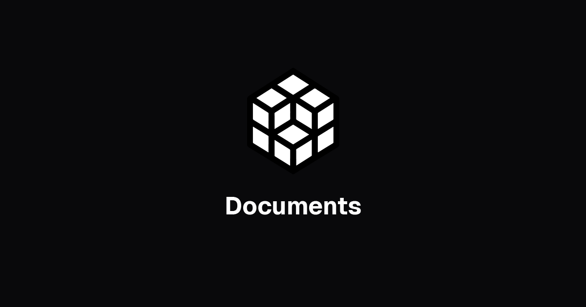
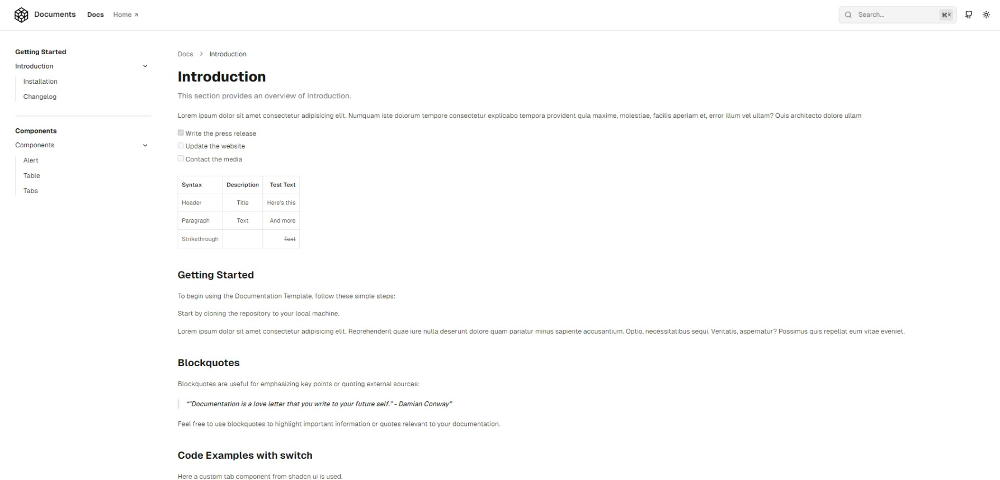
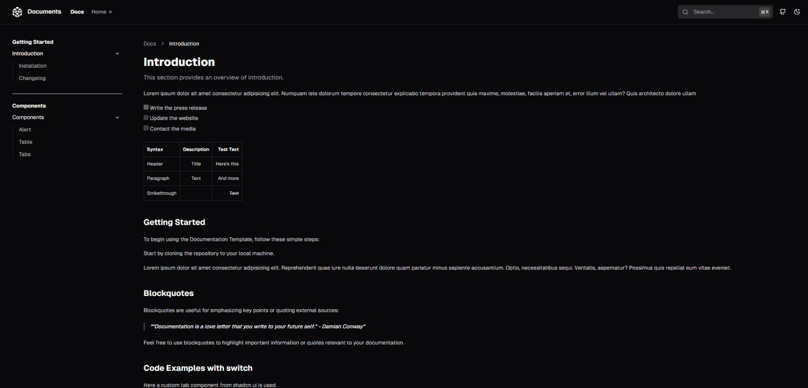

# Portfolio OS Documentation

<p align="center">
  <a href="https://johnschibelli.dev">
    
  </a>
</p>

<h1 align="center">Portfolio OS Documentation</h1>
<p align="center">Complete developer documentation for Portfolio OS - a modern, production-grade monorepo platform.</p>

<p align="center">
  <a href="https://johnschibelli.dev"></a>
  <a href="https://dashboard.johnschibelli.dev"></a>
  <a href="http://localhost:3001"></a>
  <a href="https://github.com/jschibelli/portfolio-os"></a>
</p>

---

## Overview

This documentation site provides comprehensive guides for the **Portfolio OS** platform - a self-documenting, AI-powered development ecosystem built with Next.js, TypeScript, and Turborepo.

The documentation covers:

- 🚀 **Getting Started** - Installation, setup, and first steps
- 🎯 **Features** - Platform architecture, AI chatbot, booking system, and more
- ⚙️ **Setup & Configuration** - Database, deployment, integrations, and worktree management
- 👨‍💻 **Development** - Developer guide, API reference, coding standards
- 🤖 **Automation & Scripts** - PowerShell automation, agent management, PR/issue workflows
- 🏗️ **Advanced Topics** - Multi-agent system, worktree workflows, coordination
- 📚 **Reference** - Apps, packages, releases, security
- 🔧 **Troubleshooting** - Common issues, deployment problems, performance tips

---

## Features

### Content Management
- **MDX Support** - Markdown with React components for rich documentation
- **Custom Components** - Reusable cards, notes, tabs, code blocks, and more
- **Mermaid Diagrams** - Visual flowcharts and architecture diagrams
- **Syntax Highlighting** - Beautiful code blocks with theme support

### Navigation & Structure
- **Multi-level Navigation** - Organized sidebar with expandable sections
- **Auto-generated TOC** - Table of contents for quick page navigation
- **Content Pagination** - Previous/next page navigation
- **Breadcrumbs** - Clear page hierarchy and location
- **Search** - Fast fuzzy search with result highlighting

### Developer Experience
- **Dark Mode** - Auto-detection with manual toggle
- **Responsive Design** - Mobile-first, works on all devices
- **Fast Performance** - Built on Next.js 14 with optimizations
- **SEO Ready** - Dynamic meta tags and Open Graph support

---

## Quick Start

### Local Development

```bash
# Navigate to docs directory
cd apps/docs

# Install dependencies (from monorepo root)
pnpm install

# Start development server
pnpm dev
```

Visit [http://localhost:3001](http://localhost:3001) to view the documentation locally.

### Production Build

```bash
# Build for production
pnpm build

# Start production server
pnpm start
```

### From Monorepo Root

```bash
# Start all apps (site, docs, dashboard)
pnpm dev

# Build all apps
pnpm build
```

---

## Project Structure

```
apps/docs/
├── app/                    # Next.js App Router
│   ├── docs/              # Documentation pages
│   ├── layout.tsx         # Root layout
│   └── page.tsx           # Landing page
├── components/            # React components
│   ├── markdown/          # MDX components (cards, notes, tabs, etc.)
│   ├── navigation/        # Navbar, sidebar, breadcrumbs, etc.
│   └── ui/                # UI primitives (buttons, inputs, etc.)
├── contents/              # Documentation content (MDX files)
│   └── docs/              # All documentation pages
│       ├── getting-started/
│       ├── features/
│       ├── setup/
│       ├── developer-guide/
│       ├── scripts-reference/
│       ├── multi-agent/
│       ├── api-reference/
│       └── troubleshooting/
├── lib/                   # Utilities and helpers
├── public/                # Static assets
├── settings/              # Configuration files
│   ├── documents.ts       # Navigation structure
│   ├── navigation.ts      # Header navigation
│   └── settings.ts        # Site settings
└── styles/                # Global styles
```

---

## Documentation Content

All documentation is written in **MDX** (Markdown + JSX), allowing you to use React components within markdown files.

### Available MDX Components

- **Card & CardGrid** - Feature cards and card layouts
- **Note** - Info, warning, success, and error callouts
- **Tabs** - Tabbed content sections
- **Step & StepItem** - Step-by-step guides
- **FileTree** - File structure visualization
- **Mermaid** - Diagrams and flowcharts
- **Code Blocks** - Syntax-highlighted code with copy button

### Example MDX

```mdx
---
title: My Documentation Page
description: A helpful description for SEO
---

## Introduction

<Note type="success">
This is a success note with helpful information!
</Note>

<CardGrid>
  <Card title="Feature 1" description="Description here" href="/link" />
  <Card title="Feature 2" description="Description here" href="/link" />
</CardGrid>

```typescript
// Your code here
const example = "with syntax highlighting";
```
```

---

## Configuration

### Site Settings (`settings/settings.ts`)

Configure site metadata, URL, branding, and feature toggles.

```typescript
export const sitename = "Portfolio OS Documentation"
export const description = "Comprehensive documentation for Portfolio OS"
export const url = "http://localhost:3001"
export const branding = true
export const rightsidebar = true
export const tableofcontent = true
```

### Navigation Structure (`settings/documents.ts`)

Define the sidebar navigation structure and page hierarchy.

### Header Navigation (`settings/navigation.ts`)

Configure top navigation links to external sites.

```typescript
export const Navigations = [
  { title: "Docs", href: `/docs${PageRoutes[0].href}` },
  { title: "Portfolio", href: "https://johnschibelli.dev", external: true },
  { title: "Dashboard", href: "https://dashboard.johnschibelli.dev", external: true },
]
```

---

## Technology Stack

- **Framework**: Next.js 14 (App Router)
- **Language**: TypeScript
- **Styling**: Tailwind CSS
- **Content**: MDX (Markdown + JSX)
- **UI Components**: Radix UI primitives
- **Icons**: Lucide React
- **Syntax Highlighting**: Shiki
- **Diagrams**: Mermaid.js
- **Search**: Custom fuzzy search

---

## Deployment

The documentation site can be deployed to:

- **Vercel** (Recommended)
- **Netlify**
- **Self-hosted**

### Vercel Deployment

1. Connect your GitHub repository
2. Set root directory to `apps/docs`
3. Build command: `cd ../.. && pnpm build --filter=docs`
4. Output directory: `.next`
5. Deploy!

---

## Screenshots

### Light Mode


*Documentation landing page with navigation and feature cards*


*Documentation page with syntax highlighting and navigation*


*Page footer with pagination and feedback options*


*Fuzzy search functionality with result highlighting*

### Dark Mode


*Landing page in dark mode*


*Documentation page in dark mode with code highlighting*

---

## Contributing

To add or update documentation:

1. Navigate to `apps/docs/contents/docs/`
2. Find the relevant section or create a new one
3. Edit or create MDX files
4. Update `settings/documents.ts` if adding new pages
5. Test locally with `pnpm dev`
6. Submit a pull request

---

## Live Sites

- **Portfolio Site**: [https://johnschibelli.dev](https://johnschibelli.dev)
- **Admin Dashboard**: [https://dashboard.johnschibelli.dev](https://dashboard.johnschibelli.dev)
- **Documentation**: [http://localhost:3001](http://localhost:3001) (local)
- **GitHub Repository**: [https://github.com/jschibelli/portfolio-os](https://github.com/jschibelli/portfolio-os)

---

## Support

For issues, questions, or contributions:

- Open an issue on [GitHub](https://github.com/jschibelli/portfolio-os/issues)
- Review the [Troubleshooting Guide](http://localhost:3001/docs/troubleshooting)
- Check the [Developer Guide](http://localhost:3001/docs/developer-guide)

---

## License

MIT © John Schibelli

---

**Portfolio OS** - A modern, production-grade platform demonstrating full-stack development, AI integration, and automated workflows.
