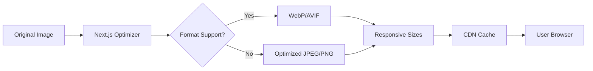

Portfolio OS implements extensive front-end automation to ensure optimal performance, code quality, and developer experience. This guide covers build optimization, asset management, performance monitoring, and automated workflows.

## Overview

Our front-end automation strategy focuses on:

1. **Build Optimization** - Fast, efficient builds with intelligent caching
2. **Asset Optimization** - Automated image, font, and CSS optimization
3. **Code Quality** - Automated linting, formatting, and type checking
4. **Performance Monitoring** - Continuous performance tracking
5. **Accessibility Automation** - Automated a11y testing and validation

---

## Build System

### Next.js Build Configuration

Portfolio OS uses Next.js 15 with optimized build settings for production performance.

**Configuration:** `apps/site/next.config.js`

```javascript
const nextConfig = {
  // Transpile workspace packages for optimal bundling
  transpilePackages: [
    '@mindware-blog/ui',
    '@mindware-blog/lib',
    '@mindware-blog/db',
    '@mindware-blog/hashnode',
    '@mindware-blog/emails',
    '@mindware-blog/chatbot',
  ],
  
  // Enable monorepo file tracing
  outputFileTracingRoot: path.join(__dirname, '../../'),
  
  // Image optimization configuration
  images: {
    qualities: [25, 50, 75, 85, 100],
    remotePatterns: [
      { protocol: 'https', hostname: 'cdn.hashnode.com' },
      { protocol: 'https', hostname: 'images.unsplash.com' },
    ],
  },
};
```

**Key Features:**

| Feature | Purpose | Benefit |
|---------|---------|---------|
| `transpilePackages` | Compile workspace packages | Smaller bundle size |
| `outputFileTracingRoot` | Track dependencies in monorepo | Correct builds |
| `images.qualities` | Multiple quality levels | Responsive images |
| `remotePatterns` | Allow external images | Image optimization |

---

### Build Process

#### Development Build

```bash
# Start development server
pnpm dev

# Development features:
# - Fast Refresh for instant updates
# - Source maps for debugging
# - Detailed error messages
# - No optimization for speed
```

**Development optimizations:**
- Hot Module Replacement (HMR)
- Fast Refresh for React components
- Unminified code for debugging
- Inline source maps

---

#### Production Build

```bash
# Build for production
pnpm build

# What happens during build:
# 1. TypeScript compilation
# 2. Component tree shaking
# 3. CSS purging and minification
# 4. Image optimization
# 5. Code splitting
# 6. Bundle compression
```

**Production optimizations:**
- Minified JavaScript and CSS
- Optimized images (WebP, AVIF)
- Code splitting by route
- Static page generation
- Automatic bundle analysis

---

### Build Analysis

#### Analyzing Bundle Size

```bash
# Build with bundle analyzer
ANALYZE=true pnpm build

# Opens interactive bundle visualization
# Shows:
# - Bundle sizes
# - Duplicate dependencies
# - Large modules
# - Optimization opportunities
```

**Add to `next.config.js`:**

```javascript
const withBundleAnalyzer = require('@next/bundle-analyzer')({
  enabled: process.env.ANALYZE === 'true',
});

module.exports = withBundleAnalyzer(nextConfig);
```

---

#### Bundle Optimization Strategies

**1. Dynamic Imports**

```typescript
// ❌ Static import (increases initial bundle)
import HeavyComponent from './HeavyComponent';

// ✅ Dynamic import (loads on demand)
const HeavyComponent = dynamic(() => import('./HeavyComponent'), {
  loading: () => <Spinner />,
  ssr: false, // Client-side only if needed
});
```

**2. Tree Shaking**

```typescript
// ❌ Imports entire library
import _ from 'lodash';

// ✅ Imports only what you need
import debounce from 'lodash/debounce';
```

**3. Code Splitting by Route**

Next.js automatically splits code by route:

```
/                    → page.js + shared.js
/blog               → blog-page.js + shared.js
/projects           → projects-page.js + shared.js
```

---

## Styling Automation

### Tailwind CSS Configuration

**Configuration:** `apps/site/tailwind.config.js`

```javascript
module.exports = {
  // Enable dark mode with class strategy
  darkMode: 'class',
  
  // Scan these files for Tailwind classes
  content: [
    './app/**/*.{js,ts,jsx,tsx,mdx}',
    './components/**/*.{js,ts,jsx,tsx}',
    './lib/**/*.{js,ts,jsx,tsx}',
  ],
  
  // Custom theme extensions
  theme: {
    extend: {
      colors: {
        // CSS variable-based colors for dynamic theming
        primary: "hsl(var(--primary))",
        secondary: "hsl(var(--secondary))",
      },
    },
  },
  
  // Plugins
  plugins: [
    require('@tailwindcss/typography'),
  ],
};
```

---

### CSS Optimization

#### Automatic Optimizations

**1. PurgeCSS Integration**

Tailwind automatically removes unused CSS:

```bash
# Development: ~3.5MB CSS
# Production:  ~15KB CSS (99% reduction!)
```

**How it works:**
- Scans all files in `content` array
- Identifies used Tailwind classes
- Removes unused styles
- Minifies remaining CSS

**2. CSS Minification**

```css
/* Development */
.bg-primary {
  background-color: hsl(var(--primary));
}

/* Production */
.bg-primary{background-color:hsl(var(--primary))}
```

**3. Critical CSS Extraction**

Next.js automatically inlines critical CSS:
- Above-the-fold styles inlined in `<head>`
- Non-critical CSS loaded asynchronously
- Eliminates render-blocking CSS

---

### Style Linting

**ESLint + Prettier** ensure consistent styling:

```bash
# Check style issues
pnpm lint

# Auto-fix issues
pnpm lint --fix

# Format all files
pnpm format
```

**Prettier configuration includes:**
- Tailwind class sorting plugin
- Consistent import organization
- Automatic semicolon insertion

---

## Image Optimization

### Next.js Image Component

Portfolio OS uses Next.js `<Image>` component for automatic optimization.

```typescript
import Image from 'next/image';

<Image
  src="/hero-image.jpg"
  alt="Hero image"
  width={1200}
  height={600}
  priority // Load immediately for LCP
  quality={85}
  placeholder="blur"
  blurDataURL={blurDataUrl}
/>
```

**Automatic optimizations:**
- WebP/AVIF format conversion
- Responsive image sizes
- Lazy loading by default
- Blur placeholder generation
- CDN delivery

---

### Image Quality Settings

**Configuration in `next.config.js`:**

```javascript
images: {
  // Generate multiple quality levels
  qualities: [25, 50, 75, 85, 100],
  
  // Allowed image sources
  remotePatterns: [
    { protocol: 'https', hostname: 'cdn.hashnode.com' },
    { protocol: 'https', hostname: 'images.unsplash.com' },
  ],
}
```

**Quality usage:**

| Quality | Use Case | Size |
|---------|----------|------|
| 25 | Blur placeholder | ~2KB |
| 50 | Thumbnail | ~10KB |
| 75 | Default | ~50KB |
| 85 | High quality | ~100KB |
| 100 | Original | Variable |

---

### Image Workflow



---

## Font Optimization

### Next.js Font System

```typescript
import { Inter, Roboto_Mono } from 'next/font/google';

// Variable font with subset
const inter = Inter({
  subsets: ['latin'],
  variable: '--font-inter',
  display: 'swap',
});

// Monospace font
const robotoMono = Roboto_Mono({
  subsets: ['latin'],
  variable: '--font-mono',
  display: 'swap',
});
```

**Optimizations:**
- Self-hosted fonts (no external requests)
- Automatic subset generation
- Variable font support
- Font display strategy
- Preloading critical fonts

---

### Font Loading Strategy

```css
/* Fonts defined as CSS variables */
:root {
  --font-inter: 'Inter', sans-serif;
  --font-mono: 'Roboto Mono', monospace;
}

/* Applied via Tailwind */
body {
  font-family: var(--font-inter);
}

code {
  font-family: var(--font-mono);
}
```

**Benefits:**
- Zero layout shift (font metrics known)
- No FOUT (Flash of Unstyled Text)
- No FOIT (Flash of Invisible Text)
- Optimal loading performance

---

## Performance Monitoring

### Core Web Vitals Tracking

Portfolio OS tracks Core Web Vitals automatically:

```typescript
// app/layout.tsx
import { Analytics } from '@vercel/analytics/react';

export default function RootLayout({ children }) {
  return (
    <html>
      <body>
        {children}
        <Analytics />
      </body>
    </html>
  );
}
```

**Metrics tracked:**

| Metric | Target | Description |
|--------|--------|-------------|
| **LCP** | < 2.5s | Largest Contentful Paint |
| **FID** | < 100ms | First Input Delay |
| **CLS** | < 0.1 | Cumulative Layout Shift |
| **FCP** | < 1.8s | First Contentful Paint |
| **TTFB** | < 600ms | Time to First Byte |

---

### Lighthouse CI (Recommended)

**Setup automated Lighthouse testing:**

```yaml
# .github/workflows/lighthouse.yml
name: Lighthouse CI

on: [pull_request]

jobs:
  lighthouse:
    runs-on: ubuntu-latest
    steps:
      - uses: actions/checkout@v4
      - uses: actions/setup-node@v4
      
      - name: Run Lighthouse CI
        run: |
          npm install -g @lhci/cli
          lhci autorun
        env:
          LHCI_GITHUB_APP_TOKEN: ${{ secrets.LHCI_GITHUB_APP_TOKEN }}
```

**Configuration:** `.lighthouserc.json`

```json
{
  "ci": {
    "collect": {
      "startServerCommand": "pnpm start",
      "url": ["http://localhost:3000/"]
    },
    "assert": {
      "assertions": {
        "categories:performance": ["error", {"minScore": 0.9}],
        "categories:accessibility": ["error", {"minScore": 0.9}],
        "categories:best-practices": ["error", {"minScore": 0.9}],
        "categories:seo": ["error", {"minScore": 0.9}]
      }
    }
  }
}
```

---

### Real User Monitoring (RUM)

**Web Vitals API:**

```typescript
// lib/analytics/web-vitals.ts
import { getCLS, getFID, getFCP, getLCP, getTTFB } from 'web-vitals';

export function reportWebVitals() {
  getCLS(console.log);
  getFID(console.log);
  getFCP(console.log);
  getLCP(console.log);
  getTTFB(console.log);
}
```

**Usage in app:**

```typescript
// app/layout.tsx
'use client';

import { useEffect } from 'react';
import { reportWebVitals } from '@/lib/analytics/web-vitals';

export default function Layout({ children }) {
  useEffect(() => {
    reportWebVitals();
  }, []);
  
  return children;
}
```

---

## Accessibility Automation

### Automated A11y Testing

**1. Playwright + axe-core**

```typescript
// tests/accessibility.spec.ts
import { test, expect } from '@playwright/test';
import { injectAxe, checkA11y } from 'axe-playwright';

test('Homepage accessibility', async ({ page }) => {
  await page.goto('/');
  await injectAxe(page);
  await checkA11y(page, null, {
    detailedReport: true,
  });
});
```

**2. Jest + jest-axe**

```typescript
// __tests__/components/Button.test.tsx
import { render } from '@testing-library/react';
import { axe, toHaveNoViolations } from 'jest-axe';

expect.extend(toHaveNoViolations);

test('Button is accessible', async () => {
  const { container } = render(<Button>Click me</Button>);
  const results = await axe(container);
  expect(results).toHaveNoViolations();
});
```

---

### Accessibility Features

**Automated checks:**

- ✅ Keyboard navigation
- ✅ Screen reader support
- ✅ Color contrast (WCAG AA)
- ✅ ARIA attributes
- ✅ Focus management
- ✅ Form labels
- ✅ Image alt text
- ✅ Heading hierarchy

**Testing coverage:**

```bash
# Run accessibility tests
pnpm test:accessibility

# Check specific pages
pnpm playwright test tests/accessibility-comprehensive.spec.ts

# Generate accessibility report
pnpm playwright test --reporter=html
```

---

## Deployment Automation

### Vercel Integration

**Automatic deployments on:**
- Every push to `main` (production)
- Every push to `develop` (staging)
- Every pull request (preview)

**Deployment features:**
- Automatic builds
- Edge caching
- Image optimization
- Analytics
- Web Vitals monitoring

---

### Deployment Preview

**Every PR gets:**
- Unique preview URL
- Independent database
- Isolated environment
- Automatic cleanup on PR close

**Preview URL format:**
```
https://portfolio-os-[pr-number]-jschibelli.vercel.app
```

---

### Build Caching

**Turbo Remote Cache** speeds up builds:

```bash
# First build: 45 seconds
# Cached build: 8 seconds (82% faster!)
```

**How it works:**
1. Turbo hashes all inputs
2. Checks remote cache (Vercel)
3. Downloads cached artifacts if available
4. Skips build if nothing changed

**Configuration:** `turbo.json`

```json
{
  "remoteCache": {
    "enabled": true,
    "signature": true
  }
}
```

---

## Code Quality Automation

### TypeScript

**Strict mode enabled:**

```json
{
  "compilerOptions": {
    "strict": true,
    "noUncheckedIndexedAccess": true,
    "noImplicitReturns": true,
    "noUnusedLocals": true,
    "noUnusedParameters": true
  }
}
```

**Type checking:**

```bash
# Check types
pnpm typecheck

# Watch mode
pnpm typecheck --watch
```

---

### ESLint

**Configuration:** `.eslintrc.json`

```json
{
  "extends": [
    "next/core-web-vitals",
    "prettier"
  ],
  "rules": {
    "no-console": ["warn", { "allow": ["warn", "error"] }],
    "no-unused-vars": "error",
    "@typescript-eslint/no-explicit-any": "error"
  }
}
```

**Automated linting:**

```bash
# Lint all files
pnpm lint

# Fix issues automatically
pnpm lint --fix

# Lint specific files
pnpm eslint 'components/**/*.tsx'
```

---

### Prettier

**Automated formatting:**

```bash
# Format all files
pnpm format

# Check formatting
pnpm format --check
```

**Prettier plugins:**
- `prettier-plugin-tailwindcss` - Sort Tailwind classes
- `prettier-plugin-organize-imports` - Sort imports
- `prettier-plugin-packagejson` - Format package.json

**Format on save:**

```json
// .vscode/settings.json
{
  "editor.formatOnSave": true,
  "editor.defaultFormatter": "esbenp.prettier-vscode"
}
```

---

## CI/CD Integration

### Automated Checks

**Every PR triggers:**

1. **Linting** - ESLint validation
2. **Type Checking** - TypeScript compilation
3. **Unit Tests** - Jest test suite
4. **E2E Tests** - Playwright tests
5. **Build Verification** - Production build test
6. **Bundle Analysis** - Size monitoring

**Workflow:** `.github/workflows/ci-optimized.yml`

```yaml
jobs:
  build-and-test:
    steps:
      - name: Lint
        run: pnpm lint
      
      - name: Type Check
        run: pnpm typecheck
      
      - name: Unit Tests
        run: pnpm test
      
      - name: Build
        run: pnpm build
```

---

### Performance Budgets

**Set performance budgets to prevent regressions:**

```javascript
// next.config.js
module.exports = {
  experimental: {
    performanceBudgets: {
      'pages/**': {
        javascript: '350kb',
        css: '100kb',
      },
    },
  },
};
```

**Build fails if budget exceeded:**

```bash
❌ Build failed: JavaScript bundle (420kb) exceeds budget (350kb)
```

---

## Developer Experience

### Hot Module Replacement

```bash
# Start dev server
pnpm dev

# HMR features:
# - Instant updates on file save
# - Preserves React component state
# - Updates CSS without refresh
# - Shows build errors in browser
```

---

### Fast Refresh

**React Fast Refresh:**
- Preserves component state during edits
- Handles most updates without full reload
- Shows syntax errors in overlay
- Recovers from runtime errors

**Example:**

```typescript
// Edit this component
export default function Counter() {
  const [count, setCount] = useState(0);
  
  return (
    <button onClick={() => setCount(count + 1)}>
      Count: {count}  // Update this line
    </button>
  );
}
// Component updates instantly, count state preserved!
```

---

### Error Handling

**Development error overlay:**
- Syntax errors with code snippets
- Runtime errors with stack traces
- Build errors with suggestions
- Click to open in editor

**Production error boundary:**

```typescript
'use client';

export default function Error({ error, reset }) {
  return (
    <div>
      <h2>Something went wrong!</h2>
      <button onClick={reset}>Try again</button>
    </div>
  );
}
```

---

## Monitoring & Analytics

### Build Metrics

**Track in CI:**
- Build time
- Bundle size
- Cache hit rate
- Test duration

**Example output:**

```
✓ Build completed
  Duration: 42s
  Cache: 87% hit rate
  Bundle: 280kb (↓ 12kb from last build)
  Tests: 156 passed
```

---

### Production Metrics

**Vercel Analytics tracks:**
- Page views
- Unique visitors
- Geographic distribution
- Device types
- Performance scores

**Access at:** `vercel.com/dashboard/analytics`

---

## Best Practices

### DO

✅ **Use Next.js Image component**
```typescript
<Image src="/hero.jpg" alt="Hero" width={1200} height={600} />
```

✅ **Dynamic imports for large components**
```typescript
const Chart = dynamic(() => import('./Chart'));
```

✅ **Optimize fonts**
```typescript
import { Inter } from 'next/font/google';
```

✅ **Track Core Web Vitals**
```typescript
import { Analytics } from '@vercel/analytics/react';
```

✅ **Use CSS variables for theming**
```css
background-color: hsl(var(--primary));
```

---

### DON'T

❌ **Don't use `` tags directly**
```html
<!-- Bad -->


<!-- Good -->
<Image src="/hero.jpg" alt="Hero" width={1200} height={600} />
```

❌ **Don't import entire libraries**
```typescript
// Bad
import _ from 'lodash';

// Good
import debounce from 'lodash/debounce';
```

❌ **Don't skip alt text**
```typescript
// Bad
<Image src="/photo.jpg" alt="" />

// Good
<Image src="/photo.jpg" alt="Team photo at conference" />
```

---

## Troubleshooting

### Build Issues

**Problem:** Build fails with memory error

```bash
# Solution: Increase Node memory
NODE_OPTIONS='--max-old-space-size=4096' pnpm build
```

**Problem:** Image optimization fails

```bash
# Solution: Check image sources in next.config.js
images: {
  remotePatterns: [/* add your domains */]
}
```

---

### Performance Issues

**Problem:** Large bundle size

```bash
# Analyze bundle
ANALYZE=true pnpm build

# Look for:
# - Duplicate dependencies
# - Large libraries
# - Unused code
```

**Problem:** Slow development server

```bash
# Clear Next.js cache
rm -rf .next

# Reinstall dependencies
pnpm install --force
```

---

## Additional Resources

### Internal Documentation
- [Testing Guide](/docs/testing)
- [CI/CD Workflows](/docs/scripts-reference/ci-cd)
- [Configuration Reference](/docs/reference/configuration)
- [Troubleshooting](/docs/troubleshooting)

### External Resources
- [Next.js Documentation](https://nextjs.org/docs)
- [Tailwind CSS Documentation](https://tailwindcss.com/docs)
- [Web Vitals](https://web.dev/vitals/)
- [Vercel Analytics](https://vercel.com/docs/analytics)
- [Lighthouse CI](https://github.com/GoogleChrome/lighthouse-ci)

---

**Need Help?** Check the [Troubleshooting Guide](/docs/troubleshooting) or create an issue in the repository.

