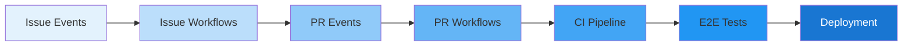

## Overview

Portfolio OS uses GitHub Actions to automate continuous integration, testing, and deployment across the monorepo.  
These workflows are event-driven and designed to work together as a single pipeline from issue creation through deployment.



This page documents the key workflows, how they are triggered, and how they interact with the automation scripts and project configuration.

<Note type="info">
All workflow files live in `.github/workflows/` and are triggered automatically by GitHub events or can be run manually via `workflow_dispatch`.
</Note>

---

## Workflow Catalog

<CardGrid>
  <Card 
    title="Issue & PR Orchestration"
    icon="git-pull-request"
    description="Complete issue-to-PR lifecycle automation"
  />
  <Card 
    title="CI Pipeline"
    icon="check-circle"
    description="Build, lint, typecheck, and test"
  />
  <Card 
    title="E2E Testing"
    icon="play-circle"
    description="Playwright-powered end-to-end tests"
  />
  <Card 
    title="Conflict Management"
    icon="alert-triangle"
    description="Automatic conflict detection and resolution"
  />
</CardGrid>

---

### Issue & PR Orchestration

#### `orchestrate-issues-prs.yml`

<Note type="success" title="Core Orchestration">
This is the central workflow that coordinates issue creation, branch management, PR creation, and review automation.
</Note>

**File**: `.github/workflows/orchestrate-issues-prs.yml`

**Purpose**: Orchestrates the complete issue → branch → PR lifecycle using automation scripts.

**Triggers**:
- `issues` events: `opened`, `edited`, `closed`
- `pull_request` events: `opened`, `synchronize`, `closed`, `review_requested`, `review_request_removed`
- `workflow_dispatch` with `issue_number` input for manual re-runs

**Key Responsibilities**:
- Auto-configure new/updated issues (project fields, labels, priority, size)
- Create branches from `develop` for selected issues
- Create draft PRs and attach them to the correct project, app, and area
- Kick off CR-GPT / PR automation scripts for analysis and feedback handling

**Primary Scripts Called**:
- `scripts/issue-management/auto-configure-issues.ps1`
- `scripts/branch-management/create-branch-from-develop.ps1`
- `scripts/issue-management/issue-implementation.ps1`
- `scripts/pr-management/universal-pr-automation-simple.ps1`

---

### PR Automation & Review

#### `pr-automation-optimized.yml`

- **File**: `.github/workflows/pr-automation-optimized.yml`
- **Purpose**: Handles PR configuration, quality checks, CR-GPT review integration, and status updates.
- **Triggers**:
  - `pull_request` events: `opened`, `synchronize`, `reopened`, `ready_for_review`, `review_requested`, `review_request_removed`
  - `workflow_dispatch` with `pr_number` input
- **Key Responsibilities**:
  - Analyze PR metadata (base branch, change scope).
  - Run code-quality and test scripts for the given PR.
  - Trigger CR-GPT-based review automation.
  - Update GitHub Projects fields and status based on results.
- **Primary Scripts Called**:
  - `scripts/pr-management/code-quality-checker.ps1`
  - `scripts/pr-management/universal-pr-automation-simple.ps1`
  - `scripts/project-management/project-status-monitor.ps1`

---

### Issue Auto-Configuration

#### `auto-configure-issues-optimized.yml`

- **File**: `.github/workflows/auto-configure-issues-optimized.yml`
- **Purpose**: Automatically configures newly created or edited issues with consistent metadata.
- **Triggers**:
  - `issues` events: `opened`, `edited`
  - `workflow_dispatch` with `issue_number` input
- **Key Responsibilities**:
  - Analyze issue title and body to infer type (bug/feature/docs/infra).
  - Set priority (`P0–P3`), size (`XS–XL`), app (Site/Dashboard/Docs), and area (Frontend/Backend/Infra/Content).
  - Apply default labels and add the issue to the appropriate GitHub Project.
- **Primary Scripts Called**:
  - `scripts/issue-management/auto-configure-issues.ps1`

---

### Core CI Pipeline

#### `ci-optimized.yml`

- **File**: `.github/workflows/ci-optimized.yml`
- **Purpose**: Core CI pipeline for building, linting, type-checking, and testing apps in the monorepo.
- **Triggers**:
  - `pull_request` events (e.g., `opened`, `synchronize`, `reopened`, `ready_for_review`)
    - **Path filters**:
      - `apps/**`
      - `packages/**`
      - `.github/workflows/**`
  - `push` events to `develop`
    - **Path filters**:
      - `apps/**`
      - `packages/**`
      - `.github/workflows/**`
- **Key Responsibilities**:
  - Detect which apps/packages changed and only run jobs for those targets.
  - Run linting, TypeScript checks, unit tests, and build steps.
  - Cache dependencies and build artifacts for faster CI runs.
- **Typical Jobs**:
  - **Path detection**: decide whether `site` and/or `dashboard` need to run.
  - **Matrix build** for `site` and `dashboard` using Turbo/PNPM.
  - **Quality gates**: lint, type-check, unit tests, optional security checks.

---

### PR Conflict Guard

#### `pr-conflict-guard.yml`

- **File**: `.github/workflows/pr-conflict-guard.yml`
- **Purpose**: Protects the main branches by detecting and attempting to resolve merge conflicts early.
- **Triggers**:
  - `pull_request` events: `opened`, `synchronize`, `reopened`
- **Key Responsibilities**:
  - Check PR mergeability against the base branch.
  - Attempt a safe auto-rebase when conflicts are detected.
  - Provide early feedback to authors when manual intervention is required (especially around lockfiles).
- **Typical Logic**:
  - Inspect `github.event.pull_request.base.ref`.
  - Try a rebase onto the base branch.
  - If rebase fails, detect common conflict patterns (e.g., `pnpm-lock.yaml`, `package-lock.json`, `yarn.lock`) and leave clear logs for the author.

---

### E2E Testing

#### `e2e-optimized.yml`

- **File**: `.github/workflows/e2e-optimized.yml`
- **Purpose**: Runs Playwright end-to-end tests for the portfolio site and dashboard.
- **Triggers**:
  - `pull_request` events on:
    - `apps/site/**`
    - `apps/dashboard/**`
  - `push` events to `develop` when `apps/site/**` or `apps/dashboard/**` change
- **Key Responsibilities**:
  - Install Playwright and required browsers.
  - Run the E2E test suite (often against a preview deployment URL).
  - Publish reports (e.g., HTML report) as artifacts.
- **Typical Jobs**:
  - **Setup**: checkout, Node/PNPM install, Playwright install.
  - **Run tests**: `npx playwright test --reporter=html`.
  - **Artifacts**: upload Playwright report for debugging failures.

---

## How Workflows Interact

### High-Level Flow

1. **Issue created/edited**
   - `auto-configure-issues-optimized.yml` sets project fields, labels, and routing.
   - `orchestrate-issues-prs.yml` may create branches and draft PRs.
2. **PR opened/updated**
   - `orchestrate-issues-prs.yml` and `pr-automation-optimized.yml` handle configuration, assignments, and CR-GPT automation.
   - `ci-optimized.yml` runs core CI checks (lint, tests, build).
   - `e2e-optimized.yml` runs Playwright E2E tests for site and dashboard.
   - `pr-conflict-guard.yml` checks mergeability and attempts safe rebase.
3. **Merge & deployment**
   - Deployment workflows (documented separately if present) consume build artifacts and test results from CI/E2E pipelines.

This design keeps each workflow focused while allowing them to form a coordinated pipeline.

---

## Environment Variables & Secrets

### Required Secrets

These secrets are typically required across workflows:

- **`GITHUB_TOKEN` / `GH_TOKEN`**
  - **Purpose**: Authenticate GitHub CLI and API calls.
  - **Provided by GitHub**: `secrets.GITHUB_TOKEN` is auto-injected.
  - **Usage**:
    - Updating issues and PRs.
    - Managing project fields.
    - Fetching repository metadata.

- **`PROJECT_ID`**
  - **Purpose**: Identifies the GitHub Project used for automation.
  - **Used by**: Issue/PR orchestration workflows when configuring project board fields.

### Common Environment Variables

Workflows commonly set additional environment variables, for example:

- **`NODE_VERSION`**: Node.js version used in CI (e.g., `20`).
- **`PNPM_VERSION`**: PNPM version used by the monorepo.
- **`MAX_CONCURRENT_JOBS`**: Limits parallel CI jobs.
- **`CACHE_TIMEOUT`**: Cache expiration for dependency/build caches.

Exact values live in the respective workflow files and can be adjusted per project needs.

---

## Permissions

Typical workflow-level permissions:

```yaml
permissions:
  contents: read
  issues: write
  pull-requests: write
  actions: read
  checks: write
```

These permissions allow workflows to update issues and PRs, manage checks, and read repository contents while keeping scope constrained.

---

## Common Issues & Troubleshooting

### Workflow Fails on Permissions

- **Symptoms**:
  - Errors mentioning insufficient permissions for updating issues/PRs or checks.
- **Checks**:
  - Confirm the `permissions` block includes `issues: write`, `pull-requests: write`, and `checks: write`.
  - Ensure the workflow is using `${{ secrets.GITHUB_TOKEN }}` and not an expired PAT.

### Issues Not Being Auto-Configured

- **Symptoms**:
  - New issues do not get labels, priority, or project fields.
- **Checks**:
  - Verify `auto-configure-issues-optimized.yml` is enabled and listening to `issues: [opened, edited]`.
  - Confirm `PROJECT_ID` (or equivalent project-related secrets/vars) is set.
  - Check workflow logs for parsing errors in the auto-configuration script.

### PRs Skipping CI or E2E

- **Symptoms**:
  - PRs are opened but `ci-optimized.yml` or `e2e-optimized.yml` do not run.
- **Checks**:
  - Confirm changed files match the `paths` filters (e.g., changes under `apps/site/**` or `apps/dashboard/**`).
  - Ensure the workflow YAML includes the relevant `pull_request` event types.

### Frequent Merge Conflicts

- **Symptoms**:
  - PRs frequently show as unmergeable or fail during rebase.
- **Checks**:
  - Verify `pr-conflict-guard.yml` is enabled and running on PR updates.
  - Investigate whether long-lived branches or lockfile churn are causing conflicts.
  - Encourage smaller, more focused PRs to reduce conflict surface area.

---

## When to Use Each Workflow

- **`auto-configure-issues-optimized.yml`**: Anytime issues are created/edited; keeps project metadata consistent.
- **`orchestrate-issues-prs.yml`**: When you want a full issue → branch → PR automation flow.
- **`pr-automation-optimized.yml`**: For PR-centric automation: configuration, quality checks, CR-GPT integration.
- **`ci-optimized.yml`**: Core CI for apps and packages; runs on most PRs and pushes to `develop`.
- **`pr-conflict-guard.yml`**: For early detection and mitigation of merge conflicts.
- **`e2e-optimized.yml`**: For validating portfolio site and dashboard behavior with Playwright before merging or deploying.

Together, these workflows provide a robust CI/CD backbone that keeps Portfolio OS reliable while minimizing manual coordination work.
