## Overview

Visual representations of CI/CD flows, automation processes, and system architecture in Portfolio OS

Visual guides to understanding how different systems and processes work together in Portfolio OS.

<Note type="info" title="Interactive Diagrams">
These diagrams provide visual representations of CI/CD flows, automation processes, and system architecture. All diagrams are color-coded and interactive in supported viewers.
</Note>

## Diagram Categories

<CardGrid>
  <Card title="CI/CD Workflows" icon="git-pull-request" href="#cicd-workflows">
    Pull requests, deployments, and build optimization
  </Card>
  <Card title="Automation Workflows" icon="cpu" href="#automation-workflows">
    Issue management, PR automation, and multi-agent coordination
  </Card>
  <Card title="System Architecture" icon="layers" href="#system-architecture">
    Application structure and monorepo organization
  </Card>
  <Card title="Development Workflows" icon="code" href="#development-workflows">
    Feature development and hotfix processes
  </Card>
  <Card title="Testing Workflows" icon="check-circle" href="#testing-workflows">
    Test pipelines and execution flows
  </Card>
  <Card title="Data Flow" icon="database" href="#data-flow-diagrams">
    Blog rendering and authentication flows
  </Card>
</CardGrid>

---

## CI/CD Workflows

### Pull Request Workflow

<Mermaid chart={`graph TB
    A[Developer Pushes to PR] --> B{Draft PR?}
    B -->|Yes| C[Skip Automation]
    B -->|No| D[Trigger CI Workflow]
    
    D --> E[Path Detection]
    E --> F{Changes in Site?}
    E --> G{Changes in Dashboard?}
    
    F -->|Yes| H[Build Site]
    G -->|Yes| I[Build Dashboard]
    
    H --> J[Lint Site]
    I --> K[Lint Dashboard]
    
    J --> L[Test Site]
    K --> M[Test Dashboard]
    
    L --> N[Type Check Site]
    M --> O[Type Check Dashboard]
    
    N --> P[Build Verification]
    O --> P
    
    P --> Q{All Checks Pass?}
    Q -->|Yes| R[Mark PR Ready]
    Q -->|No| S[Report Failures]
    
    R --> T[PR Auto-Config]
    T --> U[Assign to Project]
    U --> V[Agent Assignment]
    V --> W[Ready for Review]
    
    style A fill:#e1f5ff
    style D fill:#fff4e1
    style H fill:#e1ffe1
    style I fill:#e1ffe1
    style J fill:#f0e1ff
    style K fill:#f0e1ff
    style L fill:#fff4e1
    style M fill:#fff4e1
    style P fill:#ffe1e1
    style R fill:#e1ffe1
    style S fill:#ffe1e1
    style T fill:#f0e1ff
    style W fill:#e1ffe1`} />

---

### Deployment Pipeline

<Mermaid chart={`graph LR
    A[Code Push] --> B{Branch?}
    
    B -->|develop| C[Staging Deployment]
    B -->|main| D[Production Deployment]
    B -->|feature/*| E[Preview Deployment]
    
    C --> F[Build Application]
    D --> F
    E --> F
    
    F --> G[Run Tests]
    G --> H{Tests Pass?}
    
    H -->|No| I[Fail Deployment]
    H -->|Yes| J[Deploy to Vercel]
    
    J --> K[Health Check]
    K --> L{Healthy?}
    
    L -->|No| M[Rollback]
    L -->|Yes| N[Update Status]
    
    N --> O{Production?}
    O -->|Yes| P[Tag Release]
    O -->|No| Q[Complete]
    
    P --> Q
    M --> I
    
    style A fill:#e1f5ff
    style C fill:#fff4e1
    style D fill:#e1ffe1
    style E fill:#f0e1ff
    style F fill:#ffe1e1
    style G fill:#fff4e1
    style I fill:#ffe1e1
    style J fill:#e1ffe1
    style K fill:#f0e1ff
    style M fill:#ffe1e1
    style N fill:#e1ffe1
    style P fill:#e1f5ff
    style Q fill:#e1ffe1`} />

---

### Build Optimization Flow

<Mermaid chart={`graph TD
    A[Start Build] --> B[Check Turbo Cache]
    B --> C{Cache Hit?}
    
    C -->|Yes| D[Load from Cache]
    C -->|No| E[Full Build]
    
    D --> F[Verify Artifacts]
    E --> G[Compile TypeScript]
    
    G --> H[Bundle JavaScript]
    H --> I[Optimize Images]
    I --> J[Generate Static Pages]
    J --> K[Build CSS]
    
    K --> L[Save to Cache]
    L --> F
    
    F --> M{Valid?}
    M -->|Yes| N[Deploy]
    M -->|No| E
    
    style A fill:#e1f5ff
    style B fill:#fff4e1
    style D fill:#e1ffe1
    style E fill:#ffe1e1
    style G fill:#f0e1ff
    style H fill:#fff4e1
    style I fill:#e1ffe1
    style J fill:#f0e1ff
    style K fill:#fff4e1
    style L fill:#e1f5ff
    style F fill:#ffe1e1
    style N fill:#e1ffe1`} />

---

## Automation Workflows

<Note type="tip" title="Automation Workflows">
These diagrams illustrate the automated issue management, PR automation, and multi-agent coordination systems.
</Note>

### Issue Management Pipeline

<Mermaid chart={`graph TB
    A[Issue Created] --> B[Auto-Configuration]
    B --> C[Set Priority]
    B --> D[Set Size]
    B --> E[Set App/Area]
    
    C --> F[Add to Project Board]
    D --> F
    E --> F
    
    F --> G[Complexity Analysis]
    G --> H{Complexity Level?}
    
    H -->|Low| I[Quick Queue]
    H -->|Medium| J[Standard Queue]
    H -->|High| K[Complex Queue]
    
    I --> L[Agent Assignment]
    J --> L
    K --> L
    
    L --> M{Agent Available?}
    M -->|Yes| N[Assign to Agent]
    M -->|No| O[Add to Wait Queue]
    
    N --> P[Create Worktree]
    P --> Q[Start Development]
    
    O --> R[Wait for Availability]
    R --> M
    
    style A fill:#e1f5ff
    style B fill:#fff4e1
    style F fill:#ffe1e1
    style G fill:#f0e1ff
    style I fill:#e1ffe1
    style J fill:#fff4e1
    style K fill:#ffe1e1
    style L fill:#f0e1ff
    style N fill:#e1ffe1
    style P fill:#fff4e1
    style Q fill:#e1ffe1`} />

---

### PR Automation Flow

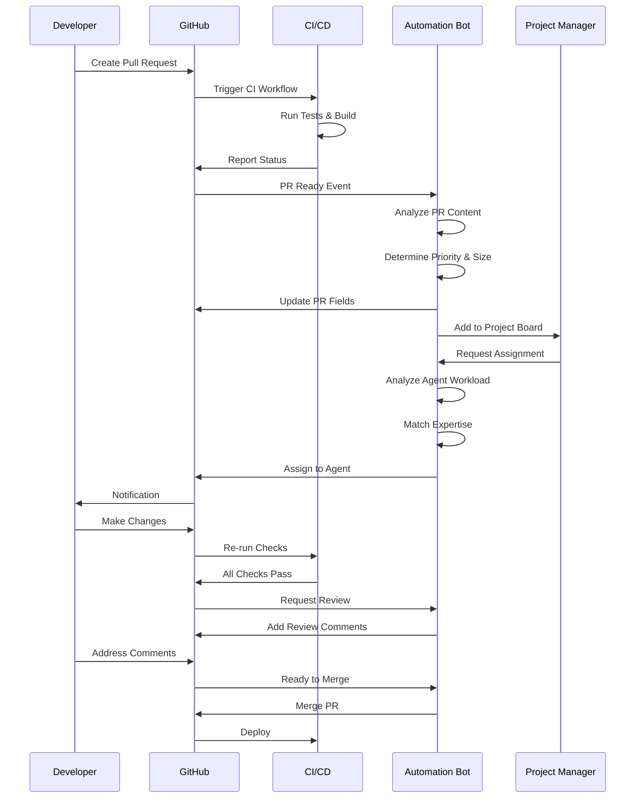

---

### Multi-Agent Coordination

<Mermaid chart={`graph TB
    A[Agent Coordinator] --> B[Check Work Queue]
    B --> C{Issues Available?}
    
    C -->|Yes| D[Load Agent Config]
    C -->|No| E[Wait]
    
    D --> F[Agent 1: Frontend]
    D --> G[Agent 2: Backend]
    D --> H[Agent 3: Infrastructure]
    
    F --> I{Agent 1 Free?}
    G --> J{Agent 2 Free?}
    H --> K{Agent 3 Free?}
    
    I -->|Yes| L[Assign Frontend Issue]
    J -->|Yes| M[Assign Backend Issue]
    K -->|Yes| N[Assign Infra Issue]
    
    L --> O[Create Worktree 1]
    M --> P[Create Worktree 2]
    N --> Q[Create Worktree 3]
    
    O --> R[Parallel Development]
    P --> R
    Q --> R
    
    R --> S[Conflict Check]
    S --> T{Conflicts?}
    
    T -->|Yes| U[Coordinate Resolution]
    T -->|No| V[Create PRs]
    
    U --> V
    V --> W[Merge Queue]
    
    style A fill:#e1f5ff
    style B fill:#fff4e1
    style D fill:#ffe1e1
    style F fill:#e1ffe1
    style G fill:#e1ffe1
    style H fill:#e1ffe1
    style L fill:#f0e1ff
    style M fill:#f0e1ff
    style N fill:#f0e1ff
    style O fill:#fff4e1
    style P fill:#fff4e1
    style Q fill:#fff4e1
    style R fill:#e1ffe1
    style S fill:#ffe1e1
    style U fill:#fff4e1
    style V fill:#e1f5ff
    style W fill:#e1ffe1`} />

---

## System Architecture

### Application Architecture

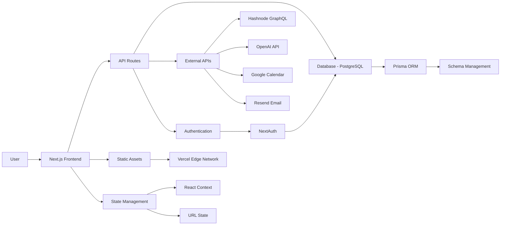

---

### Monorepo Structure

```mermaid
graph TD
    A[Portfolio OS Root] --> B[apps/]
    A --> C[packages/]
    A --> D[scripts/]
    
    B --> E[site]
    B --> F[dashboard]
    B --> G[docs]
    
    C --> H[@mindware-blog/ui]
    C --> I[@mindware-blog/lib]
    C --> J[@mindware-blog/db]
    C --> K[@mindware-blog/hashnode]
    
    D --> L[agent-management/]
    D --> M[pr-management/]
    D --> N[issue-management/]
    
    E --> O[Depends on packages]
    F --> O
    G --> O
    
    O --> H
    O --> I
    O --> J
    O --> K
```

---

## Development Workflows

### Feature Development Flow

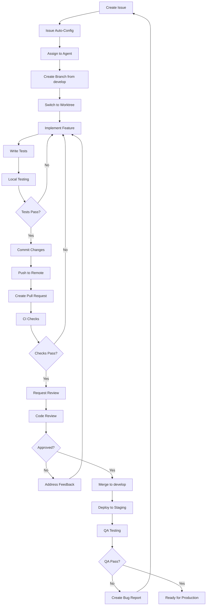

---

### Hotfix Workflow

```mermaid
graph LR
    A[Critical Bug Found] --> B[Create Hotfix Branch from main]
    B --> C[Implement Fix]
    C --> D[Write Test]
    D --> E[Local Verify]
    
    E --> F[Create Hotfix PR]
    F --> G[Fast-Track Review]
    G --> H[Merge to main]
    
    H --> I[Deploy to Production]
    I --> J[Verify Fix]
    J --> K[Backport to develop]
    K --> L[Close Issue]
```

---

## Testing Workflows

### Testing Pipeline

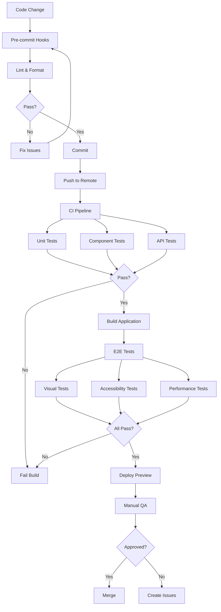

---

### Test Execution Flow

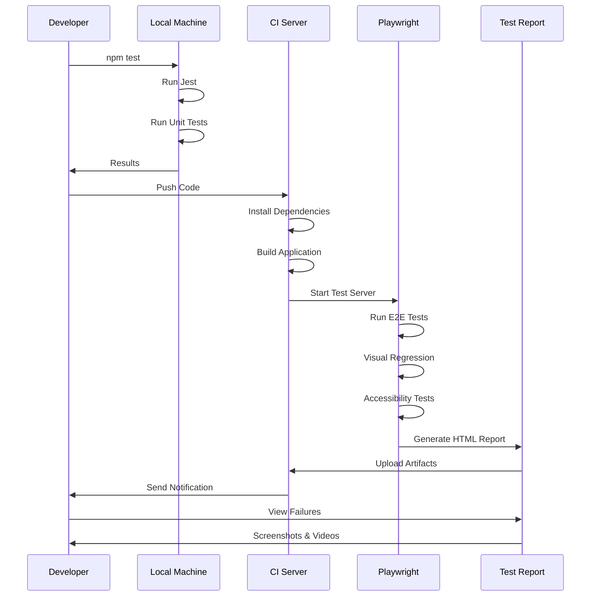

---

## Data Flow Diagrams

### Blog Post Rendering

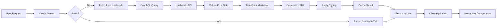

---

### Authentication Flow

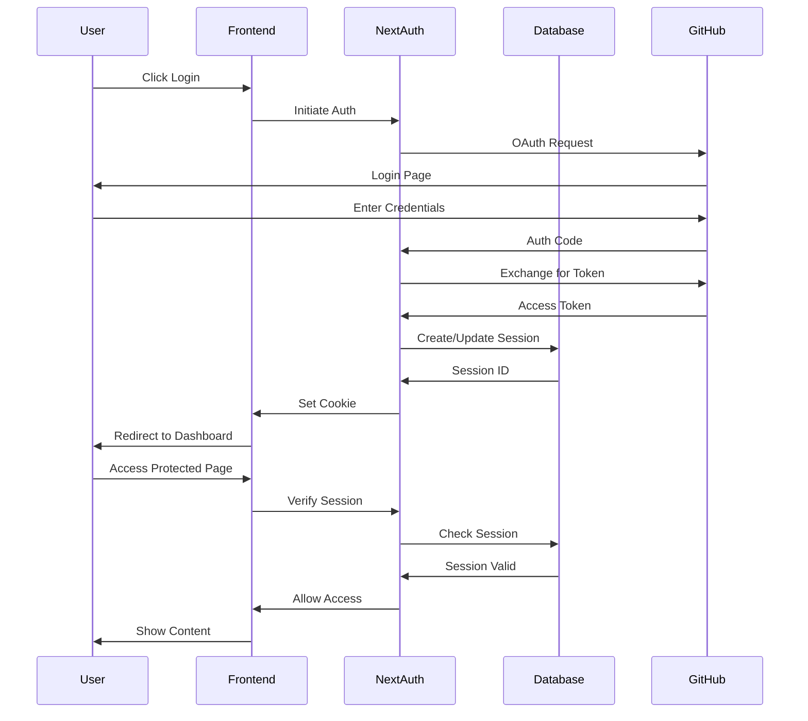

---

## Performance Optimization

### Image Optimization Pipeline

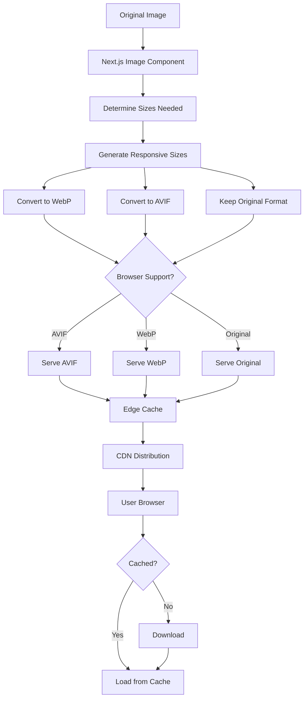

---

### Build Cache Strategy

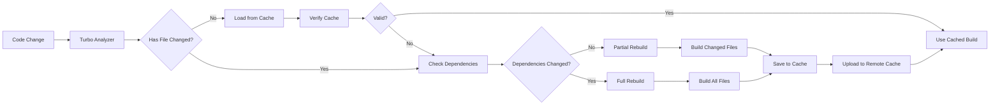

---

## Monitoring & Alerts

### Alert Management Flow

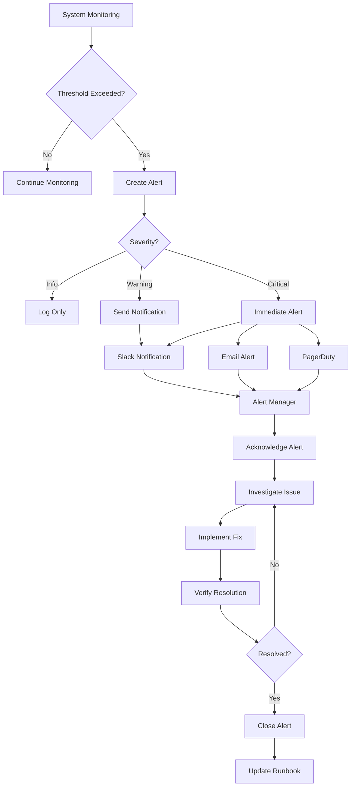

---

### Performance Monitoring

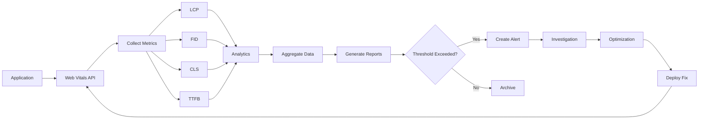

---

## Additional Resources

<CardGrid>
  <Card title="CI/CD Reference" icon="git-pull-request" href="/docs/scripts-reference/ci-cd">
    Complete CI/CD workflows and GitHub Actions documentation
  </Card>
  <Card title="Multi-Agent Architecture" icon="users" href="/docs/multi-agent/architecture">
    Deep dive into the multi-agent development system
  </Card>
  <Card title="Testing Guide" icon="check-circle" href="/docs/testing">
    Comprehensive testing infrastructure documentation
  </Card>
  <Card title="Configuration Reference" icon="settings" href="/docs/reference/configuration">
    Environment variables and configuration options
  </Card>
</CardGrid>

### External Resources

<Note type="info" title="Additional Learning">
Explore these external resources to learn more about the technologies and tools used in these workflows.
</Note>

- **[Mermaid Documentation](https://mermaid.js.org/)** - Learn how to create and customize diagrams
- **[GitHub Actions Workflow Syntax](https://docs.github.com/en/actions/reference/workflow-syntax-for-github-actions)** - Master GitHub Actions workflows
- **[Next.js Deployment](https://nextjs.org/docs/deployment)** - Best practices for deploying Next.js applications

---

<Note type="success" title="Interactive Diagrams">
These diagrams are interactive in supported viewers. Hover over elements for details, and click to zoom and explore different sections of the workflows.
</Note>
