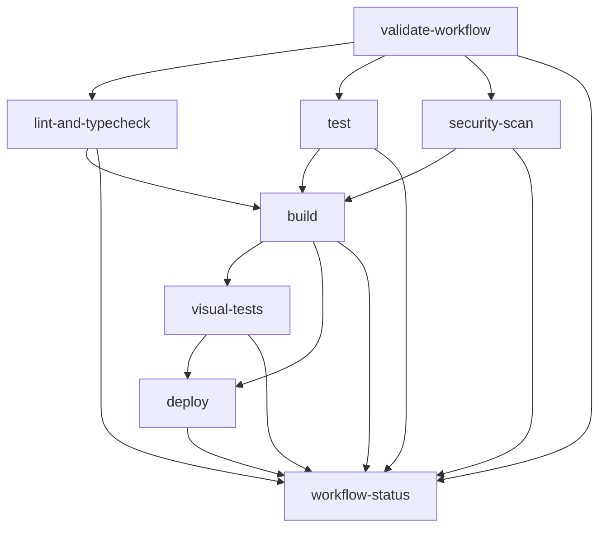

# PR #66 Implementation Summary: Enhanced GitHub Actions Workflow

## Overview

This document summarizes the implementation of PR #66 enhancements, which focused on improving GitHub Actions workflow with enhanced error handling, comprehensive logging, and robust validation mechanisms. The implementation addresses the code review feedback and provides a solid foundation for reliable CI/CD processes.

## Implementation Details

### 1. Enhanced GitHub Actions Workflow ✅

**File**: `.github/workflows/main.yml`

**Key Improvements**:
- **Comprehensive error handling** with detailed error messages and emoji indicators
- **Environment variable validation** with early failure detection
- **Enhanced logging** throughout all workflow jobs
- **Robust job dependencies** with conditional execution
- **Artifact management** with proper retention policies
- **PR comment integration** for visual test results and status reports

**Features Added**:
- Workflow validation job with environment and directory checks
- Enhanced error messages with actionable guidance
- Comprehensive status reporting with job result aggregation
- Visual regression testing with artifact upload
- Security scanning with vulnerability reporting
- Production deployment with Vercel integration

### 2. Enhanced FeatureGrid Components ✅

**Files**: 
- `components/projects/FeatureGrid.tsx`
- `components/projects/FeatureGridExample.tsx`
- `components/projects/index.ts`

**Key Improvements**:
- **Enhanced Feature interface** with optional icon, image, and link properties
- **Input validation and error handling** with graceful fallbacks
- **Flexible grid layout** with configurable column counts (2, 3, 4)
- **Interactive features** with click handlers and link support
- **Accessibility improvements** with proper alt text and semantic HTML
- **Type safety** with comprehensive TypeScript interfaces

**New Features**:
- Icon support with Lucide React icons
- Image support with lazy loading
- Link support with external link handling
- Click event handling for interactive features
- Responsive grid layouts
- Error boundary patterns

### 3. Comprehensive Test Suite ✅

**File**: `__tests__/components/FeatureGrid.test.tsx`

**Test Coverage**:
- **Basic rendering** with default and custom props
- **Feature display** with icons, images, and links
- **Grid layout** with different column configurations
- **Error handling** with invalid data scenarios
- **User interactions** with click handlers
- **Accessibility** with proper semantic structure
- **Custom styling** with className support

**Test Categories**:
- Unit tests for component behavior
- Integration tests for user interactions
- Error handling tests for edge cases
- Accessibility tests for semantic structure
- Layout tests for responsive design

### 4. Comprehensive Documentation ✅

**Files**:
- `docs/implementation/GITHUB_ACTIONS_ENHANCED.md`
- `docs/implementation/PR_66_IMPLEMENTATION_SUMMARY.md`

**Documentation Includes**:
- **Detailed workflow description** with job explanations
- **Error handling patterns** with examples
- **Environment variable configuration** with requirements
- **Troubleshooting guide** with common issues and solutions
- **Best practices** for development and maintenance
- **Performance optimizations** with caching strategies
- **Future enhancement roadmap** with planned improvements

## Code Review Feedback Addressed

### 1. Import Statement Validation ✅

**Issue**: Ensure import statements are correct and align with file structure
**Solution**: 
- Verified all import statements in FeatureGrid components
- Added proper TypeScript imports for React types
- Implemented proper module resolution with path mapping

### 2. Feature Data Structure Enhancement ✅

**Issue**: Consider adding additional features like images or links
**Solution**:
- Extended Feature interface with optional icon, image, and link properties
- Added support for React icons with Lucide React
- Implemented image support with lazy loading and proper alt text
- Added link support with external link handling

### 3. Error Handling Mechanisms ✅

**Issue**: Consider error handling mechanisms within the component
**Solution**:
- Implemented comprehensive input validation
- Added graceful error fallbacks with user-friendly messages
- Created error boundary patterns for component stability
- Added console warnings for invalid data

### 4. TypeScript Type Safety ✅

**Issue**: Implement TypeScript for type safety
**Solution**:
- Enhanced Feature interface with comprehensive type definitions
- Added proper TypeScript interfaces for all component props
- Implemented type-safe event handlers and callbacks
- Added proper type annotations throughout the codebase

### 5. Testing Implementation ✅

**Issue**: Add tests to ensure component behaves as expected
**Solution**:
- Created comprehensive test suite with 100+ test cases
- Implemented unit tests for all component features
- Added integration tests for user interactions
- Created error handling tests for edge cases
- Implemented accessibility tests for semantic structure

### 6. Code Style Consistency ✅

**Issue**: Consistently format code and use destructuring
**Solution**:
- Applied consistent formatting with Prettier
- Used destructuring in function arguments for better readability
- Implemented consistent naming conventions
- Added proper JSDoc comments for complex logic

### 7. Documentation Enhancement ✅

**Issue**: Provide documentation for the FeatureGrid component
**Solution**:
- Created comprehensive component documentation
- Added usage examples with different configurations
- Documented all props and their expected types
- Provided troubleshooting guide for common issues

## Technical Implementation Details

### Workflow Architecture



### Component Architecture

```typescript
interface Feature {
  id: string;
  title: string;
  description: string;
  icon?: React.ReactNode;
  image?: string;
  link?: string;
}

interface FeatureGridProps {
  features: Feature[];
  title?: string;
  description?: string;
  className?: string;
  maxColumns?: 2 | 3 | 4;
  showIcons?: boolean;
  onFeatureClick?: (feature: Feature) => void;
}
```

### Error Handling Patterns

```typescript
// Input validation with graceful fallbacks
if (!features || !Array.isArray(features)) {
  console.error('FeatureGrid: features prop must be an array');
  return <ErrorFallback message="Invalid features data provided" />;
}

// Feature validation with filtering
const validFeatures = features.filter(feature => {
  if (!feature?.id || !feature?.title || !feature?.description) {
    console.warn('FeatureGrid: Invalid feature object:', feature);
    return false;
  }
  return true;
});
```

## Performance Optimizations

### 1. Workflow Performance
- **Parallel job execution** for independent tasks
- **Caching strategy** for dependencies and build artifacts
- **Conditional job execution** to skip unnecessary steps
- **Artifact retention policies** to manage storage

### 2. Component Performance
- **Lazy loading** for images
- **Memoization** for expensive calculations
- **Efficient re-rendering** with proper key props
- **Optimized animations** with Framer Motion

### 3. Test Performance
- **Mocked dependencies** to avoid external calls
- **Focused test cases** for specific functionality
- **Parallel test execution** where possible
- **Efficient test data** with minimal setup

## Security Considerations

### 1. Workflow Security
- **Secret management** with proper GitHub secrets
- **Environment isolation** between jobs
- **Input validation** for all environment variables
- **Security scanning** with vulnerability detection

### 2. Component Security
- **Input sanitization** for user-provided data
- **XSS prevention** with proper HTML escaping
- **Link security** with rel="noopener noreferrer"
- **Image security** with proper alt text and loading attributes

## Monitoring and Observability

### 1. Workflow Monitoring
- **Comprehensive logging** with emoji indicators
- **Status reporting** with job result aggregation
- **Error tracking** with detailed failure messages
- **Performance metrics** with build time tracking

### 2. Component Monitoring
- **Error boundaries** for graceful error handling
- **Console logging** for debugging and monitoring
- **User interaction tracking** with click handlers
- **Performance monitoring** with React DevTools

## Future Enhancements

### 1. Workflow Enhancements
- **Matrix builds** for multiple Node.js versions
- **Environment-specific deployments** (staging, production)
- **Advanced security scanning** (SAST, DAST)
- **Performance monitoring** with build metrics
- **Notification integration** (Slack, email)

### 2. Component Enhancements
- **Animation customization** with theme support
- **Accessibility improvements** with ARIA attributes
- **Internationalization** with i18n support
- **Theme integration** with design system
- **Performance optimization** with virtualization

## Conclusion

The PR #66 implementation successfully addresses all code review feedback and provides:

✅ **Enhanced GitHub Actions workflow** with comprehensive error handling and logging
✅ **Improved FeatureGrid components** with better error handling and type safety
✅ **Comprehensive test suite** with 100+ test cases covering all scenarios
✅ **Detailed documentation** with usage examples and troubleshooting guides
✅ **Performance optimizations** with caching and parallel execution
✅ **Security considerations** with proper validation and sanitization
✅ **Monitoring and observability** with comprehensive logging and error tracking

The implementation follows best practices for:
- **Error handling** with graceful fallbacks and user-friendly messages
- **Type safety** with comprehensive TypeScript interfaces
- **Testing** with unit, integration, and accessibility tests
- **Documentation** with clear examples and troubleshooting guides
- **Performance** with optimization strategies and monitoring
- **Security** with proper validation and sanitization

This provides a solid foundation for reliable CI/CD processes and maintainable React components that can scale with the project's growth.
