## 1. Executive summary

IntraWeb needed an **operating platform** for how the company sells, delivers, and maintains client work—not another generic project tracker. **IntraWeb Nexus** combines:

- A public marketing/conversion site (`iw-site-q2`)
- An authenticated **client portal** and **staff admin OS** (`iw-portal`)
- A curated **n8n** workflow package versioned in the same monorepo

**Production core is live.** Several automation paths and newer slices (notably Social Ops) are **partial or experimental**. This case study follows the implementation, not aspirational marketing.

---

## 2. Context

Growing operators and the firms that serve them fail the same way: systems that do not talk, handoffs that break, and delivery that lives in email. For IntraWeb specifically:

- Prospect interest stopped at forms and calendars
- Client status was hard to see and harder to govern
- Approvals, documents, invoices, and change requests required manual chase
- Staff work was reactive without a single command surface

The gap was **operational infrastructure**—connections between how work is sold, delivered, and billed.

---

## 3. Requirements (inferred from what shipped)

Labeled as **inferred** from routes, schema, and workflows:

1. Clients need one authenticated home for progress, documents, messaging, and billing
2. Staff need RBAC-aware oversight of clients, projects, change orders, and integration health
3. CRM and payments must update portal state without spreadsheet re-keying
4. Automations must be reviewable in git, not only in a vendor UI
5. Privacy/deletion request paths must exist for public-site compliance flows
6. Roadmap features must not be presented as finished

---

## 4. System architecture

```mermaid
flowchart LR
  subgraph surfaces [Surfaces]
    M[Marketing iw-site-q2]
    P[Portal iw-portal]
  end
  subgraph core [Platform core]
    Clerk[Clerk]
    DB[(Supabase Postgres)]
    Stripe[Stripe]
    HS[HubSpot]
    N8N[n8n]
    Mail[Resend]
  end
  M --> HS
  M --> N8N
  P --> Clerk
  P --> DB
  P --> Stripe
  P --> HS
  P --> N8N
  P --> Mail
  N8N --> P
  N8N --> HS
  N8N --> DB
```

| Layer | Choice | Why it fits |
| --- | --- | --- |
| Apps | Next.js App Router (portal + marketing) | Colocate UI and APIs; dual Vercel deploy for blast-radius isolation |
| Auth | Clerk (+ satellite domains) | Hosted auth across accounts/portal/dashboard hosts |
| Data | Supabase Postgres + Storage | Multi-client schema, private uploads, Realtime messages |
| Payments | Stripe | Checkout, customer portal, subscriptions, webhooks |
| CRM | HubSpot | Commercial spine; mirrored into portal/OS tables |
| Orchestration | n8n | Long waits, AI document generation, multi-system glue |
| Email | Resend | Transactional mail from app and workflows |
| Monorepo | pnpm + Turborepo | Shared standards; workflow JSON beside apps |

### Portal capabilities (Implemented)

Client: dashboard, progress/approvals, documents (upload/download/sign), messaging, billing, change orders, notifications, help.  
Staff: operations queue, clients/projects, billing view, change-order review, integrations console, data health, OS command center, role settings.

### Explicitly not oversold

| Item | Status |
| --- | --- |
| Social Ops review + outbox | Experimental |
| Client member invites UX | Partially Implemented (schema ahead of product) |
| Feature flags driving behavior | Experimental (persisted, unused) |
| Every portal→n8n outbound event | Many paths have **no curated receiver** |
| Scope page as live SOW | Static plan summaries |

---

## 5. Workflow architecture

Curated workflows live under `packages/n8n-workflows` with operator lifecycle in `RUNBOOK.md` (pull → review drift → sync by id → push one file).

Categories in use: lead generation, outreach, sales, onboarding, client success, content, reporting, command center, documentation, plus shared subworkflows (Claude, HubSpot, PDF, Resend, SMS, Google Chat, logging).

### Representative deep dives

**Website Form Lead Intake (Implemented)** — Webhook normalizes marketing/HubSpot form leads, upserts CRM records, logs to Supabase, sends acknowledgment mail. Does not provision portal access by itself.

**Qualified to Buy → Portal + Clerk (Partially Implemented)** — HubSpot stage webhook provisions portal client/project via `POST /api/webhook/n8n` (`provision_client`, `add_invoice`) and drives Clerk linking. Curated vs live graph drift must be reconciled before treating as fully reliable.

**Proposal and Contract Delivery (Partially Implemented)** — AI + PDF generation, Drive/Supabase queue, portal `attach_project_document`, email/HubSpot follow-up. Human review remains in portal/OS queues. Material curated/synced drift is a maintenance risk.

**Data Deletion Handler (Partially Implemented)** — Confirmed deletion webhook calls portal privacy execution. Empty workflow id and proxy/auth edge cases keep this below “done.”

---

## 6. Engineering decisions and trade-offs

| Decision | Trade-off |
| --- | --- |
| n8n for orchestration | Faster multi-system flows and waits; requires credential hygiene, drift control, and explicit receivers |
| Portal as system of record | Clear client UX; automations must not silently diverge |
| Dual Vercel apps | Safer releases; duplicated env discipline |
| Service-role server client | Simpler trusted writes; RLS not the real enforcement on server paths—filters must be perfect |
| Shared webhook secret for HubSpot→portal | Simpler than native HubSpot signatures; weaker authenticity guarantees |
| In-repo workflow JSON | Reviewable automation; sync discipline mandatory |

---

## 7. Testing and quality

- Portal unit tests cover provisioning idempotency helpers, privacy classification, and social-ops lifecycle pieces
- Typecheck/lint/build gates exist in monorepo CI posture
- **Gaps:** limited route-auth, RLS, Stripe/HubSpot E2E, and UI coverage; n8n lacks automated graph tests in CI

Quality is strongest where commercial webhooks and schema migrations are explicit; weakest where outbound events lack receivers and where admin “replay” is status-only.

---

## 8. Security and reliability

**Controls present:** Clerk sessions, Stripe signature verification, Clerk Svix webhooks, staff RBAC + audit log for many mutations, private document storage, shared-secret portal↔n8n boundary, integration event logging.

**Limitations called out in audit (not hidden):** staff allowlist bootstrap edge case; social-ops `SECURITY DEFINER` grant hygiene; Clerk proxy vs some internal machine routes; multi-project write targeting oldest project; committed Chat webhook material in some workflow JSON; invoice→portal secret header defect; PII-rich payloads in integration logs.

Credibility here means naming the risks and fixing them in priority order—not claiming a perfect boundary.

---

## 9. Outcomes (engineering, not invented ROI)

- Reduced reliance on spreadsheet handoffs for core delivery artifacts
- Centralized client-visible progress, documents, messaging, and billing
- Standardized provisioning and document-attach patterns through versioned workflows
- Staff visibility into failed integrations and operational queues
- Clear separation between portal product logic and n8n orchestration

No fabricated time-saved percentages, revenue lifts, or customer counts.

---

## 10. Lessons learned

1. **Emit ≠ automate** — portal outbound webhooks without curated receivers fail quietly.
2. **Schema ≠ product** — membership/invite tables without UX create false confidence.
3. **Drift is a release risk** — curated JSON and live n8n must have an authority rule before sync.
4. **Status vocabulary is a feature** — Implemented / Partial / Experimental keeps portfolio and ops docs aligned.
5. **Service role demands discipline** — tenancy bugs become cross-tenant bugs when RLS is bypassed.

---

## 11. Current maturity and next steps

**Production-ready:** client portal core, staff admin core, Stripe/HubSpot/Clerk webhook paths, marketing conversion site.

**Harden next:** portal outbound receivers, add-invoice secret header, Chat secret rotation, staff allowlist enforcement, multi-project write consistency, privacy route proxy alignment.

**Experimental / later:** Social Ops publish loop, portal AI assistant, full multi-member client console.

---

## 12. Links

- Marketing site: [https://intrawebtech.com](https://intrawebtech.com)
- Project page: [/projects/intraweb](/projects/intraweb)
- Authenticated portal and admin require credentials; demos by arrangement

*Derived from the Nexus monorepo implementation and 2026-07-30 audit. Secrets, private repos, and internal runbook specifics omitted.*
