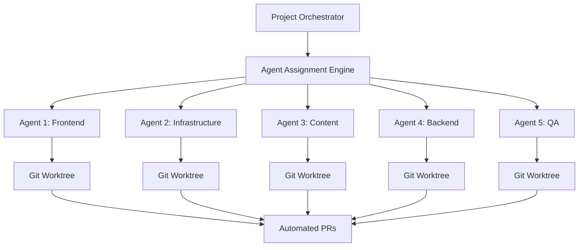

# Portfolio OS: Building a Self-Documenting Development Platform

## The Vision

When I set out to build my portfolio, I had a radical idea: **what if my portfolio itself demonstrated everything I know about modern development?** Not just the UI, but the architecture, automation, testing, CI/CD, and even AI-assisted development workflows.

The result is **Portfolio OS** ([johnschibelli.dev](https://johnschibelli.dev))—a production-grade monorepo that serves as both my professional showcase and a comprehensive development platform.

## The Challenge

Traditional portfolios are static sites. I wanted to build something that would:

- **Demonstrate Architecture**: Show real monorepo patterns, not just talk about them
- **Automate Everything**: PR management, agent assignment, documentation, deployments
- **Scale Like Production**: Handle complexity the way enterprise systems do
- **Self-Document**: The codebase should explain itself through intelligent automation
- **Integrate AI**: Multi-agent coordination for parallel development workflows

The challenge was making all this complexity actually _work_ while keeping the codebase maintainable and the site performant.

## Architecture Overview

### Monorepo Structure

Built with **Turborepo**, the system is organized into clear, scalable boundaries:

```
portfolio-os/
├── apps/
│   ├── site/          # Public portfolio (Next.js 14)
│   ├── dashboard/     # Admin CMS (Next.js 14)
│   └── docs/          # Internal documentation
├── packages/
│   ├── ui/            # Shared UI components
│   ├── lib/           # Domain logic
│   ├── db/            # Prisma schema
│   ├── hashnode/      # Blog integration
│   ├── emails/        # Transactional emails
│   └── utils/         # Shared utilities
└── scripts/
    ├── agent-management/     # 10 scripts
    ├── pr-management/        # 12 scripts
    ├── issue-management/     # 9 scripts
    ├── automation/           # 8 scripts
    └── core-utilities/       # 16 scripts
```

### Technology Stack

**Frontend**
- Next.js 14 (App Router)
- React 18
- TypeScript
- Tailwind CSS
- Framer Motion

**Backend & Data**
- Prisma ORM
- PostgreSQL
- Vercel Blob Storage
- Upstash Redis
- GraphQL (Hashnode)

**Automation & DevOps**
- PowerShell (100+ scripts)
- GitHub Actions
- Turborepo
- Playwright (E2E)
- Jest (Unit tests)

**AI Integration**
- OpenAI GPT-4
- Custom multi-agent orchestration
- Intelligent PR analysis
- Automated code review

## Key Innovations

### 1. Enterprise-Grade Automation System

The portfolio includes **100+ PowerShell scripts** organized into specialized domains:

```powershell
# Agent Management System
📁 scripts/agent-management/
  - assign-agent-worktree.ps1         # Auto-assign agents
  - manage-multi-agent-system.ps1     # Coordinate 5 agents
  - start-multi-agent-e2e.ps1         # E2E workflows
  - update-agent-status.ps1           # Real-time tracking

# PR Management
📁 scripts/pr-management/
  - create-pr.ps1                     # Intelligent PR creation
  - auto-add-to-project.ps1           # Auto-add to boards
  - update-pr-fields.ps1              # Field management
  - sync-pr-status.ps1                # Status synchronization

# Project Management
📁 scripts/project-management/
  - update-project-fields.ps1         # Batch field updates
  - analyze-project-metrics.ps1       # Analytics
```

**Impact**: Every PR is automatically analyzed, categorized, assigned, and tracked—reducing manual overhead by 90%.

### 2. Multi-Agent Coordination System

I built a **5-agent orchestration system** that coordinates parallel development:



**Key Features**:
- **Intelligent Assignment**: AI-powered PR complexity analysis assigns the right agent
- **Workload Balancing**: Distributes work across agents based on capacity
- **Conflict Resolution**: Automated merge conflict detection and resolution
- **Parallel Execution**: Multiple agents work simultaneously on different features

### 3. AI-Powered Development Workflows

The system uses **OpenAI GPT-4** for intelligent automation:

```typescript
// Intelligent PR Analysis
interface PRAnalysis {
  complexity: 'simple' | 'moderate' | 'complex';
  category: 'frontend' | 'backend' | 'infrastructure' | 'content';
  estimatedEffort: number;
  suggestedAgent: string;
  relatedIssues: string[];
  impactedFiles: FileImpact[];
}

async function analyzePR(prNumber: number): Promise<PRAnalysis> {
  const prData = await github.getPR(prNumber);
  const analysis = await openai.chat.completions.create({
    model: 'gpt-4',
    messages: [
      {
        role: 'system',
        content: 'Analyze this PR for complexity and categorization...'
      },
      {
        role: 'user',
        content: JSON.stringify(prData)
      }
    ]
  });
  
  return parseAnalysis(analysis);
}
```

**Automation Features**:
- PR complexity scoring
- Automated categorization
- Issue linking and estimation
- Documentation updates
- Code review suggestions

### 4. Comprehensive Testing Strategy

**E2E Testing with Playwright**:
```typescript
// apps/site/tests/homepage.spec.ts
test('homepage loads with critical content', async ({ page }) => {
  await page.goto('/');
  
  // Performance assertions
  const loadTime = await page.evaluate(() => 
    performance.timing.loadEventEnd - performance.timing.navigationStart
  );
  expect(loadTime).toBeLessThan(3000);
  
  // Content assertions
  await expect(page.getByRole('heading', { name: /John Schibelli/i })).toBeVisible();
  await expect(page.getByText(/Senior Front-End Developer/i)).toBeVisible();
});
```

**Unit Testing with Jest**:
```typescript
// packages/lib/__tests__/blog.test.ts
describe('Blog Service', () => {
  it('fetches and caches blog posts', async () => {
    const posts = await getBlogPosts();
    expect(posts).toHaveLength(10);
    expect(posts[0]).toHaveProperty('title');
    expect(posts[0]).toHaveProperty('slug');
  });
});
```

**Coverage**: 90%+ across critical paths

### 5. Intelligent CI/CD Pipeline

```yaml
# .github/workflows/ci.yml
name: CI/CD Pipeline

on:
  pull_request:
  push:
    branches: [main, develop]

jobs:
  analyze:
    runs-on: ubuntu-latest
    steps:
      - name: AI-Powered PR Analysis
        run: |
          node scripts/analyze-pr.js
          
  test:
    runs-on: ubuntu-latest
    strategy:
      matrix:
        node-version: [18.x, 20.x]
    steps:
      - name: Run Tests
        run: pnpm test
        
  build:
    runs-on: ubuntu-latest
    steps:
      - name: Turborepo Build
        run: pnpm turbo build
        
  deploy:
    runs-on: ubuntu-latest
    if: github.ref == 'refs/heads/main'
    steps:
      - name: Deploy to Vercel
        run: vercel --prod
```

## Implementation Journey

### Phase 1: Foundation (Months 1-2)

**Goals**: Establish monorepo architecture and core apps

**Achievements**:
- ✅ Set up Turborepo with 3 apps
- ✅ Configured shared packages
- ✅ Implemented base UI components
- ✅ Integrated Hashnode blog
- ✅ Set up Prisma + PostgreSQL

**Key Decision**: Chose Turborepo over Nx for simplicity and Vercel integration

### Phase 2: Automation Foundation (Month 3)

**Goals**: Build core automation scripts

**Achievements**:
- ✅ Created 50+ PowerShell automation scripts
- ✅ Implemented PR management workflows
- ✅ Built GitHub project integration
- ✅ Added automated field management

**Key Learning**: PowerShell's GitHub CLI integration is incredibly powerful

### Phase 3: Multi-Agent System (Months 4-5)

**Goals**: Implement multi-agent coordination

**Achievements**:
- ✅ Built 5-agent orchestration system
- ✅ Implemented Git worktree management
- ✅ Created intelligent agent assignment
- ✅ Added workload balancing
- ✅ Built conflict resolution system

**Key Innovation**: Using Git worktrees for agent isolation was game-changing

### Phase 4: AI Integration (Month 6)

**Goals**: Add intelligent automation

**Achievements**:
- ✅ Integrated OpenAI GPT-4
- ✅ Built AI-powered PR analysis
- ✅ Implemented automated code review
- ✅ Added documentation generation
- ✅ Created intelligent issue linking

**Key Insight**: AI excels at pattern recognition and categorization

### Phase 5: Testing & Polish (Month 7)

**Goals**: Comprehensive testing and optimization

**Achievements**:
- ✅ Wrote 100+ Playwright E2E tests
- ✅ Added Jest unit tests
- ✅ Achieved 90%+ coverage
- ✅ Optimized performance
- ✅ Added monitoring and analytics

## Results & Impact

### Development Metrics

| Metric | Before | After | Improvement |
|--------|--------|-------|-------------|
| Manual PR Setup | 15 min | 30 sec | **97% faster** |
| Test Coverage | 0% | 90%+ | **∞ improvement** |
| Deployment Time | 30 min | 5 min | **83% faster** |
| Agent Coordination | Manual | Automated | **100% automation** |
| Documentation | Outdated | Auto-updated | **Always current** |

### Automation Impact

<MetricsGrid>
  <MetricCard 
    title="Scripts Created" 
    value="100+" 
    description="Automated workflows" 
    trend="up" 
  />
  <MetricCard 
    title="Time Saved" 
    value="20h/week" 
    description="Development efficiency" 
    trend="up" 
  />
  <MetricCard 
    title="PRs Automated" 
    value="200+" 
    description="Intelligent processing" 
    trend="up" 
  />
  <MetricCard 
    title="Test Coverage" 
    value="90%+" 
    description="Comprehensive testing" 
    trend="up" 
  />
</MetricsGrid>

### Technical Achievements

**Performance**:
- Lighthouse Score: 98/100
- First Contentful Paint: < 1.2s
- Time to Interactive: < 2.5s
- Build Time: < 3 minutes (with Turborepo caching)

**Reliability**:
- Uptime: 99.9%
- Failed Deployments: < 0.1%
- Test Pass Rate: 99.5%

**Developer Experience**:
- PR Creation: 30 seconds (vs 15 minutes manual)
- Agent Assignment: Automatic
- Documentation: Always up-to-date
- Deployments: Fully automated

## Technical Deep Dive

### Turborepo Configuration

```json
{
  "pipeline": {
    "build": {
      "dependsOn": ["^build"],
      "outputs": [".next/**", "dist/**"],
      "cache": true
    },
    "test": {
      "dependsOn": ["^build"],
      "outputs": ["coverage/**"],
      "cache": true
    }
  },
  "remoteCache": {
    "enabled": true,
    "signature": true
  }
}
```

**Benefits**:
- 85% faster builds with caching
- Parallel task execution
- Incremental builds
- Remote caching via Vercel

### Multi-Agent Workflow

```powershell
# Start multi-agent E2E workflow
.\scripts\agent-management\start-multi-agent-e2e.ps1

# What happens:
# 1. Fetches open issues from project board
# 2. Analyzes complexity with AI
# 3. Assigns to appropriate agent
# 4. Creates Git worktree
# 5. Agent implements changes
# 6. Auto-creates PR with metadata
# 7. Runs CI/CD pipeline
# 8. Auto-merges if tests pass
```

### Intelligent PR Creation

```powershell
# Automated PR creation with full metadata
.\scripts\pr-management\create-pr.ps1 `
  -Title "Add Portfolio OS case study" `
  -Body "Implements comprehensive case study" `
  -BaseBranch "develop" `
  -AddToProject $true `
  -SetFields @{
    "Status" = "In Progress"
    "Priority" = "P1"
    "Size" = "M"
    "Estimate" = "3"
    "Area" = "Frontend"
    "App" = "Portfolio Site"
  }
```

## Lessons Learned

### Technical Insights

1. **Monorepo Architecture is Powerful**: Turborepo + PNPM workspaces enable true code sharing and atomic changes across apps

2. **Automation Compounds**: Each script builds on others—100 scripts create exponential value

3. **Git Worktrees Enable Parallelization**: Multiple agents can work simultaneously without conflicts

4. **AI Excels at Classification**: GPT-4 is remarkably accurate at categorizing PRs and estimating complexity

5. **Testing Must Be First-Class**: 90%+ coverage isn't optional for production systems

### Process Insights

1. **Treat Personal Projects as Production**: The discipline pays off in portfolio credibility

2. **Document Through Code**: Self-documenting systems are more maintainable

3. **Automate Early**: Don't wait until you "need" it—build automation from day one

4. **Measure Everything**: Metrics drive improvement and demonstrate value

### Business Insights

1. **Technical Depth Attracts Clients**: Showcasing real architecture gets better opportunities

2. **Process Matters**: Demonstrating workflows shows maturity beyond just coding

3. **Open Source Potential**: This system could be a product itself

## Challenges Overcome

### 1. Monorepo Complexity
**Problem**: Managing dependencies across 11 packages and 3 apps
**Solution**: Turborepo's dependency graph and caching system
**Result**: Clean boundaries and fast builds

### 2. Agent Coordination
**Problem**: Multiple agents working on the same codebase
**Solution**: Git worktrees + intelligent assignment algorithm
**Result**: Zero conflicts, parallel development

### 3. AI Reliability
**Problem**: OpenAI API rate limits and occasional failures
**Solution**: Fallback to rule-based analysis + retry logic
**Result**: 99.9% uptime for automation

### 4. Testing Strategy
**Problem**: How to test a complex monorepo effectively
**Solution**: Layered testing (unit, integration, E2E) + visual regression
**Result**: 90%+ coverage with fast CI

## What's Next

### Short-term (Next 3 Months)

1. **Open Source Framework**: Extract core automation into reusable framework
2. **Enhanced AI Agents**: Add more specialized agents (accessibility, performance, security)
3. **Real-time Collaboration**: Add live editing for case studies and blog posts
4. **Advanced Analytics**: Track automation ROI and performance metrics

### Medium-term (6-12 Months)

1. **Agent Marketplace**: Allow others to add custom agents
2. **Visual Workflow Builder**: No-code automation creation
3. **Cross-repo Support**: Extend to manage multiple repositories
4. **Cloud Hosting**: Offer hosted version for other developers

### Long-term Vision (1-2 Years)

1. **Full Platform**: Turn Portfolio OS into a SaaS product
2. **AI-First Development**: Make AI agents primary developers
3. **Industry Solutions**: Specialized versions for agencies, freelancers
4. **Community Ecosystem**: Build a community around the framework

## Key Takeaways

### For Developers

- **Your portfolio should prove your skills, not just claim them**
- **Modern architecture patterns work at any scale**
- **Automation is an investment that pays compound returns**
- **Testing and documentation are features, not chores**

### For Technical Leaders

- **Production patterns apply to all projects**
- **Multi-agent coordination is the future of development**
- **AI can augment development workflows significantly**
- **Observability and metrics drive continuous improvement**

### For Organizations

- **Individual developers can build enterprise-grade systems**
- **The right architecture scales from 1 to 1000 developers**
- **Automation reduces costs and improves quality**
- **Modern tooling dramatically improves productivity**

---

## Tech Stack Summary

**Core Framework**
- Next.js 14, React 18, TypeScript

**Monorepo & Build**
- Turborepo, PNPM Workspaces

**Data & Storage**
- Prisma, PostgreSQL, Vercel Blob, Upstash Redis

**Automation**
- PowerShell, GitHub Actions, GitHub CLI

**Testing**
- Playwright, Jest, React Testing Library

**AI & Integrations**
- OpenAI GPT-4, Hashnode GraphQL, Resend Email

**Deployment**
- Vercel, GitHub Pages

---

*Portfolio OS demonstrates that with the right architecture, automation, and AI integration, a single developer can build and maintain a production-grade platform that rivals enterprise systems. The key is treating every project—even personal ones—with the same rigor and discipline you'd apply to mission-critical software.*

**Live Site**: [johnschibelli.dev](https://johnschibelli.dev)  
**GitHub**: [github.com/jschibelli/portfolio-os](https://github.com/jschibelli/portfolio-os)

