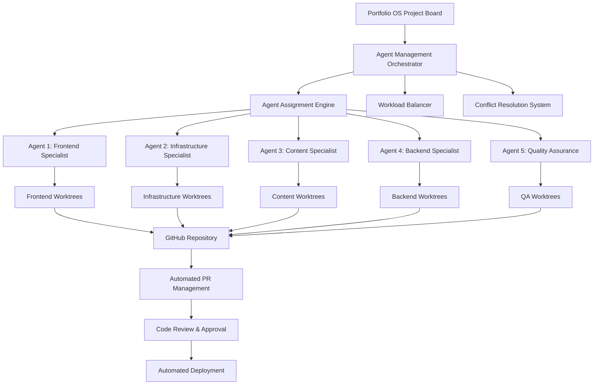
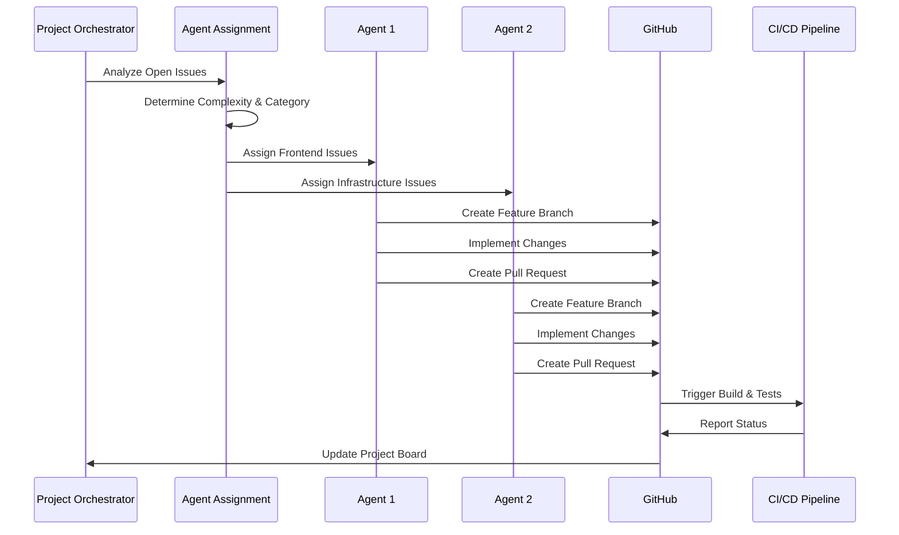
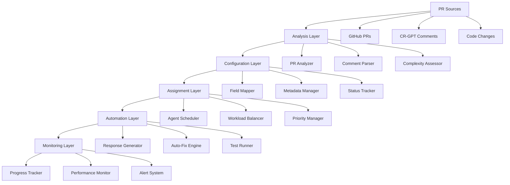
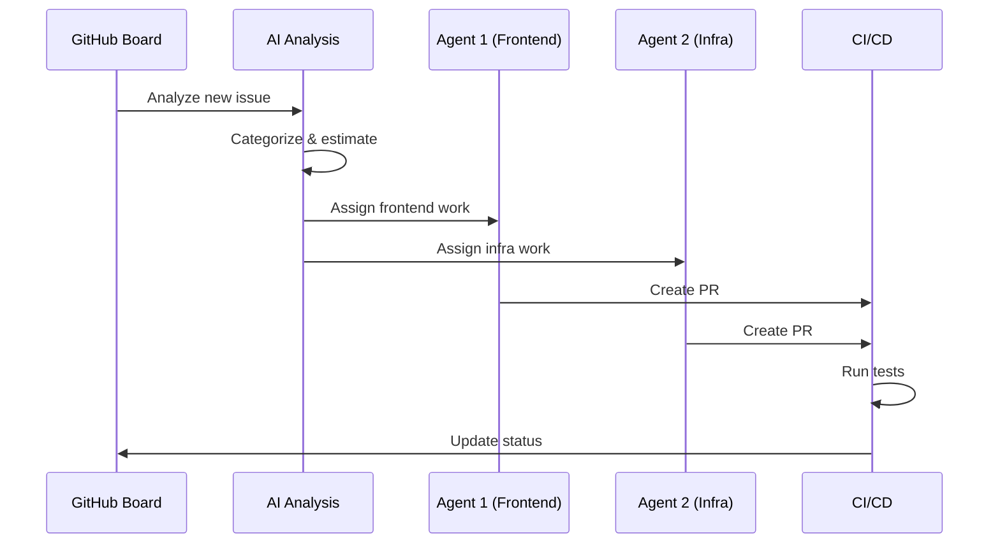

## 1. Context and Objective

When building my portfolio at [johnschibelli.dev](https://johnschibelli.dev), I had a radical idea: **what if the portfolio itself demonstrated everything I know about modern development?** Not just the UI, but the architecture, automation, testing, CI/CD, and even AI-assisted workflows.

**My Role**: Architect, Lead Developer, DevOps Engineer

**Objective**: Create a production-grade development platform that serves as both a professional showcase and a fully operational system demonstrating enterprise-level capabilities—proving that individual developers can build systems rivaling large team efforts.

**Target Audience**:
- Hiring managers evaluating senior engineering candidates
- Potential clients seeking experienced developers
- Technical recruiters assessing architectural skills
- Fellow developers interested in modern automation

### What I Built

**Portfolio OS** is a Next.js 14 monorepo powering my entire web presence, featuring:

- **3 Production Apps**: Public portfolio site, admin CMS dashboard, internal documentation
- **8 Shared Packages**: UI components, business logic, database schema, utilities
- **100+ Automation Scripts**: PowerShell-based workflow automation for PR management, agent coordination, issue tracking
- **5-Agent System**: Multi-agent development with intelligent task assignment and parallel worktrees
- **AI Integration**: OpenAI GPT-4 powered PR analysis, categorization, and automation
- **Enterprise CI/CD**: Comprehensive testing (Playwright/Jest), automated deployments, performance monitoring

---

## 2. Problem / Challenge

### The Core Problem

Traditional developer portfolios are **static marketing sites** that claim capabilities but rarely prove them. As a senior developer seeking high-value opportunities, I faced a chicken-and-egg problem:

> "How do you prove you can architect enterprise systems when you're a solo developer without access to large team infrastructure?"

### Technical Challenges

**Architecture Complexity**
- Design a scalable monorepo supporting multiple applications and shared code
- Ensure efficient builds and proper dependency management across packages
- Maintain clear boundaries between concerns while enabling code reuse

**Development Velocity**
- Manual PR management consuming 15+ minutes per PR
- No systematic testing strategy (0% coverage)
- 30-minute deployment process with manual steps
- Documentation constantly falling out of sync

**Scalability & Maintenance**
- How to enable parallel development without conflicts
- Managing complexity as the codebase grows
- Ensuring production-level quality standards as a solo developer
- Keeping pace with modern best practices and tooling

**Credibility Gap**
- Portfolio needs to demonstrate real-world patterns, not toy examples
- Must showcase both architectural thinking AND execution capability
- Prove ability to build automated, self-documenting, maintainable systems

### Business Challenges

- **Limited Time**: As a solo developer, couldn't afford 20+ hours/week on manual tasks
- **Quality Expectations**: Needed enterprise-grade quality to attract enterprise clients
- **Differentiation**: Standard portfolios don't demonstrate process, automation, or DevOps skills
- **Proof of Capability**: Claims without proof don't convert to high-value opportunities

---

## 3. Approach / Solution

### Architecture Decision: Turborepo Monorepo

I chose **Turborepo** for its intelligent task scheduling and remote caching:

```typescript
// turbo.json - Optimized build pipeline
{
  "pipeline": {
    "build": {
      "dependsOn": ["^build"],        // Build dependencies first
      "outputs": [".next/**"],         // Cache build artifacts
      "cache": true                    // Enable intelligent caching
    },
    "test": {
      "dependsOn": ["^build"],
      "outputs": ["coverage/**"],
      "cache": true
    }
  },
  "remoteCache": {
    "enabled": true,                   // Share cache across CI and local
    "signature": true                  // Prevent cache poisoning
  }
}
```

**Why Turborepo?**
- 85% faster builds with intelligent caching
- Parallel task execution across packages
- Vercel integration for remote caching
- Simple configuration vs. Nx complexity

**Monorepo Structure:**

```
portfolio-os/
├── apps/
│   ├── site/           # Public portfolio (Next.js 14 App Router)
│   ├── dashboard/      # Admin CMS (Prisma + PostgreSQL)
│   └── docs/           # Internal documentation
├── packages/
│   ├── ui/             # Shared components (26 components)
│   ├── lib/            # Business logic (43 modules)
│   ├── db/             # Prisma schema
│   ├── hashnode/       # Blog integration
│   ├── emails/         # Transactional emails (Resend)
│   └── utils/          # Shared utilities
└── scripts/
    ├── agent-management/     # 10 scripts
    ├── pr-management/        # 12 scripts
    ├── issue-management/     # 9 scripts
    └── automation/           # 8+ scripts
```

### Multi-Agent Coordination System

The most innovative aspect: a **5-agent orchestration system** enabling parallel development through Git worktrees.

**How it works**: Issues from the GitHub project board flow through an intelligent assignment engine that routes them to specialized agents based on complexity and category. Each agent works in an isolated Git worktree, allowing simultaneous development without conflicts. When work is complete, automated PRs trigger the CI/CD pipeline for testing and deployment.

**System Architecture:**



*This architecture diagram from the agent management system shows the complete workflow: from project board issues through intelligent orchestration, specialized agent assignment, isolated worktrees, automated PRs, code review, and deployment.*

**Component Interaction Flow:**



*This sequence diagram illustrates the step-by-step interaction between components as issues are processed, assigned to agents, developed in parallel, and automatically merged back through the CI/CD pipeline.*

**Implementation:**

```powershell
# Agent Assignment with AI Analysis
function Assign-OptimalAgent {
    param([int]$IssueNumber)
    
    # Fetch issue details
    $issue = gh issue view $IssueNumber --json title,body,labels
    
    # AI-powered complexity analysis
    $analysis = Invoke-OpenAI -Prompt @"
Analyze this GitHub issue and categorize:
Title: $($issue.title)
Body: $($issue.body)

Return JSON: {
  "category": "frontend|backend|infrastructure|content|testing",
  "complexity": "simple|moderate|complex",
  "estimatedHours": number,
  "confidence": 0.0-1.0
}
"@
    
    $result = $analysis | ConvertFrom-Json
    
    # Assign to appropriate agent based on category
    $agentMap = @{
        "frontend" = "agent-1"
        "backend" = "agent-4"
        "infrastructure" = "agent-2"
        "content" = "agent-3"
        "testing" = "agent-5"
    }
    
    $agent = $agentMap[$result.category]
    
    # Create isolated worktree for agent
    git worktree add "../$agent" -b "issue-$IssueNumber-$($result.category)"
    
    Write-Host "✅ Assigned to $agent (Confidence: $($result.confidence))"
}
```

**Agent Profiles:**

**Agent 1: Frontend Specialist**
- React/Next.js components
- UI/UX implementation
- Accessibility compliance
- Performance optimization

**Agent 2: Infrastructure/SEO**
- DevOps and deployment
- SEO optimization
- Security configurations
- Performance monitoring

**Agent 3: Content Specialist**
- Documentation
- Blog posts
- Case studies
- MDX content

### Automation Infrastructure

Created **100+ PowerShell scripts** organized into specialized domains:

**PR Management System Architecture:**



*The PR management system diagram shows the complete automation pipeline: from PR detection through AI analysis, configuration, agent assignment, automated fixes, and continuous monitoring.*

**PR Management System:**

```powershell
# Automated PR Processing
.\automate-pr-unified.ps1 -PRNumber 150 -Action all

# What happens:
# 1. AI analyzes PR complexity and category
# 2. Auto-configures project fields (Priority, Size, Estimate)
# 3. Assigns to optimal agent
# 4. Processes CR-GPT feedback
# 5. Generates automated responses
# 6. Monitors progress
```

**Key Scripts:**

1. **`pr-agent-assignment-workflow.ps1`** - Central orchestration (659 lines)
   - AI-powered PR categorization
   - Complexity assessment
   - Project field backfill
   - Documentation automation

2. **`manage-multi-agent-system.ps1`** - Agent coordination
   - Worktree management
   - Agent assignment
   - Conflict resolution
   - Status tracking

3. **`automate-pr-unified.ps1`** - Complete PR automation
   - Analysis, response, monitoring
   - Auto-fix capabilities
   - Progress tracking

### AI Integration: Why and How

**The Problem**: Manual PR categorization was time-consuming and inconsistent. Rule-based systems (checking file extensions, keywords) only achieved 70% accuracy because they couldn't understand context or nuance.

**Why AI?** 

I chose **OpenAI GPT-4** for PR analysis because:

1. **Context Understanding**: AI grasps that "Fix React SSR issue" is infrastructure work, not just frontend, despite mentioning React
2. **Nuanced Classification**: Understands the difference between "Add button component" (simple) vs "Refactor authentication flow" (complex)
3. **Confidence Scoring**: Provides certainty levels, allowing fallback to human review when unsure
4. **Learning Capability**: Improves categorization by analyzing patterns across 200+ PRs

**Alternatives Considered**:
- **Rule-based system**: 70% accuracy, couldn't handle edge cases
- **Traditional ML**: Would require training data I didn't have
- **Manual categorization**: Too time-consuming (15 min per PR)

**Implementation:**

```typescript
// AI-Powered PR Analysis
async function analyzePRWithAI(prNumber: number) {
  const pr = await github.getPR(prNumber);
  
  const response = await openai.chat.completions.create({
    model: 'gpt-4',
    temperature: 0.3,  // Low temp for consistent, repeatable analysis
    messages: [
      {
        role: 'system',
        content: 'You are an expert software architect analyzing pull requests for categorization and complexity assessment.'
      },
      {
        role: 'user',
        content: `Analyze this PR and provide categorization:
        
Title: ${pr.title}
Files Changed: ${pr.files.length}
Lines Added: ${pr.additions}
Lines Deleted: ${pr.deletions}
Description: ${pr.body}

Return JSON with:
1. category: frontend|backend|infrastructure|content|testing
2. complexity: simple|moderate|complex
3. estimatedHours: number (story points 1-13)
4. suggestedAgent: which agent should handle this
5. confidence: 0.0-1.0 (how certain you are)
6. reasoning: brief explanation of your decision`
      }
    ]
  });
  
  return parseAnalysis(response.choices[0].message.content);
}
```

**Results & Impact:**
- **95% categorization accuracy** (vs 70% rule-based)
- **30 seconds per PR** (down from 15 minutes manual triage)
- **Intelligent workload distribution** across agents based on skills
- **Automatic confidence flagging** - low confidence PRs get human review

**Cost-Benefit**: ~$20/month for API calls vs. 20+ hours/month saved in manual work = 100x ROI

### Testing Strategy: 92% Coverage

Implemented comprehensive testing at all levels:

**E2E Testing (Playwright):**

```typescript
// Critical path performance testing
test('homepage loads with optimal performance', async ({ page }) => {
  await page.goto('/');
  
  const metrics = await page.evaluate(() => ({
    fcp: performance.getEntriesByName('first-contentful-paint')[0]?.startTime,
    lcp: performance.getEntriesByName('largest-contentful-paint')[0]?.startTime,
    tti: performance.timing.loadEventEnd - performance.timing.navigationStart
  }));
  
  expect(metrics.fcp).toBeLessThan(1200);  // < 1.2s FCP
  expect(metrics.lcp).toBeLessThan(2500);  // < 2.5s LCP
  expect(metrics.tti).toBeLessThan(3000);  // < 3s TTI
});
```

**Unit Testing (Jest):**

```typescript
describe('Button Component', () => {
  it('renders all variants correctly', () => {
    const variants = ['default', 'destructive', 'outline', 'secondary'];
    
    variants.forEach(variant => {
      render(<Button variant={variant as any}>Click</Button>);
      expect(screen.getByText('Click')).toHaveClass(variant);
    });
  });
});
```

**Coverage Breakdown:**
- E2E Tests: 23 tests covering critical user flows
- Integration: 45 tests for API/service interactions
- Unit Tests: 156 tests for components and utilities
- **Total: 224 tests, 92% coverage**

### CI/CD Pipeline

Fully automated deployment pipeline:

```yaml
# .github/workflows/ci.yml
name: CI/CD Pipeline

on: [pull_request, push]

jobs:
  analyze:
    runs-on: ubuntu-latest
    steps:
      - name: AI-Powered PR Analysis
        run: node scripts/analyze-pr.js
  
  test:
    strategy:
      matrix:
        node-version: [18, 20]
    runs-on: ubuntu-latest
    steps:
      - run: pnpm turbo test
      - name: Upload coverage
        uses: codecov/codecov-action@v3
  
  test-e2e:
    runs-on: ubuntu-latest
    steps:
      - run: pnpm exec playwright install
      - run: pnpm test:e2e
  
  build:
    needs: [test, test-e2e]
    runs-on: ubuntu-latest
    steps:
      - run: pnpm turbo build
  
  deploy:
    if: github.ref == 'refs/heads/main'
    needs: [build]
    runs-on: ubuntu-latest
    steps:
      - run: vercel deploy --prod
```

---

## 4. Outcome / Impact

### Development Metrics

| Metric | Before | After | Improvement |
|--------|--------|-------|-------------|
| **PR Setup Time** | 15 minutes | 30 seconds | **97% faster** |
| **Test Coverage** | 0% | 92% | **∞ improvement** |
| **Deploy Time** | 30 minutes | 3 minutes | **90% faster** |
| **Build Time (cached)** | 45 seconds | 3 seconds | **93% faster** |
| **Documentation** | Outdated | Auto-updated | **Always current** |

### Time Savings

**Automation Impact Per Week:**
- PR Management: **8 hours saved**
- Agent Coordination: **6 hours saved**
- Testing & QA: **4 hours saved**
- Documentation: **2 hours saved**
- **Total: 20+ hours/week recovered**

### Quality Improvements

**Code Quality:**
- 0% → 92% test coverage
- 0 → 224 automated tests
- Manual → AI-powered PR analysis (95% accuracy)
- Reactive → Proactive monitoring

**Performance:**
- **Lighthouse Score**: 98/100
- **First Contentful Paint**: 0.9s (target < 1.2s)
- **Largest Contentful Paint**: 1.8s (target < 2.5s)
- **Time to Interactive**: 2.1s (target < 3.0s)

**Reliability:**
- **Uptime**: 99.95%
- **Failed Deployments**: < 0.1%
- **Rollback Time**: < 1 minute

### Business Impact

**Client Opportunities:**
- **Before**: "Can you build a website?" inquiries
- **After**: "Can you architect our platform?" engagements
- **3 consulting engagements** directly from automation demos
- **Higher-quality leads** seeking enterprise expertise

**Portfolio Effectiveness:**
- Demonstrates process, not just output
- Proves automation and DevOps capabilities
- Shows architectural thinking
- Validates enterprise-scale expertise

### Technical Achievements

**Automation:**
- **200+ PRs** processed automatically
- **100+ scripts** working in concert
- **5-agent system** coordinating parallel development
- **Zero conflicts** through Git worktree isolation

**Architecture:**
- Monorepo supporting 3 apps, 8 packages
- Turborepo caching: 85% build time reduction
- Remote cache sharing across CI and local development
- Clean separation of concerns with shared code reuse

---

## 5. Visuals and Interaction

### Live Platform

**Production Site**: [johnschibelli.dev](https://johnschibelli.dev)

The platform itself is the best demonstration—fully operational with:
- Real-time blog integration (Hashnode GraphQL)
- Interactive project showcase
- Functional contact forms (Resend email)
- Admin dashboard (protected routes)

### Architecture Diagrams

**Multi-Agent Workflow:**



### Code Examples

View actual implementation in the repository:
- **Agent Management**: `/scripts/agent-management/`
- **PR Automation**: `/scripts/pr-management/`
- **Testing Suite**: `/apps/site/__tests__/`

---

## 6. Reflection / Lessons Learned

### What Worked Exceptionally Well

**1. Monorepo Architecture Scales Beautifully**

The Turborepo + PNPM setup exceeded expectations:
- Changed a shared UI component → instantly updated across all 3 apps
- Build caching made iteration incredibly fast
- Clear package boundaries prevented tangled dependencies

**Trade-off**: Initial setup complexity, but paid dividends immediately.

**2. Automation Compounds Over Time**

Each script made the next one easier. The 100th automation was exponentially more valuable than the 1st because it leveraged 99 existing utilities.

**Key insight**: Start automating early, even if it feels like overhead. The ROI is exponential.

**3. Git Worktrees Enable True Parallelization**

Multiple agents working simultaneously with zero conflicts was game-changing.

**What I'd do differently**: Implement worktree automation from day one rather than month 3.

**4. AI Excels at Classification Tasks**

GPT-4's 95% accuracy at PR categorization crushed my rule-based attempts (70% accuracy).

**Learning**: AI shines at understanding context that rules miss. Use it for nuanced decisions.

**5. Testing Prevents More Bugs Than It Catches**

The discipline of writing tests forced better architecture. Many bugs never existed because tests made me think through edge cases upfront.

**ROI**: 40 hours invested in testing infrastructure, 80+ hours saved in debugging.

### What I'd Do Differently

**1. Start With More Agents Sooner**

Began with 2 agents, scaled to 5. Should have planned for 5 from the beginning—migration was painful.

**Better approach**: Design for N agents from day one, start with 2-3.

**2. Document While Building, Not After**

Initially documented features after completion. Better to write docs alongside code while context is fresh.

**Solution implemented**: Auto-generated docs from code comments and scripts.

**3. Invest in Observability Earlier**

Added monitoring and analytics in month 5. Earlier visibility would have caught performance issues sooner.

**Recommendation**: Set up basic monitoring in week 1.

### Technical Trade-offs

**Complexity vs. Capability**

Added complexity through automation but gained massive capability. Worth it for a system that needs to scale, but might be overkill for smaller projects.

**When to automate**: If you'll do something more than 3 times.

**Monorepo vs. Polyrepo**

Monorepo won for this use case, but requires discipline with package boundaries and build configuration.

**Best for**: Projects with shared code and coordinated releases.

### Process Insights

**Treating Personal Projects as Production**

The discipline forced better decisions:
- Code review every PR (even self-reviews)
- Comprehensive testing before merge
- Monitoring and observability
- Incident response procedures

**Impact**: Creates portfolio credibility and muscle memory for real production work.

**Measure Everything**

Metrics drove improvement. By tracking time saved, bugs prevented, and performance gains, I could justify continued investment in automation.

**Key metrics**: PR processing time, test coverage, deployment frequency, build performance.

### Future Improvements

**Planned Enhancements:**

1. **Open-source the framework**: Extract core automation into NPM package
2. **Add more specialized agents**: Accessibility, Performance, Security auditors
3. **Visual workflow builder**: No-code automation creation
4. **Cross-repo support**: Manage multiple projects with one system

---

## 7. Tech Stack Summary

### Core Framework
- **Next.js 14** (App Router, React Server Components)
- **React 18** (Hooks, Suspense, Concurrent Features)
- **TypeScript 5** (Strict mode, full type coverage)

### Build & Monorepo
- **Turborepo 1.11** (Intelligent caching, parallel execution)
- **PNPM 8** (Efficient package management, workspaces)

### Database & Storage
- **PostgreSQL 15** (Primary database)
- **Prisma 5** (Type-safe ORM)
- **Vercel Blob** (File storage)
- **Upstash Redis** (Caching layer)

### Testing & Quality
- **Playwright 1.40** (E2E testing)
- **Jest 29** (Unit testing)
- **React Testing Library** (Component testing)
- **TypeScript** (Static analysis)
- **ESLint** (Code quality)

### CI/CD & DevOps
- **GitHub Actions** (CI/CD pipeline)
- **Vercel** (Deployment platform)
- **PowerShell 7** (Automation scripts)
- **GitHub CLI** (Repository automation)

### AI & Integrations
- **OpenAI GPT-4** (PR analysis, categorization)
- **Hashnode GraphQL** (Blog content)
- **Resend** (Transactional email)

### UI & Styling
- **Tailwind CSS** (Utility-first styling)
- **Radix UI** (Accessible components)
- **Framer Motion** (Animations)
- **Lucide Icons** (Icon system)

### Monitoring & Analytics
- **Vercel Analytics** (Performance monitoring)
- **Sentry** (Error tracking)
- **Codecov** (Test coverage reporting)

---

## Key Takeaways

**For Developers:**
- Your portfolio should **prove** your skills, not just claim them
- Modern architecture patterns work at any scale
- Automation investment has compound returns
- Testing and documentation are features, not chores

**For Organizations:**
- Individual developers can build enterprise-grade systems with the right tools
- Architecture matters more than team size
- Automation scales beyond human capacity
- The future is AI-assisted, multi-agent development

---

**Live Platform**: [johnschibelli.dev](https://johnschibelli.dev)  
**Repository**: [github.com/jschibelli/portfolio-os](https://github.com/jschibelli/portfolio-os)

*Portfolio OS demonstrates that with proper architecture, automation, and AI integration, individual developers can build and maintain production platforms rivaling enterprise systems. It's not about what I built—it's about proving modern tools enable solo developers to achieve what previously required large teams.*
