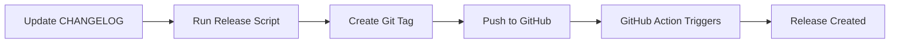

# Release Guide

Complete guide for creating and managing releases in Portfolio OS.

## 📋 Table of Contents

- [Release Process Overview](#release-process-overview)
- [Semantic Versioning](#semantic-versioning)
- [Creating a Release](#creating-a-release)
- [Pre-Releases](#pre-releases)
- [Automated Release Workflow](#automated-release-workflow)
- [Troubleshooting](#troubleshooting)

---

## 🎯 Release Process Overview

Portfolio OS uses an automated release system that:

1. ✅ Uses **semantic versioning** (SemVer)
2. ✅ Automates release creation via GitHub Actions
3. ✅ Extracts release notes from CHANGELOG.md
4. ✅ Supports pre-releases (alpha, beta, RC)
5. ✅ Generates release notes automatically

### Release Workflow



---

## 🔢 Semantic Versioning

We follow [Semantic Versioning 2.0.0](https://semver.org/):

### Version Format

```
MAJOR.MINOR.PATCH[-PRERELEASE]

Examples:
  1.0.0         - Stable release
  1.0.0-alpha.1 - Alpha pre-release
  1.0.0-beta.1  - Beta pre-release
  1.0.0-rc.1    - Release candidate
  1.0.1         - Patch release
  1.1.0         - Minor release
  2.0.0         - Major release
```

### When to Increment

| Version | When to Use | Example |
|---------|------------|---------|
| **MAJOR** (2.0.0) | Breaking changes, major redesigns | Complete UI overhaul, API changes |
| **MINOR** (1.1.0) | New features, backwards compatible | New dashboard features, new pages |
| **PATCH** (1.0.1) | Bug fixes, minor improvements | Fix bugs, update dependencies |

### Pre-Release Types

- **alpha** (`1.0.0-alpha.1`) - Early testing, unstable
- **beta** (`1.0.0-beta.1`) - Feature complete, testing
- **rc** (`1.0.0-rc.1`) - Release candidate, final testing

---

## 🚀 Creating a Release

### Method 1: Using the Release Script (Recommended)

#### Stable Release

```powershell
# Navigate to project root
cd C:\Users\jschi\OneDrive\Desktop\2025_portfolio\portfolio-os

# Create release
.\scripts\project-management\create-release.ps1 -Version "1.0.0"
```

#### Pre-Release

```powershell
# Alpha release
.\scripts\project-management\create-release.ps1 -Version "1.0.0" -PreRelease "alpha.1"

# Beta release
.\scripts\project-management\create-release.ps1 -Version "1.0.0" -PreRelease "beta.1"

# Release candidate
.\scripts\project-management\create-release.ps1 -Version "1.0.0" -PreRelease "rc.1"
```

#### Dry Run (Preview)

```powershell
# Preview what will happen
.\scripts\project-management\create-release.ps1 -Version "1.0.0" -DryRun
```

### Method 2: Manual Release

```powershell
# 1. Update CHANGELOG.md with release notes
# 2. Commit changes
git add CHANGELOG.md package.json
git commit -m "chore: Prepare release v1.0.0"
git push

# 3. Create and push tag
git tag -a v1.0.0 -m "Release v1.0.0 - Multi-Agent Development System"
git push origin v1.0.0

# 4. GitHub Action automatically creates the release
```

### Method 3: Using GitHub CLI

```powershell
# Create release directly
gh release create v1.0.0 \
  --title "🚀 Portfolio OS v1.0.0" \
  --notes-file CHANGELOG.md \
  --latest
```

---

## 🧪 Pre-Releases

### Why Use Pre-Releases?

- 🧪 Test new features before stable release
- 📊 Gather feedback from early users
- 🐛 Catch bugs before production
- 🎯 Staged rollout for risk mitigation

### Pre-Release Workflow

```powershell
# 1. Create alpha for early testing
.\scripts\project-management\create-release.ps1 -Version "1.1.0" -PreRelease "alpha.1"

# 2. After testing, create beta
.\scripts\project-management\create-release.ps1 -Version "1.1.0" -PreRelease "beta.1"

# 3. Final testing with release candidate
.\scripts\project-management\create-release.ps1 -Version "1.1.0" -PreRelease "rc.1"

# 4. Stable release
.\scripts\project-management\create-release.ps1 -Version "1.1.0"
```

### Pre-Release Naming Convention

```
v1.1.0-alpha.1   - First alpha
v1.1.0-alpha.2   - Second alpha (if needed)
v1.1.0-beta.1    - First beta
v1.1.0-beta.2    - Second beta (if needed)
v1.1.0-rc.1      - Release candidate
v1.1.0           - Stable release
```

---

## ⚙️ Automated Release Workflow

### How It Works

The GitHub Action (`.github/workflows/release.yml`) automatically:

1. ✅ Detects when a version tag is pushed
2. ✅ Extracts version number and determines type
3. ✅ Reads release notes from CHANGELOG.md
4. ✅ Creates GitHub release with appropriate title
5. ✅ Marks as pre-release if applicable
6. ✅ Generates additional release notes from commits

### Workflow Triggers

```yaml
on:
  push:
    tags:
      - 'v*.*.*'      # Matches v1.0.0
      - 'v*.*.*-*'    # Matches v1.0.0-beta.1
```

### Release Title Format

- 🚀 Stable: `Portfolio OS v1.0.0`
- 🔬 Alpha: `Portfolio OS v1.0.0-alpha.1 (Alpha)`
- 🧪 Beta: `Portfolio OS v1.0.0-beta.1 (Beta)`
- 🎯 RC: `Portfolio OS v1.0.0-rc.1 (Release Candidate)`

### Monitoring Releases

```powershell
# Check GitHub Actions status
gh run list --workflow=release.yml

# View specific run
gh run view <run-id>

# Check latest release
gh release view --web
```

---

## 📝 Release Checklist

### Before Release

- [ ] Update CHANGELOG.md with release notes
- [ ] Update version in package.json files
- [ ] Run all tests: `pnpm test`
- [ ] Run linting: `pnpm lint`
- [ ] Build successfully: `pnpm build`
- [ ] Commit and push all changes
- [ ] Ensure you're on correct branch (main/develop)
- [ ] No uncommitted changes

### During Release

- [ ] Run release script or create tag manually
- [ ] Verify tag pushed to GitHub
- [ ] Check GitHub Actions workflow started
- [ ] Monitor workflow for errors

### After Release

- [ ] Verify release appears on GitHub
- [ ] Check release notes are correct
- [ ] Test release in production
- [ ] Announce release (if applicable)
- [ ] Update documentation if needed

---

## 🔧 Common Release Scenarios

### Scenario 1: First Stable Release (v1.0.0)

```powershell
# You're currently at v1.0.0 in package.json
.\scripts\project-management\create-release.ps1 -Version "1.0.0" -Message "First stable release"
```

### Scenario 2: Bug Fix Release

```powershell
# Fix bugs, update CHANGELOG.md, then:
.\scripts\project-management\create-release.ps1 -Version "1.0.1"
```

### Scenario 3: New Feature Release

```powershell
# Add features, update CHANGELOG.md, then:
.\scripts\project-management\create-release.ps1 -Version "1.1.0"
```

### Scenario 4: Breaking Changes

```powershell
# Major refactor, update CHANGELOG.md, then:
.\scripts\project-management\create-release.ps1 -Version "2.0.0"
```

### Scenario 5: Testing New Feature

```powershell
# Create beta for testing
.\scripts\project-management\create-release.ps1 -Version "1.2.0" -PreRelease "beta.1"

# After testing, stable release
.\scripts\project-management\create-release.ps1 -Version "1.2.0"
```

---

## 🐛 Troubleshooting

### Issue: Tag Already Exists

```
❌ Tag v1.0.0 already exists!
```

**Solution:**
- Choose a different version number
- Or delete existing tag: `git tag -d v1.0.0` and `git push origin :refs/tags/v1.0.0`

### Issue: GitHub Action Failed

```
❌ Release workflow failed
```

**Solution:**
1. Check GitHub Actions tab
2. Review error logs
3. Common causes:
   - Invalid CHANGELOG.md format
   - Permissions issue
   - Network error

**Fix:**
```powershell
# Re-run the workflow
gh run rerun <run-id>
```

### Issue: Release Not Showing

```
Tag pushed but no release created
```

**Solution:**
1. Check if GitHub Action ran: `gh run list`
2. Verify workflow file exists: `.github/workflows/release.yml`
3. Check repository permissions
4. Manually create release: `gh release create v1.0.0 --notes-file CHANGELOG.md`

### Issue: Wrong Version in Release

```
Release created with wrong version number
```

**Solution:**
```powershell
# Delete the release
gh release delete v1.0.0 --yes

# Delete the tag
git tag -d v1.0.0
git push origin :refs/tags/v1.0.0

# Create again with correct version
.\scripts\project-management\create-release.ps1 -Version "1.0.1"
```

---

## 📚 Additional Resources

### Commands Reference

```powershell
# List all releases
gh release list

# View specific release
gh release view v1.0.0

# Download release assets
gh release download v1.0.0

# List all tags
git tag -l

# Delete tag locally
git tag -d v1.0.0

# Delete tag remotely
git push origin :refs/tags/v1.0.0

# View workflow runs
gh run list --workflow=release.yml

# View specific run
gh run view <run-id> --log
```

### External Documentation

- [Semantic Versioning 2.0.0](https://semver.org/)
- [GitHub Releases Documentation](https://docs.github.com/en/repositories/releasing-projects-on-github)
- [GitHub Actions - softprops/action-gh-release](https://github.com/softprops/action-gh-release)

---

## 🎯 Quick Reference

### Release Script Options

```powershell
# Required
-Version "X.Y.Z"        # Version number (without 'v' prefix)

# Optional
-PreRelease "beta.1"    # Pre-release identifier
-Message "Description"  # Custom release message
-DryRun                 # Preview without making changes
```

### Examples

```powershell
# Stable release
.\scripts\project-management\create-release.ps1 -Version "1.0.0"

# Beta release
.\scripts\project-management\create-release.ps1 -Version "1.1.0" -PreRelease "beta.1"

# With custom message
.\scripts\project-management\create-release.ps1 -Version "1.0.1" -Message "Critical bug fixes"

# Dry run
.\scripts\project-management\create-release.ps1 -Version "1.0.0" -DryRun
```

---

*Last updated: October 8, 2025*

