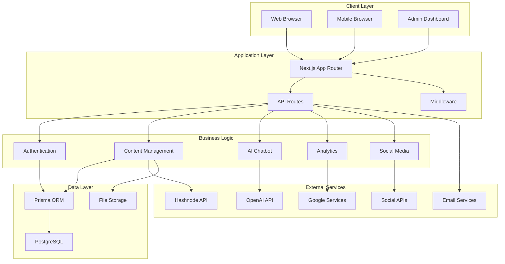
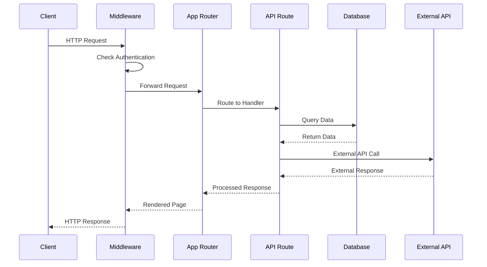
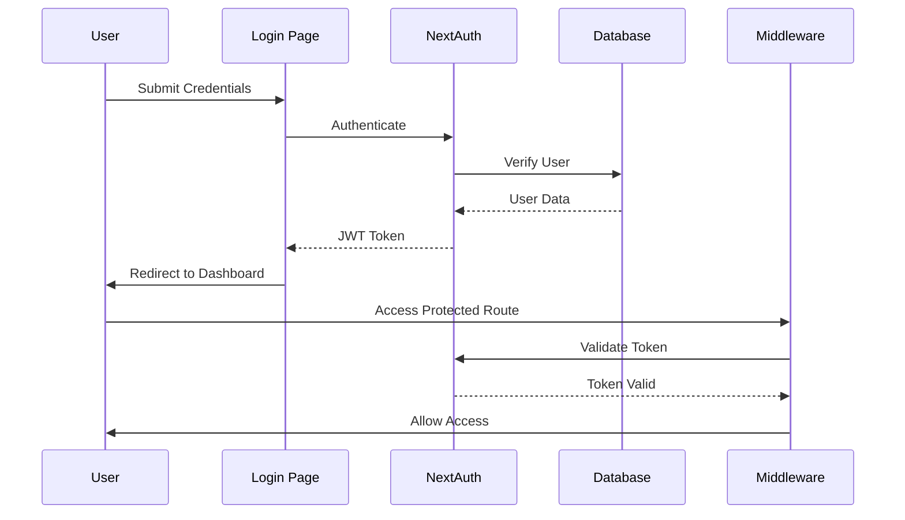
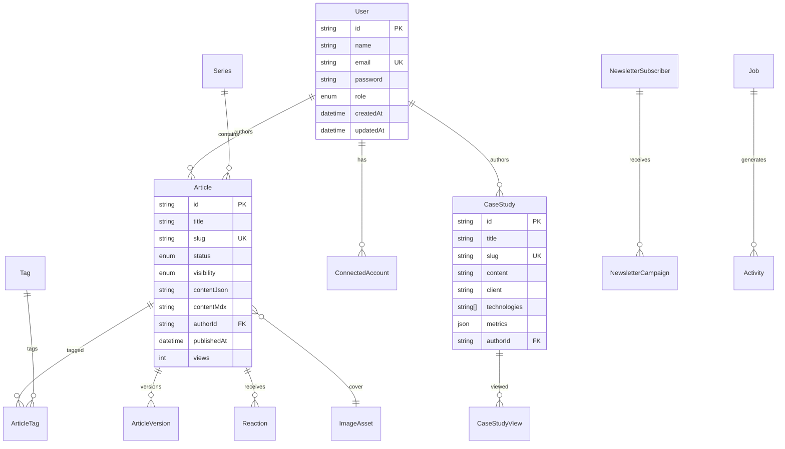
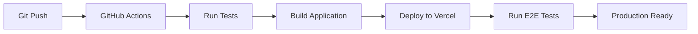

# Architecture Overview

**Last Updated**: January 2025  
**Version**: 2.0.0

## Summary

The Mindware Blog is a modern, full-stack blog platform built with Next.js 14, featuring a comprehensive admin dashboard, AI-powered chatbot, and integrated analytics. This document outlines the system architecture, data flow, and key design decisions.

## High-Level Architecture



## Application Layers

### 1. Client Layer
- **Web Browser**: Public blog interface with responsive design
- **Mobile Browser**: Mobile-optimized experience
- **Admin Dashboard**: Content management and analytics interface

### 2. Application Layer
- **Next.js App Router**: Modern React framework with file-based routing
- **API Routes**: Server-side endpoints for data operations
- **Middleware**: Authentication, authorization, and request processing

### 3. Business Logic Layer
- **Authentication**: NextAuth.js with JWT sessions
- **Content Management**: Article and case study management
- **AI Chatbot**: OpenAI-powered conversational interface
- **Analytics**: Google Analytics and Plausible integration
- **Social Media**: Automated posting and engagement

### 4. Data Layer
- **PostgreSQL**: Primary database for all application data
- **Prisma ORM**: Type-safe database access and migrations
- **File Storage**: Vercel Blob for media assets

## Runtime Data Flow

### Request Processing Flow



### Authentication Flow



## State Management

### Context-Based State Management

The application uses React Context for state management with the following structure:

```typescript
// App Context - Global application state
interface AppContext {
  publication: PublicationFragment;
  post: PostFullFragment | null;
  page: StaticPageFragment | null;
  series: SeriesFragment | null;
}

// Theme Context - UI theme management
interface ThemeContext {
  theme: 'light' | 'dark' | 'system';
  setTheme: (theme: string) => void;
}
```

### State Locations

- **Global State**: `components/contexts/appContext.tsx`
- **Theme State**: `components/contexts/ThemeContext.tsx`
- **Form State**: Local component state with React Hook Form
- **Server State**: React Query for API data caching

## Routing Model

### App Router Structure

```
app/
├── (admin)/              # Admin route group
│   └── admin/            # Admin dashboard
├── api/                  # API routes
│   ├── auth/             # Authentication
│   ├── admin/            # Admin operations
│   ├── ai/               # AI chatbot
│   └── webhooks/         # External webhooks
├── blog/                 # Blog pages
│   └── [slug]/           # Dynamic blog posts
├── case-studies/         # Case study pages
├── login/                # Authentication
└── layout.tsx            # Root layout
```

### Route Conventions

- **Static Routes**: Direct file-based routing
- **Dynamic Routes**: `[param]` syntax for dynamic segments
- **Route Groups**: `(group)` syntax for organization without affecting URL
- **API Routes**: `route.ts` files in `api/` directory

### Middleware

```typescript
// Authentication middleware
export async function middleware(req: NextRequest) {
  const { pathname } = req.nextUrl;
  
  if (pathname.startsWith("/admin")) {
    const token = await getToken({ req });
    if (!token || !hasAdminRole(token)) {
      return NextResponse.redirect(new URL("/login", req.url));
    }
  }
  
  return NextResponse.next();
}
```

## Database Architecture

### Entity Relationship Diagram



### Database Design Principles

1. **Normalization**: Proper 3NF design with minimal redundancy
2. **Indexing**: Strategic indexes on frequently queried fields
3. **Constraints**: Foreign key constraints for data integrity
4. **Enums**: Type-safe status and role definitions
5. **Timestamps**: Automatic createdAt/updatedAt tracking

## Error Handling Strategy

### Error Boundaries

```typescript
// Global error boundary
export default function GlobalError({
  error,
  reset,
}: {
  error: Error & { digest?: string };
  reset: () => void;
}) {
  return (
    <html>
      <body>
        <h2>Something went wrong!</h2>
        <button onClick={() => reset()}>Try again</button>
      </body>
    </html>
  );
}
```

### API Error Handling

```typescript
// Standardized API response format
interface ApiResponse<T> {
  success: boolean;
  data?: T;
  error?: {
    code: string;
    message: string;
    details?: any;
  };
}

// Error handling middleware
export function withErrorHandling(handler: ApiHandler) {
  return async (req: NextRequest, res: NextResponse) => {
    try {
      return await handler(req, res);
    } catch (error) {
      console.error('API Error:', error);
      return NextResponse.json(
        { success: false, error: { code: 'INTERNAL_ERROR', message: 'Something went wrong' } },
        { status: 500 }
      );
    }
  };
}
```

### Logging Strategy

- **Development**: Console logging with detailed stack traces
- **Production**: Structured logging with Sentry integration
- **API Errors**: Centralized error tracking and alerting
- **Performance**: Request timing and database query monitoring

## Caching Strategy

### Client-Side Caching

- **React Query**: API response caching with stale-while-revalidate
- **Next.js**: Automatic static generation and ISR
- **Browser**: HTTP caching headers for static assets

### Server-Side Caching

- **Database**: Connection pooling and query optimization
- **API**: Response caching for expensive operations
- **CDN**: Vercel Edge Network for global distribution

## Security Considerations

### Authentication & Authorization

- **JWT Tokens**: Secure session management
- **Role-Based Access**: ADMIN, EDITOR, AUTHOR roles
- **Password Hashing**: bcrypt with salt rounds
- **CSRF Protection**: NextAuth.js built-in protection

### Data Protection

- **Input Validation**: Zod schema validation
- **SQL Injection**: Prisma ORM protection
- **XSS Prevention**: React's built-in escaping
- **Environment Variables**: Secure secret management

## Performance Optimization

### Frontend Optimization

- **Code Splitting**: Automatic route-based splitting
- **Image Optimization**: Next.js Image component
- **Bundle Analysis**: Webpack bundle analyzer
- **Lazy Loading**: Dynamic imports for heavy components

### Backend Optimization

- **Database Indexing**: Optimized query performance
- **Connection Pooling**: Efficient database connections
- **API Rate Limiting**: Prevent abuse and ensure stability
- **Caching**: Redis for session storage (production)

## Monitoring & Observability

### Application Monitoring

- **Sentry**: Error tracking and performance monitoring
- **Vercel Analytics**: Real-time performance metrics
- **Google Analytics**: User behavior tracking
- **Plausible**: Privacy-focused analytics

### Infrastructure Monitoring

- **Vercel Dashboard**: Deployment and performance metrics
- **Database Monitoring**: Query performance and connection health
- **API Monitoring**: Response times and error rates

## Deployment Architecture

### Environment Strategy

- **Development**: Local development with hot reloading
- **Preview**: Vercel preview deployments for PRs
- **Production**: Vercel production deployment with custom domain

### CI/CD Pipeline



## Scalability Considerations

### Horizontal Scaling

- **Stateless Design**: No server-side session storage
- **Database Scaling**: Read replicas for query distribution
- **CDN**: Global content delivery network
- **Microservices**: Modular API design for future extraction

### Performance Scaling

- **Database Optimization**: Query optimization and indexing
- **Caching Layers**: Multi-level caching strategy
- **Asset Optimization**: Image and bundle optimization
- **API Rate Limiting**: Prevent resource exhaustion

## Related Documentation

- [API Reference](api.md) - Detailed API documentation
- [Database Schema](database-schema.md) - Complete database documentation
- [Deployment Guide](runbooks/deploy.md) - Deployment procedures
- [Security Guidelines](security.md) - Security best practices
- [Performance Guide](performance.md) - Optimization strategies

## Decision Records

- [ADR-001: State Management Approach](adr/001-state-management.md)
- [ADR-002: Database ORM Selection](adr/002-database-orm.md)
- [ADR-003: Authentication Strategy](adr/003-authentication.md)
- [ADR-004: API Design Patterns](adr/004-api-design.md)
