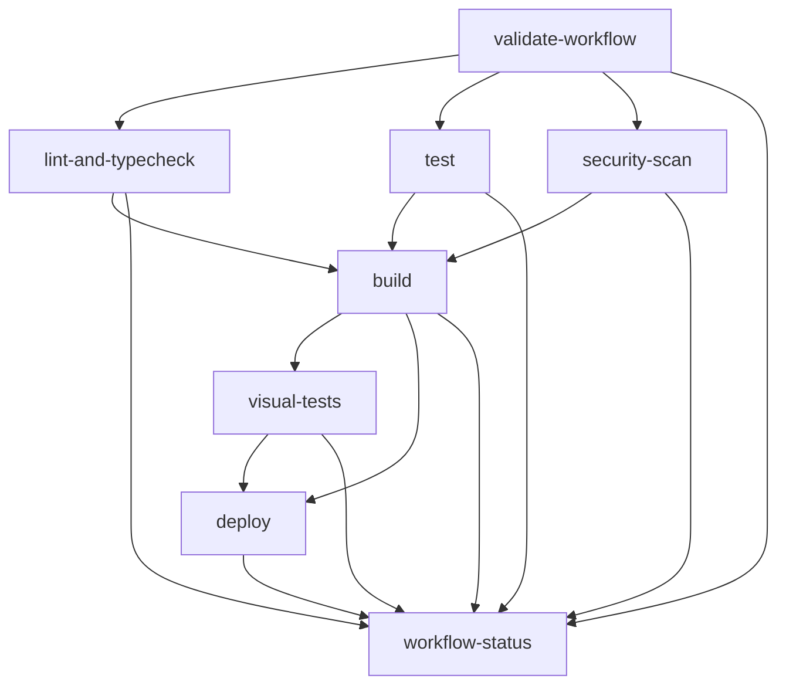

# Enhanced GitHub Actions Workflow Documentation

## Overview

This document describes the enhanced GitHub Actions workflow with improved error handling, comprehensive logging, and robust validation mechanisms. The workflow has been designed to provide detailed feedback, better debugging capabilities, and enhanced reliability for the CI/CD pipeline.

## Key Improvements

### 1. Enhanced Error Handling & Logging ✅

The workflow now includes comprehensive error handling and detailed logging throughout all jobs:

#### Environment Variable Validation
- **Automatic validation** of all required environment variables
- **Clear error messages** with emoji indicators (❌/✅)
- **Early failure detection** to prevent downstream issues
- **Detailed logging** for each validation step

#### Improved Job Error Handling
- **Comprehensive status reporting** for all workflow jobs
- **Detailed failure messages** with context
- **Graceful error recovery** where possible
- **Enhanced logging** throughout the build process

### 2. Workflow Structure

The enhanced workflow consists of the following jobs:

```yaml
jobs:
  validate-workflow     # Validates workflow configuration
  lint-and-typecheck    # Code quality checks
  test                  # Test suite execution
  security-scan         # Security vulnerability scanning
  build                 # Application build
  visual-tests          # Visual regression testing
  deploy                # Vercel deployment
  workflow-status       # Final status report
```

### 3. Job Dependencies & Flow



## Detailed Job Descriptions

### 1. Validate Workflow Configuration

**Purpose**: Validates workflow environment variables and directory structure before any other jobs run.

**Key Features**:
- Environment variable format validation
- Working directory existence checks
- Essential file validation (package.json, next.config.js)
- Early failure detection with detailed error messages

**Error Handling**:
```bash
# Example error output
❌ NODE_VERSION is not set - this is required for Node.js setup
❌ Working directory 'packages/blog-starter-kit/themes/enterprise' does not exist
❌ package.json not found in working directory
```

### 2. Lint and Type Check

**Purpose**: Ensures code quality through ESLint and TypeScript type checking.

**Key Features**:
- ESLint execution with detailed error reporting
- TypeScript type checking with comprehensive error messages
- Dependency installation validation
- Clear failure messages with suggested fixes

**Error Handling**:
```bash
# Example error output
❌ ESLint found issues that need to be fixed
Run 'pnpm lint' locally to see detailed errors

❌ TypeScript type check failed
Run 'pnpm typecheck' locally to see detailed errors
```

### 3. Test Suite

**Purpose**: Executes the complete test suite with coverage reporting.

**Key Features**:
- Test execution with coverage
- Test result artifact upload
- Comprehensive error reporting
- Performance optimization with caching

**Error Handling**:
```bash
# Example error output
❌ Test suite failed
Run 'pnpm test' locally to see detailed test results
```

### 4. Security Scan

**Purpose**: Performs security vulnerability scanning on dependencies.

**Key Features**:
- pnpm audit execution
- Security results artifact upload
- Vulnerability reporting
- Security event integration

**Error Handling**:
```bash
# Example error output
❌ Security audit found vulnerabilities
Run 'pnpm audit' locally to see detailed security issues
Consider running 'pnpm audit --fix' to automatically fix issues
```

### 5. Build Application

**Purpose**: Builds the application for production deployment.

**Key Features**:
- Environment variable validation for build
- Build artifact upload
- Comprehensive error reporting
- Build optimization

**Error Handling**:
```bash
# Example error output
❌ Build failed
Check the build logs above for specific errors
Common issues:
  - TypeScript errors
  - Missing environment variables
  - Import/export issues
```

### 6. Visual Regression Tests

**Purpose**: Performs visual regression testing to ensure UI consistency.

**Key Features**:
- Visual test execution
- Screenshot and diff artifact upload
- PR comment integration with test results
- Baseline image management guidance

**Error Handling**:
```bash
# Example error output
❌ Visual regression tests failed
Check the test results and update baseline images if changes are intentional
```

### 7. Deploy to Vercel

**Purpose**: Deploys the application to Vercel production environment.

**Key Features**:
- Vercel deployment with proper authentication
- Environment variable configuration
- Deployment status reporting
- Error handling for deployment failures

### 8. Workflow Status Report

**Purpose**: Provides comprehensive status reporting for the entire workflow.

**Key Features**:
- Job result aggregation
- PR comment integration
- Workflow summary generation
- Final status determination

## Environment Variables

### Required Environment Variables

```yaml
env:
  NODE_VERSION: '20'                    # Node.js version
  PNPM_VERSION: '8'                     # pnpm version
  PNPM_CACHE_PATH: ~/.pnpm-store        # pnpm cache location
  WORKING_DIRECTORY: packages/blog-starter-kit/themes/enterprise
```

### Build Environment Variables

```yaml
NEXT_PUBLIC_MODE: production
NEXT_PUBLIC_HASHNODE_GQL_ENDPOINT: ${{ secrets.NEXT_PUBLIC_HASHNODE_GQL_ENDPOINT || 'https://gql.hashnode.com/' }}
NEXT_PUBLIC_HASHNODE_PUBLICATION_HOST: ${{ secrets.NEXT_PUBLIC_HASHNODE_PUBLICATION_HOST || 'mindware.hashnode.dev' }}
NEXT_PUBLIC_FEATURE_SCHEDULING: 'true'
NEXT_PUBLIC_FEATURE_CASE_STUDY: 'true'
NEXT_PUBLIC_FEATURE_CLIENT_INTAKE: 'true'
FEATURE_SCHEDULING: 'true'
FEATURE_CASE_STUDY: 'true'
FEATURE_CLIENT_INTAKE: 'true'
```

### Required Secrets

```yaml
secrets:
  VERCEL_TOKEN:                    # Vercel deployment token
  VERCEL_ORG_ID:                   # Vercel organization ID
  VERCEL_PROJECT_ID:               # Vercel project ID
  NEXT_PUBLIC_HASHNODE_GQL_ENDPOINT: # Hashnode GraphQL endpoint
  NEXT_PUBLIC_HASHNODE_PUBLICATION_HOST: # Hashnode publication host
```

## Error Handling Patterns

### 1. Early Validation

```yaml
- name: Validate environment variables
  run: |
    if [ -z "${{ env.NODE_VERSION }}" ]; then
      echo "❌ NODE_VERSION is not set - this is required for Node.js setup"
      exit 1
    fi
```

### 2. Command Execution with Error Handling

```yaml
- name: Run ESLint
  run: |
    pnpm lint
    if [ $? -ne 0 ]; then
      echo "❌ ESLint found issues that need to be fixed"
      echo "Run 'pnpm lint' locally to see detailed errors"
      exit 1
    fi
```

### 3. Artifact Upload with Conditional Logic

```yaml
- name: Upload test coverage
  uses: actions/upload-artifact@v3
  if: always()
  with:
    name: test-coverage
    path: ${{ env.WORKING_DIRECTORY }}/coverage/
    retention-days: 7
```

### 4. PR Comment Integration

```yaml
- name: Comment PR with visual test results
  if: github.event_name == 'pull_request' && always()
  uses: actions/github-script@v6
  with:
    github-token: ${{ secrets.GITHUB_TOKEN }}
    script: |
      # Comprehensive error handling and comment generation
```

## Logging Standards

### 1. Emoji Indicators

- ✅ Success
- ❌ Error/Failure
- ⚠️ Warning
- 🔍 Information/Process
- 📦 Installation
- 🏗️ Build
- 🧪 Testing
- 🔒 Security
- 🎨 Visual
- 🚀 Deployment

### 2. Log Message Format

```bash
echo "🔍 Validating workflow environment variables..."
echo "✅ All environment variables validated successfully"
echo "❌ Build failed"
echo "⚠️ $var is not set, using default value"
```

### 3. Error Context

All error messages include:
- Clear description of the issue
- Suggested actions to resolve
- Relevant command examples
- Context about the failure

## Artifact Management

### Uploaded Artifacts

1. **test-coverage**: Test coverage reports (7 days retention)
2. **security-audit-results**: Security scan results (30 days retention)
3. **build-artifacts**: Build output (7 days retention)
4. **visual-test-results**: Visual test results (7 days retention)
5. **visual-test-screenshots**: Visual test screenshots (7 days retention)

### Artifact Access

Artifacts are automatically uploaded and can be accessed through:
- GitHub Actions UI
- PR comments (for visual tests)
- Workflow status reports

## Performance Optimizations

### 1. Caching Strategy

```yaml
- name: Setup pnpm cache
  uses: actions/cache@v3
  with:
    path: ${{ env.PNPM_CACHE_PATH }}
    key: ${{ runner.os }}-pnpm-store-${{ hashFiles('**/pnpm-lock.yaml') }}
    restore-keys: |
      ${{ runner.os }}-pnpm-store-
```

### 2. Parallel Job Execution

Jobs that don't depend on each other run in parallel:
- `lint-and-typecheck`
- `test`
- `security-scan`

### 3. Conditional Job Execution

```yaml
if: always() && needs.validate-workflow.result == 'success'
```

## Troubleshooting Guide

### Common Issues

#### 1. Environment Variable Errors

**Problem**: `❌ NODE_VERSION is not set`

**Solution**: Check the workflow file for correct environment variable definitions.

#### 2. Build Failures

**Problem**: `❌ Build failed`

**Solutions**:
- Check TypeScript errors
- Verify environment variables
- Review import/export statements
- Check for missing dependencies

#### 3. Test Failures

**Problem**: `❌ Test suite failed`

**Solutions**:
- Run tests locally: `pnpm test`
- Check test coverage
- Review test configuration
- Verify test data

#### 4. Security Scan Failures

**Problem**: `❌ Security audit found vulnerabilities`

**Solutions**:
- Run `pnpm audit` locally
- Update vulnerable dependencies
- Use `pnpm audit --fix` for automatic fixes
- Review security reports

#### 5. Visual Test Failures

**Problem**: `❌ Visual differences detected!`

**Solutions**:
- Review visual differences in artifacts
- Update baseline images if changes are intentional
- Fix UI issues if changes are unintentional
- Run `pnpm test:visual:update` locally

### Debugging Steps

1. **Check workflow logs** in GitHub Actions tab
2. **Review status reports** posted as PR comments
3. **Test locally** before pushing:
   ```bash
   pnpm lint
   pnpm typecheck
   pnpm test
   pnpm build
   ```
4. **Verify secrets** are set correctly
5. **Check Vercel project** configuration
6. **Review visual test artifacts** for UI changes

## Best Practices

### 1. Development Workflow

1. **Local Testing**: Always test locally before pushing
2. **Incremental Changes**: Make small, focused changes
3. **Review Logs**: Check workflow logs for issues
4. **Update Dependencies**: Keep dependencies current

### 2. Error Handling

1. **Clear Messages**: Use descriptive error messages
2. **Actionable Guidance**: Provide specific steps to resolve issues
3. **Context**: Include relevant context in error messages
4. **Logging**: Use consistent logging patterns

### 3. Performance

1. **Caching**: Leverage caching for dependencies
2. **Parallel Jobs**: Use parallel execution where possible
3. **Conditional Logic**: Use conditional job execution
4. **Artifact Management**: Clean up old artifacts regularly

## Future Enhancements

### Planned Improvements

1. **Matrix Builds**: Support for multiple Node.js versions
2. **Environment-Specific Deployments**: Staging and production environments
3. **Advanced Security Scanning**: SAST and DAST integration
4. **Performance Monitoring**: Build time and performance metrics
5. **Notification Integration**: Slack/email notifications for failures

### Customization Options

1. **Job Configuration**: Easy job enable/disable
2. **Environment Variables**: Flexible environment configuration
3. **Artifact Retention**: Configurable retention periods
4. **Notification Settings**: Customizable notification preferences

## Conclusion

The enhanced GitHub Actions workflow provides:

- ✅ **Comprehensive error handling** with detailed logging
- ✅ **Robust validation** of environment and configuration
- ✅ **Clear feedback** through PR comments and status reports
- ✅ **Performance optimization** through caching and parallel execution
- ✅ **Security integration** with vulnerability scanning
- ✅ **Visual regression testing** with artifact management
- ✅ **Production deployment** with Vercel integration

This workflow ensures reliable, maintainable, and efficient CI/CD processes while providing excellent developer experience through clear error messages and comprehensive feedback.
