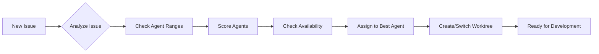

# Agent Management System - Developer Guide

**Version**: 2.0  
**Last Updated**: October 7, 2025  
**Target Audience**: Developers, DevOps Engineers, System Administrators

---

## 📋 Table of Contents

1. [Quick Start](#quick-start)
2. [System Overview](#system-overview)
3. [Core Concepts](#core-concepts)
4. [Script Reference](#script-reference)
5. [Common Workflows](#common-workflows)
6. [Configuration](#configuration)
7. [Development Patterns](#development-patterns)
8. [Troubleshooting](#troubleshooting)
9. [Best Practices](#best-practices)
10. [API Integration](#api-integration)

---

## 🚀 Quick Start

### Prerequisites

```powershell
# 1. Verify Git is installed
git --version

# 2. Verify GitHub CLI is installed and authenticated
gh auth status

# 3. Verify you're in the portfolio-os repository
git remote -v

# 4. Verify you're on the correct branch
git branch --show-current
```

### 5-Minute Setup

```powershell
# 1. Navigate to the repository root
cd c:\path\to\portfolio-os

# 2. Show agent coordination options
.\scripts\agent-management\manage-agent-coordination-unified.ps1 -Action help

# 3. Check agent status
.\scripts\agent-management\manage-agent-coordination-unified.ps1 -Action status

# 4. View Agent 1 (Frontend) commands
.\scripts\agent-management\manage-agent-coordination-unified.ps1 -Action agent1

# 5. View Agent 2 (Infrastructure) commands
.\scripts\agent-management\manage-agent-coordination-unified.ps1 -Action agent2
```

### First Agent Assignment

```powershell
# Auto-assign an issue to the optimal agent
.\scripts\agent-management\manage-worktree-operations-unified.ps1 `
    -Operation assign `
    -IssueNumber 250 `
    -Agent auto

# Or manually assign to a specific agent
.\scripts\agent-management\manage-worktree-operations-unified.ps1 `
    -Operation assign `
    -IssueNumber 250 `
    -Agent chris
```

---

## 🏗️ System Overview

### Architecture

The Agent Management System is built on three foundational pillars:

```
┌─────────────────────────────────────────────────────┐
│         Agent Management Orchestration Layer        │
├─────────────────────────────────────────────────────┤
│  • Coordination  • Assignment  • Workflow Control   │
└─────────────────────────────────────────────────────┘
                        ↓
┌─────────────────────────────────────────────────────┐
│            Worktree Management Layer                │
├─────────────────────────────────────────────────────┤
│  • Creation  • Switching  • Synchronization         │
└─────────────────────────────────────────────────────┘
                        ↓
┌─────────────────────────────────────────────────────┐
│         Integration & Automation Layer              │
├─────────────────────────────────────────────────────┤
│  • GitHub API  • Project Boards  • CI/CD            │
└─────────────────────────────────────────────────────┘
```

### Agent Profiles

#### Agent 1: Frontend/UI Specialist
- **Skills**: React, Next.js, TypeScript, Tailwind, UI/UX
- **Issue Range**: #247-254 (odd numbers typically)
- **Worktree**: `worktrees/agent-1-chris`
- **Specialties**: Frontend features, accessibility, performance

#### Agent 2: Infrastructure/SEO Specialist
- **Skills**: DevOps, SEO, Infrastructure, Security, Content
- **Issue Range**: #248-252 (even numbers typically)
- **Worktree**: `worktrees/agent-2-jason`
- **Specialties**: Infrastructure, SEO, deployment, security

---

## 🔑 Core Concepts

### 1. Worktrees

**What are worktrees?**
Git worktrees allow multiple working directories from a single repository, enabling agents to work on different branches simultaneously without conflicts.

**Benefits**:
- ✅ Parallel development without branch switching
- ✅ Isolated environments per agent
- ✅ No risk of uncommitted changes affecting other agents
- ✅ Easy context switching

**Structure**:
```
portfolio-os/
├── .git/                           # Main repository
├── worktrees/
│   ├── agent-1-chris/             # Agent 1's worktree
│   │   ├── .git                   # Linked to main repo
│   │   └── [full repository]      # Complete working directory
│   └── agent-2-jason/             # Agent 2's worktree
│       ├── .git
│       └── [full repository]
└── [main working directory]
```

### 2. Agent Assignment

**Assignment Criteria**:
1. **Issue Range**: Each agent has designated issue number ranges
2. **Skill Matching**: Issues matched to agent expertise
3. **Workload Balancing**: Distribution based on current load
4. **Complexity**: Issues assigned based on agent capability levels

**Assignment Flow**:


### 3. Coordination Modes

#### Synchronous Mode
- Agents work sequentially on related issues
- Used for dependent features
- Minimizes merge conflicts

#### Asynchronous Mode
- Agents work independently on separate issues
- Maximum parallel efficiency
- Used for isolated features

#### Hybrid Mode
- Mix of sync and async based on issue dependencies
- Most common in real-world scenarios
- Requires active coordination

---

## 📚 Script Reference

### 1. Agent Coordination (`manage-agent-coordination-unified.ps1`)

**Purpose**: Central coordination and command management for all agents.

#### Parameters

| Parameter | Type | Required | Description |
|-----------|------|----------|-------------|
| `-Action` | String | Yes | Action to perform: `agent1`, `agent2`, `status`, `sync`, `commands`, `setup`, `help` |
| `-Detailed` | Switch | No | Show detailed information including skills and specialties |
| `-DryRun` | Switch | No | Preview actions without executing |

#### Examples

```powershell
# Show Agent 1 commands and status
.\manage-agent-coordination-unified.ps1 -Action agent1

# Show detailed status for all agents
.\manage-agent-coordination-unified.ps1 -Action status -Detailed

# Show sync commands
.\manage-agent-coordination-unified.ps1 -Action sync

# Auto-detect current agent and show relevant commands
.\manage-agent-coordination-unified.ps1 -Action commands

# Show setup instructions
.\manage-agent-coordination-unified.ps1 -Action setup

# Display help
.\manage-agent-coordination-unified.ps1 -Action help
```

#### Use Cases

**Daily Standup**: Show current agent status
```powershell
.\manage-agent-coordination-unified.ps1 -Action status -Detailed
```

**New Developer Onboarding**: Show setup instructions
```powershell
.\manage-agent-coordination-unified.ps1 -Action setup
```

**Branch Sync**: Get sync commands for agents
```powershell
.\manage-agent-coordination-unified.ps1 -Action sync
```

---

### 2. Worktree Operations (`manage-worktree-operations-unified.ps1`)

**Purpose**: Comprehensive worktree lifecycle management.

#### Parameters

| Parameter | Type | Required | Description |
|-----------|------|----------|-------------|
| `-Operation` | String | Yes | Operation: `assign`, `switch`, `status`, `create`, `list`, `sync`, `cleanup`, `help` |
| `-IssueNumber` | Int | Conditional | Issue number (required for `assign`) |
| `-Agent` | String | Conditional | Agent name: `chris`, `jason`, `agent1`, `agent2`, `auto` |
| `-DryRun` | Switch | No | Preview without executing |
| `-Force` | Switch | No | Force operation even if constraints violated |
| `-Detailed` | Switch | No | Show detailed information |

#### Examples

```powershell
# Auto-assign issue to optimal agent
.\manage-worktree-operations-unified.ps1 -Operation assign -IssueNumber 250 -Agent auto

# Manually assign to specific agent
.\manage-worktree-operations-unified.ps1 -Operation assign -IssueNumber 247 -Agent chris

# Switch to agent's worktree
.\manage-worktree-operations-unified.ps1 -Operation switch -Agent jason

# Show all worktree status
.\manage-worktree-operations-unified.ps1 -Operation status -Detailed

# Create worktree for agent
.\manage-worktree-operations-unified.ps1 -Operation create -Agent agent1

# Sync all worktrees
.\manage-worktree-operations-unified.ps1 -Operation sync

# Preview cleanup (safe)
.\manage-worktree-operations-unified.ps1 -Operation cleanup -DryRun

# Force cleanup (dangerous!)
.\manage-worktree-operations-unified.ps1 -Operation cleanup -Force
```

#### Use Cases

**Issue Assignment**: Automatically assign and switch
```powershell
# Let the system choose the best agent
.\manage-worktree-operations-unified.ps1 -Operation assign -IssueNumber 251 -Agent auto
```

**Context Switching**: Quickly switch between agents
```powershell
# Switch to Agent 2's worktree
.\manage-worktree-operations-unified.ps1 -Operation switch -Agent agent2
```

**Maintenance**: Keep worktrees in sync
```powershell
# Daily sync routine
.\manage-worktree-operations-unified.ps1 -Operation sync
```

---

### 3. E2E Development Workflows (`start-multi-agent-e2e-unified.ps1`)

**Purpose**: End-to-end development workflow orchestration.

#### Parameters

| Parameter | Type | Required | Description |
|-----------|------|----------|-------------|
| `-Agent` | String | Yes | Target agent: `Agent1`, `Agent2`, `Both`, `All` |
| `-Mode` | String | No | Execution mode: `continuous`, `individual`, `batch`, `monitor` (default: `continuous`) |
| `-Setup` | Switch | No | Show setup instructions |
| `-DryRun` | Switch | No | Preview without executing |
| `-Detailed` | Switch | No | Show detailed information |

#### Examples

```powershell
# Start continuous E2E for Agent 1
.\start-multi-agent-e2e-unified.ps1 -Agent Agent1 -Mode continuous

# Show setup for both agents
.\start-multi-agent-e2e-unified.ps1 -Agent Both -Setup

# Individual issue processing for Agent 2
.\start-multi-agent-e2e-unified.ps1 -Agent Agent2 -Mode individual -Detailed

# Batch processing for both agents
.\start-multi-agent-e2e-unified.ps1 -Agent Both -Mode batch

# Monitoring mode
.\start-multi-agent-e2e-unified.ps1 -Agent All -Mode monitor

# Preview continuous mode
.\start-multi-agent-e2e-unified.ps1 -Agent Agent1 -Mode continuous -DryRun
```

#### Execution Modes

**Continuous Mode** (Recommended)
- Processes all assigned issues sequentially
- Automated project field updates
- Continuous PR creation and monitoring
- Best for: Production workflows

**Individual Mode**
- Step-by-step issue processing
- Manual control at each stage
- Best for: Learning, debugging, complex issues

**Batch Mode**
- Process multiple issues in parallel
- Optimized for throughput
- Best for: Large backlog clearing

**Monitor Mode**
- Real-time progress tracking
- Performance analytics
- Best for: Oversight and reporting

---

### 4. Advanced Coordinator (`manage-agent-coordinator.ps1`)

**Purpose**: Intelligent AI-powered issue assignment and load balancing.

#### Parameters

| Parameter | Type | Required | Description |
|-----------|------|----------|-------------|
| `-Operation` | String | Yes | Operation: `auto-assign`, `balance-load`, `claim-issue`, `coordinate`, `status`, `analyze` |
| `-Target` | String | No | Target issue or agent |
| `-Options` | String | No | Additional options |
| `-DryRun` | Switch | No | Preview without executing |
| `-MaxIssues` | Int | No | Maximum issues to process (default: 10) |

#### Examples

```powershell
# Auto-assign up to 10 issues
.\manage-agent-coordinator.ps1 -Operation auto-assign -MaxIssues 10

# Balance workload across agents
.\manage-agent-coordinator.ps1 -Operation balance-load

# Analyze specific issue
.\manage-agent-coordinator.ps1 -Operation analyze -Target 250

# Coordinate entire system
.\manage-agent-coordinator.ps1 -Operation coordinate -MaxIssues 20

# Show coordinator status
.\manage-agent-coordinator.ps1 -Operation status

# Preview auto-assignment
.\manage-agent-coordinator.ps1 -Operation auto-assign -MaxIssues 5 -DryRun
```

---

### 5. Multi-Agent System Manager (`manage-multi-agent-system.ps1`)

**Purpose**: System-level agent lifecycle and environment management.

#### Operations

- `setup`: Initialize multi-agent environment
- `create`: Create new agent worktrees
- `destroy`: Remove agent worktrees
- `list`: Display agent status
- `assign`: Assign issues to agents
- `sync`: Synchronize worktrees
- `status`: Show system health
- `cleanup`: Automated maintenance

#### Examples

```powershell
# Initial system setup
.\manage-multi-agent-system.ps1 -Operation setup

# List all agents
.\manage-multi-agent-system.ps1 -Operation list

# System status check
.\manage-multi-agent-system.ps1 -Operation status

# Sync all agents
.\manage-multi-agent-system.ps1 -Operation sync

# System cleanup
.\manage-multi-agent-system.ps1 -Operation cleanup
```

---

### 6. Development Setup (`setup-agent-development.ps1`)

**Purpose**: Initialize and configure the multi-agent development environment.

#### Parameters

| Parameter | Type | Required | Description |
|-----------|------|----------|-------------|
| `-Agent1Name` | String | No | Name for Agent 1 (default: "Agent-1") |
| `-Agent2Name` | String | No | Name for Agent 2 (default: "Agent-2") |

#### Examples

```powershell
# Standard setup
.\setup-agent-development.ps1

# Custom agent names
.\setup-agent-development.ps1 -Agent1Name "Chris" -Agent2Name "Jason"
```

---

### 7. Status Updates (`update-agent-status.ps1`)

**Purpose**: Update project board status based on agent actions.

#### Parameters

| Parameter | Type | Required | Description |
|-----------|------|----------|-------------|
| `-IssueNumber` | Int | Yes | Issue number to update |
| `-Action` | String | Yes | Action: `start`, `complete`, `create-pr`, `merge-pr` |
| `-AgentName` | String | No | Agent name (default: "agent-3") |
| `-DryRun` | Switch | No | Preview without executing |

#### Examples

```powershell
# Agent starts work on issue
.\update-agent-status.ps1 -IssueNumber 250 -Action start -AgentName agent-2

# Agent completes issue
.\update-agent-status.ps1 -IssueNumber 250 -Action complete -AgentName agent-2

# PR created
.\update-agent-status.ps1 -IssueNumber 250 -Action create-pr -AgentName agent-2

# PR merged
.\update-agent-status.ps1 -IssueNumber 250 -Action merge-pr -AgentName agent-2

# Preview update
.\update-agent-status.ps1 -IssueNumber 250 -Action start -DryRun
```

---

### 8. PR Assignment Workflow (`pr-agent-assignment-workflow.ps1`)

**Purpose**: Automated PR analysis and agent assignment.

#### Parameters

| Parameter | Type | Required | Description |
|-----------|------|----------|-------------|
| `-Operation` | String | Yes | Operation type |
| `-PRNumber` | Int | Conditional | PR number (if applicable) |
| `-DryRun` | Switch | No | Preview without executing |

#### Examples

```powershell
# Analyze and assign PR
.\pr-agent-assignment-workflow.ps1 -Operation assign -PRNumber 123

# Batch process open PRs
.\pr-agent-assignment-workflow.ps1 -Operation batch-assign

# Preview assignment
.\pr-agent-assignment-workflow.ps1 -Operation assign -PRNumber 123 -DryRun
```

---

## 🔄 Common Workflows

### Workflow 1: Daily Development Start

```powershell
# 1. Check overall system status
.\scripts\agent-management\manage-agent-coordination-unified.ps1 -Action status

# 2. Switch to your agent's worktree
.\scripts\agent-management\manage-worktree-operations-unified.ps1 -Operation switch -Agent chris

# 3. Sync with latest changes
git pull origin develop

# 4. View your assigned issues and commands
.\scripts\agent-management\manage-agent-coordination-unified.ps1 -Action agent1 -Detailed

# 5. Start working on an issue
.\scripts\agent-management\manage-worktree-operations-unified.ps1 -Operation assign -IssueNumber 247 -Agent chris
```

### Workflow 2: New Issue Assignment

```powershell
# Option A: Auto-assign to optimal agent
.\scripts\agent-management\manage-worktree-operations-unified.ps1 `
    -Operation assign `
    -IssueNumber 255 `
    -Agent auto

# Option B: Use intelligent coordinator
.\scripts\agent-management\manage-agent-coordinator.ps1 `
    -Operation analyze `
    -Target 255

# Then manually assign if needed
.\scripts\agent-management\manage-worktree-operations-unified.ps1 `
    -Operation assign `
    -IssueNumber 255 `
    -Agent agent1
```

### Workflow 3: E2E Issue Processing

```powershell
# 1. Start E2E workflow for Agent 1
.\scripts\agent-management\start-multi-agent-e2e-unified.ps1 `
    -Agent Agent1 `
    -Mode continuous `
    -Detailed

# 2. Monitor progress
.\scripts\monitoring\automation-metrics.ps1 `
    -Operation agents `
    -Agent Agent1 `
    -RealTime

# 3. Update status as work progresses
.\scripts\agent-management\update-agent-status.ps1 `
    -IssueNumber 247 `
    -Action start `
    -AgentName agent-1

# 4. Complete and merge
.\scripts\agent-management\update-agent-status.ps1 `
    -IssueNumber 247 `
    -Action complete `
    -AgentName agent-1
```

### Workflow 4: Coordinated Multi-Agent Sprint

```powershell
# 1. Setup both agents
.\scripts\agent-management\manage-agent-coordination-unified.ps1 -Action setup

# 2. Balance workload
.\scripts\agent-management\manage-agent-coordinator.ps1 -Operation balance-load

# 3. Auto-assign issues to both agents
.\scripts\agent-management\manage-agent-coordinator.ps1 `
    -Operation auto-assign `
    -MaxIssues 8

# 4. Start E2E for both agents
.\scripts\agent-management\start-multi-agent-e2e-unified.ps1 `
    -Agent Both `
    -Mode continuous

# 5. Monitor coordination
.\scripts\agent-management\manage-agent-coordinator.ps1 -Operation status
```

### Workflow 5: Worktree Maintenance

```powershell
# 1. Check worktree status
.\scripts\agent-management\manage-worktree-operations-unified.ps1 -Operation status -Detailed

# 2. Sync all worktrees
.\scripts\agent-management\manage-worktree-operations-unified.ps1 -Operation sync

# 3. Preview cleanup (safe)
.\scripts\agent-management\manage-worktree-operations-unified.ps1 -Operation cleanup -DryRun

# 4. If needed, force cleanup
.\scripts\agent-management\manage-worktree-operations-unified.ps1 -Operation cleanup -Force

# 5. Recreate worktrees
.\scripts\agent-management\manage-worktree-operations-unified.ps1 -Operation create -Agent agent1
.\scripts\agent-management\manage-worktree-operations-unified.ps1 -Operation create -Agent agent2
```

---

## ⚙️ Configuration

### Agent Configuration File

**Location**: `scripts/configuration/agent-assignment-config.json`

**Structure**:
```json
{
  "humanAgents": {
    "chris": {
      "name": "Chris (Agent 1)",
      "agentType": "Frontend/UI Specialist",
      "workTreePath": "worktrees/agent-1-chris",
      "branchPrefix": "issue-",
      "issueRanges": [247, 254, 251, 254, 253, 254],
      "skills": ["React", "Next.js", "UI/UX", "Accessibility", "Performance"],
      "specialties": ["frontend", "ui", "accessibility", "performance"],
      "maxConcurrentIssues": 4
    },
    "jason": {
      "name": "Jason (Agent 2)",
      "agentType": "Infrastructure/SEO Specialist",
      "workTreePath": "worktrees/agent-2-jason",
      "branchPrefix": "issue-",
      "issueRanges": [248, 252, 249, 252, 250, 252],
      "skills": ["DevOps", "SEO", "Infrastructure", "Security", "Content"],
      "specialties": ["infrastructure", "seo", "deployment", "security"],
      "maxConcurrentIssues": 4
    }
  }
}
```

### Customizing Agent Configuration

```powershell
# 1. Edit configuration file
code scripts/configuration/agent-assignment-config.json

# 2. Modify agent properties:
#    - issueRanges: Adjust issue number assignments
#    - skills: Add/remove agent capabilities
#    - maxConcurrentIssues: Adjust workload capacity
#    - workTreePath: Change worktree location

# 3. Validate configuration
.\scripts\agent-management\manage-agent-coordination-unified.ps1 -Action status

# 4. Apply changes (scripts auto-load config)
```

### Environment Variables

```powershell
# GitHub API Token (for enhanced operations)
$env:GITHUB_TOKEN = "ghp_your_token_here"

# Project Board ID
$env:PROJECT_BOARD_ID = "PVT_kwHOAEnMVc4BCu-c"

# Default Agent
$env:DEFAULT_AGENT = "agent1"

# Dry Run Mode (for testing)
$env:AGENT_SYSTEM_DRY_RUN = "true"
```

---

## 💻 Development Patterns

### Pattern 1: Dry Run Everything First

**Always preview potentially destructive operations:**

```powershell
# Good: Preview first
.\manage-worktree-operations-unified.ps1 -Operation cleanup -DryRun
# Review output, then:
.\manage-worktree-operations-unified.ps1 -Operation cleanup -Force

# Bad: Execute without preview
.\manage-worktree-operations-unified.ps1 -Operation cleanup -Force
```

### Pattern 2: Status Before Action

**Check status before making changes:**

```powershell
# Check current state
.\manage-agent-coordination-unified.ps1 -Action status -Detailed

# Then perform action
.\manage-worktree-operations-unified.ps1 -Operation assign -IssueNumber 250 -Agent auto

# Verify result
.\manage-agent-coordination-unified.ps1 -Action status
```

### Pattern 3: Detailed Logging

**Enable detailed output for troubleshooting:**

```powershell
# Standard operation
.\manage-agent-coordinator.ps1 -Operation auto-assign

# With detailed logging
.\manage-agent-coordinator.ps1 -Operation auto-assign -Detailed

# With output redirection for logs
.\manage-agent-coordinator.ps1 -Operation auto-assign -Detailed 2>&1 | Tee-Object -FilePath "logs/agent-assignment.log"
```

### Pattern 4: Incremental Operations

**Process in small batches:**

```powershell
# Good: Small batches
.\manage-agent-coordinator.ps1 -Operation auto-assign -MaxIssues 5
# Review, then process more
.\manage-agent-coordinator.ps1 -Operation auto-assign -MaxIssues 5

# Bad: Large batches without review
.\manage-agent-coordinator.ps1 -Operation auto-assign -MaxIssues 50
```

### Pattern 5: Error Recovery

**Handle errors gracefully:**

```powershell
# Wrap in try-catch for automation
try {
    .\manage-worktree-operations-unified.ps1 -Operation sync
    Write-Host "Sync successful" -ForegroundColor Green
} catch {
    Write-Host "Sync failed: $($_.Exception.Message)" -ForegroundColor Red
    # Attempt recovery
    .\manage-worktree-operations-unified.ps1 -Operation status
}
```

---

## 🐛 Troubleshooting

### Issue: Worktree Already Exists

**Error**: `Work tree already exists: worktrees/agent-1-chris`

**Solution**:
```powershell
# Check existing worktrees
git worktree list

# Remove existing worktree
git worktree remove worktrees/agent-1-chris --force

# Recreate
.\manage-worktree-operations-unified.ps1 -Operation create -Agent agent1
```

### Issue: Agent Can't Access Worktree

**Error**: `Work tree not found: worktrees/agent-2-jason`

**Solution**:
```powershell
# Verify worktree exists
.\manage-worktree-operations-unified.ps1 -Operation status

# If missing, create it
.\manage-worktree-operations-unified.ps1 -Operation create -Agent agent2

# Verify creation
git worktree list
```

### Issue: Merge Conflicts in Worktree

**Error**: Merge conflicts when syncing worktrees

**Solution**:
```powershell
# 1. Switch to the problematic worktree
cd worktrees/agent-1-chris

# 2. Check status
git status

# 3. Resolve conflicts manually or abort
git merge --abort

# 4. Reset to clean state
git fetch origin
git reset --hard origin/develop

# 5. Return to main directory
cd ../..

# 6. Try sync again
.\scripts\agent-management\manage-worktree-operations-unified.ps1 -Operation sync
```

### Issue: GitHub Authentication Failed

**Error**: `GitHub authentication required`

**Solution**:
```powershell
# Check auth status
gh auth status

# Login if needed
gh auth login

# Verify credentials
gh api user

# Test with simple query
gh issue list --limit 5
```

### Issue: Script Execution Policy

**Error**: `cannot be loaded because running scripts is disabled`

**Solution**:
```powershell
# Check current policy
Get-ExecutionPolicy

# Set policy for current user (recommended)
Set-ExecutionPolicy -ExecutionPolicy RemoteSigned -Scope CurrentUser

# Or bypass for single command
powershell -ExecutionPolicy Bypass -File .\manage-agent-coordination-unified.ps1 -Action status
```

### Issue: Agent Assignment Not Working

**Error**: `No suitable agent found for Issue #XXX`

**Solution**:
```powershell
# 1. Check agent configuration
.\manage-agent-coordination-unified.ps1 -Action status -Detailed

# 2. Verify issue ranges in config
code scripts/configuration/agent-assignment-config.json

# 3. Force assignment if needed
.\manage-worktree-operations-unified.ps1 `
    -Operation assign `
    -IssueNumber XXX `
    -Agent agent1 `
    -Force

# 4. Analyze issue for recommendations
.\manage-agent-coordinator.ps1 -Operation analyze -Target XXX
```

### Issue: Worktree Sync Failures

**Error**: Worktree sync fails repeatedly

**Solution**:
```powershell
# 1. Check for uncommitted changes
.\manage-worktree-operations-unified.ps1 -Operation status -Detailed

# 2. Clean worktrees (nuclear option)
.\manage-worktree-operations-unified.ps1 -Operation cleanup -Force

# 3. Recreate from scratch
.\manage-multi-agent-system.ps1 -Operation setup

# 4. Verify recreation
git worktree list
```

---

## ✅ Best Practices

### 1. Daily Routine

```powershell
# Morning: Start of day
.\scripts\agent-management\manage-agent-coordination-unified.ps1 -Action status
.\scripts\agent-management\manage-worktree-operations-unified.ps1 -Operation sync

# During: Work on issues
.\scripts\agent-management\manage-worktree-operations-unified.ps1 -Operation assign -IssueNumber XXX -Agent auto
.\scripts\agent-management\update-agent-status.ps1 -IssueNumber XXX -Action start

# Evening: End of day
.\scripts\agent-management\update-agent-status.ps1 -IssueNumber XXX -Action complete
.\scripts\agent-management\manage-agent-coordination-unified.ps1 -Action status
```

### 2. Code Review Before Merge

- Always preview operations with `-DryRun`
- Check worktree status before major operations
- Verify agent assignments are correct
- Review coordination status after bulk operations

### 3. Naming Conventions

- Use descriptive branch names: `issue-XXX-descriptive-name`
- Follow agent prefixes: `agent1-`, `agent2-`
- Use consistent issue references: `#XXX` format

### 4. Documentation

- Document custom workflows in team wiki
- Keep agent configuration comments up to date
- Log unusual operations for audit trail
- Share learnings in team retrospectives

### 5. Security

- Never commit GitHub tokens to repository
- Use environment variables for sensitive data
- Review agent permissions regularly
- Audit worktree access patterns

### 6. Performance

- Limit concurrent operations to agent capacity
- Use batch mode for bulk operations
- Monitor system resources during heavy operations
- Clean up unused worktrees regularly

### 7. Error Handling

- Always check operation exit codes
- Log errors for post-mortem analysis
- Have rollback procedures documented
- Test recovery procedures regularly

---

## 🔌 API Integration

### GitHub CLI Integration

```powershell
# List issues for project
gh issue list --project "Portfolio Site" --limit 20

# Create issue
gh issue create --title "New feature" --body "Description" --project "Portfolio Site"

# Update issue
gh issue edit 250 --add-label "in-progress"

# Create PR
gh pr create --title "Fix #250" --body "Closes #250" --base develop
```

### Project Board Integration

```powershell
# Add issue to project
gh project item-add 20 --owner jschibelli --url "https://github.com/jschibelli/portfolio-os/issues/250"

# Update field
gh project item-edit --id ITEM_ID --field-id FIELD_ID --project-id PROJECT_ID --value "In Progress"
```

### Automation Integration

```powershell
# Trigger from GitHub Actions
name: Agent Assignment
on:
  issues:
    types: [opened]
jobs:
  assign:
    runs-on: windows-latest
    steps:
      - uses: actions/checkout@v3
      - name: Auto-assign to agent
        run: |
          .\scripts\agent-management\manage-worktree-operations-unified.ps1 `
            -Operation assign `
            -IssueNumber ${{ github.event.issue.number }} `
            -Agent auto
```

---

## 📞 Support & Resources

### Documentation
- **Main README**: `scripts/agent-management/README.md`
- **Consolidation Summary**: `scripts/agent-management/CONSOLIDATION_SUMMARY.md`
- **This Guide**: `scripts/agent-management/DEVELOPER_GUIDE.md`

### Quick Help

```powershell
# Script-specific help
.\manage-agent-coordination-unified.ps1 -Action help
.\manage-worktree-operations-unified.ps1 -Operation help
.\start-multi-agent-e2e-unified.ps1 -Agent Agent1 -Setup
```

### Common Commands Reference Card

```powershell
# Status Check
.\scripts\agent-management\manage-agent-coordination-unified.ps1 -Action status

# Assign Issue
.\scripts\agent-management\manage-worktree-operations-unified.ps1 -Operation assign -IssueNumber XXX -Agent auto

# Switch Agent
.\scripts\agent-management\manage-worktree-operations-unified.ps1 -Operation switch -Agent chris

# Sync Worktrees
.\scripts\agent-management\manage-worktree-operations-unified.ps1 -Operation sync

# Balance Load
.\scripts\agent-management\manage-agent-coordinator.ps1 -Operation balance-load

# Update Status
.\scripts\agent-management\update-agent-status.ps1 -IssueNumber XXX -Action start
```

---

## 🎓 Advanced Topics

### Custom Agent Creation

To add a new agent (Agent 3):

1. **Update Configuration**:
```json
{
  "agent3": {
    "name": "Agent 3: Backend Specialist",
    "agentType": "Backend/API Specialist",
    "workTreePath": "worktrees/agent-3-backend",
    "branchPrefix": "issue-",
    "issueRanges": [260, 270],
    "skills": ["Node.js", "API", "Database", "Prisma"],
    "specialties": ["backend", "api", "database"],
    "maxConcurrentIssues": 3
  }
}
```

2. **Create Worktree**:
```powershell
.\manage-worktree-operations-unified.ps1 -Operation create -Agent agent3
```

3. **Update Scripts**: Modify unified scripts to include agent3 in agent lists

### Extending Functionality

To add custom operations:

1. Create new script in `scripts/agent-management/`
2. Follow naming convention: `<purpose>-<action>.ps1`
3. Include standard parameters: `-DryRun`, `-Detailed`, `-Force`
4. Add help documentation
5. Update README and this guide

---

**Version**: 2.0  
**Last Updated**: October 7, 2025  
**Maintained By**: Portfolio OS Development Team
