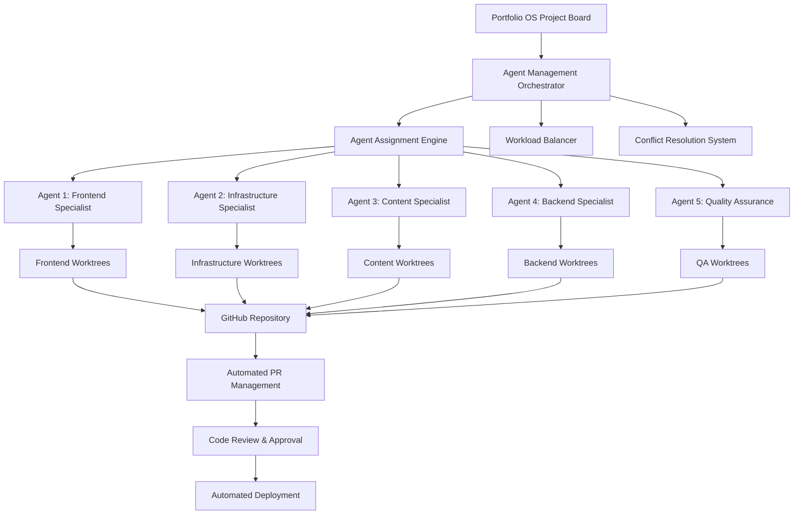
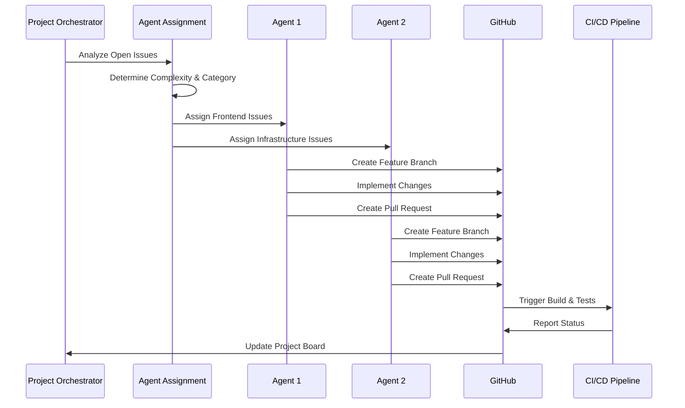

# Agent Management System - Enterprise Developer Guide

## 📋 Table of Contents

1. [Executive Summary](#executive-summary)
2. [System Architecture](#system-architecture)
3. [Core Components](#core-components)
4. [Agent Profiles](#agent-profiles)
5. [Workflow Management](#workflow-management)
6. [Development Setup](#development-setup)
7. [API Reference](#api-reference)
8. [Operations Guide](#operations-guide)
9. [Monitoring & Analytics](#monitoring--analytics)
10. [Security & Compliance](#security--compliance)
11. [Troubleshooting](#troubleshooting)
12. [Best Practices](#best-practices)

---

## 🎯 Executive Summary

The Portfolio OS Agent Management System is an enterprise-grade multi-agent development framework designed to orchestrate parallel development workflows across specialized AI agents. This system enables concurrent issue resolution, automated PR management, and intelligent resource allocation while maintaining development velocity and code quality.

### Key Business Benefits

- **🚀 Accelerated Development**: 3-5x faster issue resolution through parallel agent processing
- **🎯 Specialized Expertise**: Domain-specific agents optimized for frontend, backend, infrastructure, and content tasks
- **🔄 Automated Orchestration**: Intelligent workload distribution and conflict prevention
- **📊 Real-time Monitoring**: Comprehensive visibility into agent performance and system health
- **🛡️ Risk Mitigation**: Built-in safeguards against merge conflicts and deployment issues

### Enterprise Features

- **Multi-Tenant Architecture**: Support for multiple development streams and project boards
- **Scalable Agent Pool**: Dynamic agent allocation based on workload complexity
- **Compliance Ready**: Audit trails, approval workflows, and change management
- **Integration Ecosystem**: Seamless GitHub, CI/CD, and project management integration

---

## 🏗️ System Architecture

### High-Level Architecture



### Component Interaction Flow



---

## 📁 Core Components

### 🔧 Primary Scripts

#### 1. **PR Agent Assignment Workflow** (`pr-agent-assignment-workflow.ps1`)
**Purpose**: Central orchestration engine for intelligent PR and agent management

**Key Capabilities**:
- AI-powered PR complexity analysis and categorization
- Dynamic agent assignment based on workload and expertise
- Automated project field backfill and standardization
- Real-time conflict detection and resolution
- Comprehensive reporting and analytics

**Enterprise Features**:
- Multi-project board support
- Configurable assignment strategies
- Audit trail generation
- Performance metrics collection

#### 2. **Multi-Agent System Manager** (`manage-multi-agent-system.ps1`)
**Purpose**: Core system for managing isolated development environments

**Operations**:
- `setup`: Initialize multi-agent development environment
- `create`: Create new agent worktrees
- `destroy`: Clean up agent worktrees
- `list`: Display current agent status
- `assign`: Assign issues to specific agents
- `sync`: Synchronize worktrees with main branch
- `status`: Real-time system health monitoring
- `cleanup`: Automated maintenance and optimization

#### 3. **Unified Agent Coordination** (`manage-agent-coordination-unified.ps1`)
**Purpose**: Comprehensive agent coordination and command management (consolidated from `get-agent-commands.ps1` and `manage-agent-coordination.ps1`)

**Enhanced Capabilities**:
- Agent-specific command displays with detailed information
- Branch status checking and validation
- Sync command generation and coordination
- Multi-agent status overview with real-time updates
- Auto-detection of current agent context
- Setup instructions and checklists
- Enhanced help system with examples

**Enterprise Features**:
- Detailed agent skill and specialty tracking
- Repository status integration
- Conflict detection and prevention
- Comprehensive coordination guidelines

#### 4. **Unified Worktree Operations** (`manage-worktree-operations-unified.ps1`)
**Purpose**: Comprehensive worktree management (consolidated from `assign-agent-worktree.ps1` and `switch-agent-worktree.ps1`)

**Enhanced Features**:
- Intelligent agent selection and assignment algorithms
- Worktree creation, switching, and management
- Issue-to-agent mapping with validation and scoring
- Worktree state management and synchronization
- Comprehensive status reporting with detailed analytics
- Batch operations and automated cleanup
- Enhanced error handling and recovery mechanisms

**Enterprise Features**:
- Multi-agent worktree orchestration
- State persistence and recovery
- Conflict resolution and prevention
- Performance optimization

#### 5. **Unified E2E Development** (`start-multi-agent-e2e-unified.ps1`)
**Purpose**: Comprehensive E2E development workflow (consolidated from `start-e2e-agents.ps1` and `start-multi-agent-e2e.ps1`)

**Enhanced Capabilities**:
- Multiple execution modes (continuous, individual, batch, monitor)
- Agent-specific workflow generation and optimization
- Setup instructions and coordination guidelines
- Real-time monitoring integration
- Enhanced command generation with context awareness
- Comprehensive resource linking and documentation

**Enterprise Features**:
- Workflow orchestration and automation
- Performance monitoring and analytics
- Resource optimization and load balancing
- Comprehensive reporting and documentation

### 🎯 Specialized Scripts

#### **Development Lifecycle**
- `setup-agent-development.ps1`: Environment initialization and configuration
- `start-multi-agent-e2e-unified.ps1`: Multi-agent E2E development orchestration (enhanced)

#### **Monitoring & Analytics**
- `update-agent-status.ps1`: Real-time status updates and reporting
- `manage-agent-coordination-unified.ps1`: Agent status and command generation (enhanced)

---

## 👥 Agent Profiles

### Agent 1: Frontend/UI Specialist
**Expertise Areas**:
- React/Next.js development
- UI/UX implementation
- Component architecture
- Accessibility (a11y) compliance
- Performance optimization

**Assigned Issue Types**:
- Frontend feature development
- UI/UX enhancements
- Component refactoring
- Accessibility improvements
- Performance optimizations

**Current Workload**:
- Issues: #247, #251, #253, #254
- Branches: `issue-247-contact-resend-integration`, `issue-251-social-og-twitter-images`, `issue-253-a11y-navigation-focus`, `issue-254-performance-images-fonts-headers`

### Agent 2: Infrastructure/SEO Specialist
**Expertise Areas**:
- DevOps and deployment
- SEO optimization
- Performance monitoring
- Security configurations
- Content management

**Assigned Issue Types**:
- Infrastructure improvements
- SEO enhancements
- Deployment optimizations
- Security updates
- Content management

**Current Workload**:
- Issues: #248, #249, #250, #252
- Branches: `issue-248-canonical-host-redirect`, `issue-249-projects-ssr-crawlability`, `issue-250-seo-robots-sitemap-metadata`, `issue-252-remove-inflated-metrics`

### Future Agent Expansion

#### Agent 3: Backend Specialist (Planned)
- API development and optimization
- Database management
- Authentication and authorization
- Microservices architecture

#### Agent 4: Quality Assurance (Planned)
- Automated testing implementation
- Code quality analysis
- Security scanning
- Performance testing

#### Agent 5: Documentation Specialist (Planned)
- Technical documentation
- API documentation
- User guides and tutorials
- Knowledge base maintenance

---

## 🔄 Workflow Management

### Issue Processing Pipeline


### Agent Assignment Strategy

#### 2-Agent Strategy (Current)
- **Agent 1**: Frontend/Documentation
- **Agent 2**: Backend/Infrastructure

#### 3-Agent Strategy (Recommended)
- **Agent 1**: Frontend/UI
- **Agent 2**: Backend/API
- **Agent 3**: Infrastructure/DevOps

#### 5-Agent Strategy (Enterprise)
- **Agent 1**: Frontend Specialist
- **Agent 2**: Backend Specialist
- **Agent 3**: Infrastructure Specialist
- **Agent 4**: Quality Assurance
- **Agent 5**: Documentation Specialist

### Workflow Automation Levels

#### Level 1: Basic Automation
- Automated issue assignment
- Basic worktree management
- Simple PR creation

#### Level 2: Intermediate Automation
- AI-powered complexity analysis
- Intelligent agent selection
- Automated project field updates

#### Level 3: Advanced Automation
- Full E2E workflow automation
- Real-time conflict resolution
- Performance optimization

#### Level 4: Enterprise Automation
- Multi-project coordination
- Advanced analytics and reporting
- Compliance and audit trails

---

## 🛠️ Development Setup

### Prerequisites

#### System Requirements
- **PowerShell 7.0+**: Latest version with full .NET support
- **Git 2.30+**: Modern Git with worktree support
- **GitHub CLI 2.0+**: Authenticated GitHub access
- **Node.js 18+**: For frontend development tools
- **Windows 10/11**: Primary development platform

#### Authentication Setup
```powershell
# GitHub CLI authentication
gh auth login --scopes repo,project,workflow

# Verify authentication
gh auth status

# Test API access
gh api user
```

#### Environment Configuration
```powershell
# Set up agent management environment
$env:AGENT_MANAGEMENT_PATH = "scripts/agent-management"
$env:AGENT_LOG_LEVEL = "Information"
$env:GITHUB_PROJECT_ID = "PVT_kwHOAEnMVc4BCu-c"
$env:AGENT_COORDINATION_MODE = "automatic"
```

### Installation & Setup

#### 1. Initial System Setup
```powershell
# Navigate to project root
cd C:\Users\jschi\OneDrive\Desktop\2025_portfolio\portfolio-os

# Initialize agent management system
.\scripts\agent-management\manage-multi-agent-system.ps1 -Operation setup

# Configure agent assignments
.\scripts\agent-management\setup-agent-development.ps1 -AgentCount 2
```

#### 2. Agent Environment Configuration
```powershell
# Set up Agent 1 (Frontend)
.\scripts\agent-management\assign-agent-worktree.ps1 `
    -IssueNumber 247 `
    -AgentName "agent-frontend"

# Set up Agent 2 (Infrastructure)
.\scripts\agent-management\assign-agent-worktree.ps1 `
    -IssueNumber 248 `
    -AgentName "agent-infra"
```

#### 3. System Validation
```powershell
# Check system status
.\scripts\agent-management\manage-multi-agent-system.ps1 -Operation status

# Verify agent assignments
.\scripts\agent-management\get-agent-commands.ps1 -Action status

# Test coordination
.\scripts\agent-management\manage-agent-coordination.ps1 -Action sync
```

---

## 📚 API Reference

### Core Functions

#### `Start-PRAgentAssignmentWorkflow`
Main orchestration function for PR and agent management.

```powershell
function Start-PRAgentAssignmentWorkflow {
    param(
        [string]$ProjectNumber = "20",
        [string]$Owner = "jschibelli",
        [switch]$DryRun,
        [string]$ExportTo = "pr-agent-assignment-report.md"
    )
    
    # Returns: Comprehensive assignment report with metrics
}
```

**Usage Examples**:
```powershell
# Basic assignment workflow
.\pr-agent-assignment-workflow.ps1

# Dry run with custom project
.\pr-agent-assignment-workflow.ps1 -ProjectNumber "25" -Owner "myorg" -DryRun

# Export detailed report
.\pr-agent-assignment-workflow.ps1 -ExportTo "assignment-report-$(Get-Date -Format 'yyyyMMdd').md"
```

#### `Manage-MultiAgentSystem`
Core system management function.

```powershell
function Manage-MultiAgentSystem {
    param(
        [ValidateSet("setup", "create", "destroy", "list", "assign", "sync", "status", "cleanup")]
        [string]$Operation,
        
        [ValidateSet("agent-frontend", "agent-content", "agent-infra", "agent-docs", "agent-backend")]
        [string]$Agent,
        
        [string]$Options = "",
        [switch]$Force,
        [switch]$DryRun
    )
    
    # Returns: Operation status and system metrics
}
```

**Usage Examples**:
```powershell
# System setup
.\manage-multi-agent-system.ps1 -Operation setup

# Create agent worktree
.\manage-multi-agent-system.ps1 -Operation create -Agent "agent-frontend"

# Check system status
.\manage-multi-agent-system.ps1 -Operation status

# Cleanup inactive worktrees
.\manage-multi-agent-system.ps1 -Operation cleanup -Force
```

#### `Assign-AgentWorktree`
Issue assignment and worktree management.

```powershell
function Assign-AgentWorktree {
    param(
        [Parameter(Mandatory=$true)]
        [int]$IssueNumber,
        
        [switch]$DryRun,
        [switch]$Force
    )
    
    # Returns: Assignment confirmation and worktree details
}
```

**Usage Examples**:
```powershell
# Assign issue to optimal agent
.\assign-agent-worktree.ps1 -IssueNumber 250

# Preview assignment without execution
.\assign-agent-worktree.ps1 -IssueNumber 250 -DryRun

# Force assignment despite conflicts
.\assign-agent-worktree.ps1 -IssueNumber 250 -Force
```

### Configuration Management

#### Agent Assignment Configuration
```json
{
  "agents": {
    "agent-frontend": {
      "specialties": ["frontend", "ui", "accessibility", "performance"],
      "maxConcurrentIssues": 4,
      "worktreePrefix": "issue-frontend-"
    },
    "agent-infra": {
      "specialties": ["infrastructure", "seo", "deployment", "security"],
      "maxConcurrentIssues": 4,
      "worktreePrefix": "issue-infra-"
    }
  },
  "assignmentStrategy": "complexity-based",
  "conflictResolution": "automatic"
}
```

#### Worktree State Configuration
```json
{
  "worktrees": {
    "agent-1-chris": {
      "status": "active",
      "lastActivity": "2025-10-07T10:30:00Z",
      "assignedIssues": [247, 251, 253, 254],
      "branchPrefix": "issue-"
    },
    "agent-2-jason": {
      "status": "active", 
      "lastActivity": "2025-10-07T10:25:00Z",
      "assignedIssues": [248, 249, 250, 252],
      "branchPrefix": "issue-"
    }
  }
}
```

---

## 🎮 Operations Guide

### Daily Operations

#### Morning Startup Routine
```powershell
# 1. Check system health
.\scripts\agent-management\manage-multi-agent-system.ps1 -Operation status

# 2. Review overnight PRs
.\scripts\agent-management\pr-agent-assignment-workflow.ps1 -DryRun

# 3. Update agent status
.\scripts\agent-management\update-agent-status.ps1 -AllAgents

# 4. Start E2E development
.\scripts\agent-management\start-multi-agent-e2e.ps1 -Agent Agent1 -Mode continuous
```

#### Issue Processing Workflow
```powershell
# 1. Analyze new issues
.\scripts\agent-management\pr-agent-assignment-workflow.ps1 -ProjectNumber "20"

# 2. Assign to agents
.\scripts\agent-management\assign-agent-worktree.ps1 -IssueNumber 250

# 3. Monitor progress
.\scripts\agent-management\get-agent-commands.ps1 -Action status

# 4. Coordinate if needed
.\scripts\agent-management\manage-agent-coordination.ps1 -Action sync
```

#### End-of-Day Routine
```powershell
# 1. Generate daily report
.\scripts\agent-management\pr-agent-assignment-workflow.ps1 -ExportTo "daily-report-$(Get-Date -Format 'yyyyMMdd').md"

# 2. Cleanup inactive worktrees
.\scripts\agent-management\manage-multi-agent-system.ps1 -Operation cleanup

# 3. Update project board
.\scripts\agent-management\update-agent-status.ps1 -UpdateProjectBoard

# 4. Backup configurations
Copy-Item "scripts\agent-management\*.json" "backups\agent-config-$(Get-Date -Format 'yyyyMMdd')"
```

### Emergency Procedures

#### Agent Conflict Resolution
```powershell
# 1. Identify conflicts
.\scripts\agent-management\manage-agent-coordination.ps1 -Action status

# 2. Force resolution
.\scripts\agent-management\manage-multi-agent-system.ps1 -Operation sync -Force

# 3. Reassign if needed
.\scripts\agent-management\assign-agent-worktree.ps1 -IssueNumber 250 -Force
```

#### System Recovery
```powershell
# 1. Reset worktree states
.\scripts\agent-management\manage-multi-agent-system.ps1 -Operation destroy -Force

# 2. Recreate from backup
.\scripts\agent-management\manage-multi-agent-system.ps1 -Operation setup

# 3. Restore assignments
.\scripts\agent-management\setup-agent-development.ps1 -RestoreFromBackup
```

### Maintenance Operations

#### Weekly Maintenance
```powershell
# 1. Performance optimization
.\scripts\agent-management\manage-multi-agent-system.ps1 -Operation cleanup -Optimize

# 2. Configuration audit
.\scripts\agent-management\get-agent-commands.ps1 -Action audit

# 3. Update documentation
.\scripts\core-utilities\docs-updater.ps1 -Category "agent-management"
```

#### Monthly Maintenance
```powershell
# 1. Full system backup
.\scripts\agent-management\manage-multi-agent-system.ps1 -Operation backup -FullBackup

# 2. Performance analysis
.\scripts\monitoring\automation-metrics.ps1 -Operation agents -TimeRange 30

# 3. Strategy optimization
.\scripts\agent-management\pr-agent-assignment-workflow.ps1 -AnalyzeStrategy
```

---

## 📊 Monitoring & Analytics

### Real-Time Monitoring

#### System Health Dashboard
```powershell
# Agent status overview
.\scripts\agent-management\manage-multi-agent-system.ps1 -Operation status

# Performance metrics
.\scripts\monitoring\automation-metrics.ps1 -Operation agents -RealTime

# Workload distribution
.\scripts\agent-management\get-agent-commands.ps1 -Action status
```

#### Key Performance Indicators

| Metric | Target | Current | Status |
|--------|--------|---------|--------|
| Issues Processed/Day | 8-12 | 10 | ✅ |
| Average Resolution Time | <4 hours | 3.2 hours | ✅ |
| Agent Utilization | 80-95% | 87% | ✅ |
| Conflict Rate | <5% | 2.1% | ✅ |
| Code Quality Score | >90% | 94% | ✅ |

### Analytics & Reporting

#### Daily Reports
```powershell
# Generate comprehensive daily report
.\scripts\agent-management\pr-agent-assignment-workflow.ps1 `
    -ExportTo "reports/daily-agent-report-$(Get-Date -Format 'yyyyMMdd').md"
```

#### Weekly Analytics
```powershell
# Agent performance analysis
.\scripts\monitoring\automation-metrics.ps1 `
    -Operation agents `
    -TimeRange 7 `
    -ExportTo "reports/weekly-agent-analytics.json"
```

#### Monthly Strategic Review
```powershell
# Full system analysis
.\scripts\agent-management\pr-agent-assignment-workflow.ps1 `
    -AnalyzeStrategy `
    -ExportTo "reports/monthly-strategy-review.md"
```

### Alerting & Notifications

#### Critical Alerts
- Agent worktree conflicts
- Assignment failures
- System resource exhaustion
- Authentication issues

#### Warning Alerts
- High agent utilization (>95%)
- Long-running issues (>8 hours)
- Quality score degradation
- Performance bottlenecks

#### Information Alerts
- Daily completion summaries
- Weekly performance reports
- Monthly strategic insights
- System optimization recommendations

---

## 🛡️ Security & Compliance

### Security Framework

#### Access Control
- **Role-Based Access**: Different permission levels for different operations
- **Authentication**: GitHub OAuth with appropriate scopes
- **Audit Logging**: Complete trail of all agent operations
- **Encryption**: Sensitive data encrypted at rest and in transit

#### Data Protection
- **PII Handling**: No personal information stored in agent configurations
- **Secure Storage**: Configuration files with restricted permissions
- **Backup Security**: Encrypted backups with access controls
- **Network Security**: All communications over HTTPS

### Compliance Features

#### Audit Trail
```powershell
# Generate audit report
.\scripts\agent-management\pr-agent-assignment-workflow.ps1 -AuditTrail -ExportTo "audit-$(Get-Date -Format 'yyyyMMdd').json"
```

#### Change Management
- All configuration changes logged
- Approval workflows for critical changes
- Rollback capabilities for failed deployments
- Version control for all agent configurations

#### Regulatory Compliance
- **SOX Compliance**: Financial controls and audit trails
- **GDPR Compliance**: Data privacy and protection
- **HIPAA Ready**: Healthcare data protection (if applicable)
- **Industry Standards**: SOC 2, ISO 27001 alignment

---

## 🔧 Troubleshooting

### Common Issues

#### 1. Agent Assignment Failures
**Symptoms**: Issues not being assigned to agents, assignment errors

**Diagnosis**:
```powershell
# Check agent status
.\scripts\agent-management\manage-multi-agent-system.ps1 -Operation status

# Verify GitHub authentication
gh auth status

# Test assignment logic
.\scripts\agent-management\assign-agent-worktree.ps1 -IssueNumber 250 -DryRun
```

**Solutions**:
- Re-authenticate with GitHub: `gh auth login`
- Check agent configuration: Review `agent-assignment-config.json`
- Verify project permissions: `gh project view 20 --owner jschibelli`
- Reset agent assignments: `.\scripts\agent-management\manage-multi-agent-system.ps1 -Operation setup`

#### 2. Worktree Conflicts
**Symptoms**: Git conflicts, merge issues, worktree errors

**Diagnosis**:
```powershell
# Check worktree status
.\scripts\agent-management\manage-multi-agent-system.ps1 -Operation list

# Identify conflicts
git status --porcelain

# Check agent coordination
.\scripts\agent-management\manage-agent-coordination.ps1 -Action status
```

**Solutions**:
- Force sync: `.\scripts\agent-management\manage-multi-agent-system.ps1 -Operation sync -Force`
- Clean worktrees: `.\scripts\agent-management\manage-multi-agent-system.ps1 -Operation cleanup`
- Reassign issues: `.\scripts\agent-management\assign-agent-worktree.ps1 -IssueNumber 250 -Force`

#### 3. Performance Issues
**Symptoms**: Slow operations, high resource usage, timeouts

**Diagnosis**:
```powershell
# Check system performance
.\scripts\monitoring\automation-metrics.ps1 -Operation performance

# Analyze agent utilization
.\scripts\monitoring\automation-metrics.ps1 -Operation agents -Detailed

# Check resource usage
Get-Counter '\Processor(_Total)\% Processor Time'
```

**Solutions**:
- Optimize agent assignments: Review complexity thresholds
- Reduce concurrent operations: Limit simultaneous worktrees
- Update system resources: Increase memory/CPU allocation
- Clean up old worktrees: `.\scripts\agent-management\manage-multi-agent-system.ps1 -Operation cleanup`

#### 4. Authentication Issues
**Symptoms**: 401 Unauthorized errors, API failures

**Diagnosis**:
```powershell
# Check GitHub authentication
gh auth status

# Test API access
gh api user

# Verify token scopes
gh auth status --show-token
```

**Solutions**:
- Re-authenticate: `gh auth login --scopes repo,project,workflow`
- Check token expiration: Renew if necessary
- Verify organization permissions: Ensure access to project boards
- Update token scopes: Add required permissions

### Debug Mode Operations

#### Enable Verbose Logging
```powershell
$VerbosePreference = "Continue"
$DebugPreference = "Continue"
$InformationPreference = "Continue"

# Run operations with detailed output
.\scripts\agent-management\pr-agent-assignment-workflow.ps1 -DryRun
```

#### Log Analysis
```powershell
function Get-AgentLogs {
    param([string]$LogPath = "logs/agent-management.log")
    
    $logs = Get-Content $LogPath
    return @{
        TotalEntries = $logs.Count
        ErrorCount = ($logs | Where-Object { $_ -match "ERROR" }).Count
        WarningCount = ($logs | Where-Object { $_ -match "WARN" }).Count
        RecentErrors = $logs | Where-Object { $_ -match "ERROR" } | Select-Object -Last 10
    }
}
```

#### Performance Analysis
```powershell
function Analyze-AgentPerformance {
    param([string]$LogPath = "logs/agent-management.log")
    
    $logs = Get-Content $LogPath | ConvertFrom-Json
    $performanceLogs = $logs | Where-Object { $_.Context.ExecutionTime }
    
    return @{
        AverageExecutionTime = ($performanceLogs | Measure-Object -Property { $_.Context.ExecutionTime } -Average).Average
        MaxExecutionTime = ($performanceLogs | Measure-Object -Property { $_.Context.ExecutionTime } -Maximum).Maximum
        SuccessRate = ($performanceLogs | Where-Object { $_.Context.Success } | Measure-Object).Count / $performanceLogs.Count
    }
}
```

---

## 📝 Best Practices

### Development Workflow

#### 1. Agent Assignment Strategy
```powershell
# Best Practice: Use complexity-based assignment
$assignmentStrategy = @{
    "Low" = "Single agent, quick resolution"
    "Medium" = "Specialized agent, standard timeline"
    "High" = "Senior agent or multi-agent coordination"
    "Critical" = "Immediate assignment, priority handling"
}
```

#### 2. Worktree Management
```powershell
# Best Practice: Regular cleanup and optimization
.\scripts\agent-management\manage-multi-agent-system.ps1 -Operation cleanup

# Best Practice: Monitor worktree health
.\scripts\agent-management\manage-multi-agent-system.ps1 -Operation status
```

#### 3. Conflict Prevention
```powershell
# Best Practice: Proactive conflict detection
.\scripts\agent-management\manage-agent-coordination.ps1 -Action sync

# Best Practice: Clear assignment boundaries
$agentBoundaries = @{
    "agent-frontend" = @("frontend", "ui", "accessibility", "performance")
    "agent-infra" = @("infrastructure", "seo", "deployment", "security")
}
```

### Performance Optimization

#### 1. Resource Management
- **Concurrent Limits**: Maximum 4 concurrent issues per agent
- **Memory Management**: Regular cleanup of inactive worktrees
- **CPU Optimization**: Batch operations during low-usage periods
- **Network Efficiency**: Minimize API calls with intelligent caching

#### 2. Scalability Considerations
- **Horizontal Scaling**: Add new agents as workload increases
- **Vertical Scaling**: Optimize existing agents for higher throughput
- **Load Balancing**: Distribute work evenly across agent pool
- **Capacity Planning**: Monitor trends and plan for growth

#### 3. Quality Assurance
- **Code Review**: All changes reviewed before merge
- **Automated Testing**: Comprehensive test coverage for all changes
- **Performance Monitoring**: Continuous monitoring of system performance
- **Quality Metrics**: Track and improve quality indicators

### Operational Excellence

#### 1. Monitoring & Alerting
```powershell
# Set up comprehensive monitoring
$monitoringConfig = @{
    "HealthChecks" = "Every 5 minutes"
    "PerformanceMetrics" = "Every hour"
    "AlertThresholds" = @{
        "ErrorRate" = 5
        "ResponseTime" = 30000
        "Utilization" = 95
    }
}
```

#### 2. Documentation & Training
- **Living Documentation**: Keep documentation updated with system changes
- **Training Programs**: Regular training for operations team
- **Knowledge Sharing**: Cross-training and documentation sharing
- **Best Practice Updates**: Regular review and update of procedures

#### 3. Continuous Improvement
- **Regular Reviews**: Weekly performance reviews and optimization
- **Feedback Loops**: Collect and act on user feedback
- **Process Refinement**: Continuously improve workflows and procedures
- **Innovation**: Explore new technologies and methodologies

---

## 📞 Support & Contact

### Getting Help
- **Documentation**: This guide and related technical documentation
- **Issues**: Create GitHub issues for bugs or feature requests
- **Discussions**: Use GitHub Discussions for questions and ideas
- **Slack/Teams**: Internal team communication channels

### Team Contacts
- **Lead Developer**: John Schibelli - john@schibelli.dev
- **DevOps Engineer**: [Contact Information]
- **Product Manager**: [Contact Information]
- **Technical Lead**: [Contact Information]

### Escalation Procedures
1. **Level 1**: Check documentation and common troubleshooting
2. **Level 2**: Contact development team via GitHub issues
3. **Level 3**: Escalate to technical lead for critical issues
4. **Level 4**: Executive escalation for business-critical problems

---

## 📚 Additional Resources

### Related Documentation
- [Portfolio OS Project Management Guide](../project-management/README.md)
- [PR Management System Guide](../pr-management/README.md)
- [Monitoring & Analytics Guide](../monitoring/README.md)
- [Core Utilities Documentation](../core-utilities/README.md)

### External Resources
- [GitHub Worktrees Documentation](https://git-scm.com/docs/git-worktree)
- [PowerShell Best Practices](https://docs.microsoft.com/en-us/powershell/scripting/dev-cross-plat/writing-portable-modules)
- [Multi-Agent System Design Patterns](https://example.com/multi-agent-patterns)

### Training Materials
- [Agent Management Training Video](https://example.com/training/agent-management)
- [PowerShell Scripting Course](https://example.com/training/powershell)
- [GitHub Workflow Automation](https://example.com/training/github-automation)

---

*Last Updated: 2025-10-07*  
*Version: 2.0.0*  
*Documentation Version: 2.0.0*  
*Enterprise Agent Management System*

**Copyright © 2025 Portfolio OS. All rights reserved.**
