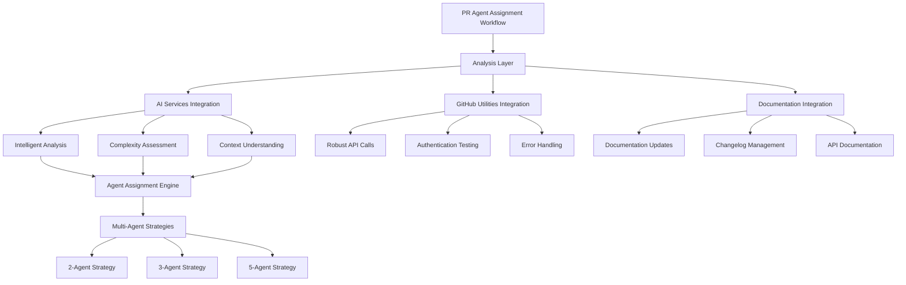

# Automation System - Enterprise Developer Guide

## 📋 Table of Contents

1. [Overview](#overview)
2. [Architecture](#architecture)
3. [Core Components](#core-components)
4. [Development Setup](#development-setup)
5. [API Reference](#api-reference)
6. [Tutorials](#tutorials)
7. [Best Practices](#best-practices)
8. [Troubleshooting](#troubleshooting)

---

## 🎯 Overview

The Portfolio OS Automation System is an enterprise-grade automation suite designed to streamline PR management, agent assignment, and project workflows. It provides intelligent PR analysis, AI-powered categorization, automated project field management, and comprehensive workflow automation.

### Key Features
- **Intelligent PR Analysis**: AI-powered PR categorization and complexity assessment
- **Dynamic Agent Assignment**: Multi-agent strategies with intelligent load balancing
- **Automated Workflows**: 5-step integrated workflow for complete PR processing
- **Project Integration**: Seamless GitHub project board integration
- **Documentation Automation**: Automated documentation updates and maintenance
- **Issue Management**: Related issue processing and estimation

---

## 🏗️ Architecture

### System Components



### Data Flow

1. **PR Detection** → Monitor and fetch open PRs
2. **Analysis** → AI-powered or rule-based analysis
3. **Complexity Assessment** → Determine PR complexity and category
4. **Project Integration** → Update project fields and metadata
5. **Documentation Processing** → Update relevant documentation
6. **Issue Management** → Process related issues and estimates
7. **Agent Assignment** → Assign PRs to optimal agents

---

## 📁 Core Components

### 🔧 `pr-agent-assignment-workflow.ps1`
**Purpose**: Main automation workflow orchestrator

**Key Operations**:
- PR analysis and categorization
- Complexity assessment and estimation
- Project field backfill and standardization
- Documentation automation
- Issue management and estimation
- Dynamic agent assignment

**Parameters**:
```powershell
param(
    [string]$ProjectNumber = "20",
    [string]$Owner = "jschibelli",
    [switch]$DryRun,
    [string]$ExportTo = "pr-agent-assignment-report.md"
)
```

### 🤖 AI Services Integration
**Purpose**: Intelligent analysis and recommendations

**Features**:
- AI-powered PR categorization
- Intelligent complexity assessment
- Context-aware analysis
- Confidence scoring and reasoning
- Graceful fallback to rule-based analysis

### 🔗 GitHub Utilities Integration
**Purpose**: Robust GitHub API interaction

**Features**:
- Enhanced error handling and retry logic
- Authentication testing and validation
- Rate limit management
- Comprehensive API wrapper functions

### 📚 Documentation Integration
**Purpose**: Automated documentation maintenance

**Features**:
- Category detection for documentation PRs
- Automated documentation updates
- Changelog and release note management
- API and component documentation maintenance

---

## 🛠️ Development Setup

### Prerequisites

#### Required Software
```bash
# PowerShell 7+
winget install Microsoft.PowerShell

# GitHub CLI
winget install GitHub.cli

# Git
winget install Git.Git
```

#### Authentication Setup
```powershell
# GitHub CLI authentication
gh auth login

# Verify authentication
gh auth status

# Test API access
gh api user
```

#### Environment Configuration
```powershell
# Set up automation environment
$env:AUTOMATION_DATA_PATH = "scripts/automation/data"
$env:AUTOMATION_LOG_LEVEL = "Information"
$env:GITHUB_PROJECT_ID = "PVT_kwHOAEnMVc4BCu-c"
$env:DEFAULT_PROJECT_OWNER = "jschibelli"
```

### Project Structure
```
scripts/automation/
├── pr-agent-assignment-workflow.ps1    # Main workflow script
├── docs/                               # Documentation
│   ├── integrations/                   # Integration guides
│   │   ├── ai-services.md             # AI services integration
│   │   ├── documentation.md           # Documentation automation
│   │   └── github-utilities.md        # GitHub utilities integration
│   ├── examples/                      # Usage examples
│   └── README.md                      # Main documentation guide
├── data/                              # Automation data storage
├── logs/                              # Automation logs
├── exports/                           # Report exports
├── DEVELOPER_GUIDE.md                 # This guide
├── README.md                          # Quick start guide
└── AUTOMATION_ANALYSIS.md             # Analysis documentation
```

---

## 📚 API Reference

### Core Functions

#### `Start-PRAgentAssignmentWorkflow`
Main workflow orchestrator for PR agent assignment.

```powershell
function Start-PRAgentAssignmentWorkflow {
    param(
        [string]$ProjectNumber,
        [string]$Owner,
        [switch]$DryRun,
        [string]$ExportTo
    )
    
    # Initialize services and authentication
    # Analyze open PRs
    # Assess complexity and categorize
    # Update project fields
    # Process documentation
    # Manage related issues
    # Assign agents
    # Generate reports
}
```

#### `Analyze-PRComplexity`
Analyzes PR complexity using AI or rule-based methods.

```powershell
function Analyze-PRComplexity {
    param(
        [object]$PR,
        [object]$PRDetails,
        [array]$CRGPTComments,
        [bool]$UseAI
    )
    
    # Analyze PR content
    # Assess complexity factors
    # Determine category
    # Calculate effort estimate
    # Return analysis results
}
```

#### `Assign-PRAgents`
Assigns PRs to optimal agents based on strategy.

```powershell
function Assign-PRAgents {
    param(
        [array]$PRAnalysis,
        [string]$Strategy,
        [int]$AgentCount
    )
    
    # Determine optimal agent count
    # Apply assignment strategy
    # Balance workload
    # Generate assignments
}
```

#### `Process-ProjectFields`
Updates project fields and metadata.

```powershell
function Process-ProjectFields {
    param(
        [array]$PRs,
        [string]$ProjectNumber,
        [string]$Owner
    )
    
    # Backfill project fields
    # Update status and priority
    # Set estimates and iterations
    # Validate field assignments
}
```

#### `Update-Documentation`
Processes documentation updates for relevant PRs.

```powershell
function Update-Documentation {
    param(
        [array]$DocumentationPRs,
        [string]$DocumentationType
    )
    
    # Identify documentation needs
    # Run documentation updates
    # Update changelogs
    # Maintain API documentation
}
```

#### `Manage-RelatedIssues`
Processes issues related to PRs.

```powershell
function Manage-RelatedIssues {
    param(
        [array]$RelatedIssues,
        [object]$PRAnalysis
    )
    
    # Extract related issues
    # Set estimates based on PR complexity
    # Assign to appropriate iterations
    # Update issue status
}
```

---

## 🎓 Tutorials

### Tutorial 1: Basic Automation Workflow

**Objective**: Set up and run the basic PR agent assignment workflow.

**Steps**:
1. **Navigate to automation directory**:
   ```powershell
   cd scripts/automation
   ```

2. **Run basic workflow**:
   ```powershell
   .\pr-agent-assignment-workflow.ps1
   ```

3. **Monitor workflow execution**:
   ```powershell
   # Watch for real-time output
   # Check for errors and warnings
   # Verify agent assignments
   ```

**Expected Results**:
- All open PRs analyzed and categorized
- Project fields updated and standardized
- Documentation processed for relevant PRs
- Issues managed and estimates set
- Agents assigned based on complexity

### Tutorial 2: Dry Run and Validation

**Objective**: Test the workflow without making changes using dry-run mode.

**Steps**:
1. **Run dry-run workflow**:
   ```powershell
   .\pr-agent-assignment-workflow.ps1 -DryRun
   ```

2. **Review planned actions**:
   ```powershell
   # Check planned PR assignments
   # Review project field updates
   # Verify documentation processing
   # Confirm issue management actions
   ```

3. **Export dry-run report**:
   ```powershell
   .\pr-agent-assignment-workflow.ps1 -DryRun -ExportTo "dry-run-report.md"
   ```

**Dry-run Features**:
- Shows all planned actions without execution
- Validates configuration and permissions
- Tests AI services and GitHub utilities
- Generates detailed preview reports

### Tutorial 3: Custom Project Configuration

**Objective**: Configure the workflow for a different project board.

**Steps**:
1. **Verify project access**:
   ```powershell
   gh project view 25 --owner myusername
   ```

2. **Run with custom project**:
   ```powershell
   .\pr-agent-assignment-workflow.ps1 -ProjectNumber "25" -Owner "myusername"
   ```

3. **Export custom report**:
   ```powershell
   .\pr-agent-assignment-workflow.ps1 -ProjectNumber "25" -Owner "myusername" -ExportTo "custom-project-report.md"
   ```

**Custom Configuration**:
- Different project board and owner
- Custom field mappings and presets
- Project-specific agent strategies
- Tailored documentation processing

### Tutorial 4: AI Services Integration

**Objective**: Set up and use AI services for intelligent analysis.

**Steps**:
1. **Initialize AI services**:
   ```powershell
   .\scripts\core-utilities\manage-ai-services.ps1
   ```

2. **Test AI services**:
   ```powershell
   .\scripts\core-utilities\manage-ai-services.ps1 -Test
   ```

3. **Run workflow with AI**:
   ```powershell
   .\pr-agent-assignment-workflow.ps1
   # AI services will be automatically detected and used
   ```

**AI Integration Features**:
- Intelligent PR categorization
- Context-aware complexity assessment
- Confidence scoring and reasoning
- Graceful fallback to rule-based analysis

### Tutorial 5: Multi-Agent Strategy Configuration

**Objective**: Configure and test different agent assignment strategies.

**Steps**:
1. **Test 2-agent strategy**:
   ```powershell
   .\pr-agent-assignment-workflow.ps1 -DryRun
   # Review 2-agent assignments in output
   ```

2. **Test 3-agent strategy**:
   ```powershell
   # Modify agent count in script or parameters
   .\pr-agent-assignment-workflow.ps1 -DryRun
   ```

3. **Test 5-agent strategy**:
   ```powershell
   # Enable 5-agent strategy for complex scenarios
   .\pr-agent-assignment-workflow.ps1 -DryRun
   ```

**Agent Strategies**:
- **2-Agent**: Frontend/Docs + Backend/Infra
- **3-Agent**: Frontend + Backend + Ready-to-merge
- **5-Agent**: Specialized agents for each domain

### Tutorial 6: Documentation Automation

**Objective**: Set up and test automated documentation processing.

**Steps**:
1. **Create test documentation PR**:
   ```powershell
   # Create PR with documentation-related changes
   # Include "doc", "documentation", "readme" in title
   ```

2. **Run workflow**:
   ```powershell
   .\pr-agent-assignment-workflow.ps1
   ```

3. **Verify documentation updates**:
   ```powershell
   # Check documentation files updated
   # Verify changelog entries
   # Confirm API documentation updates
   ```

**Documentation Features**:
- Automatic category detection
- Changelog and release note updates
- API and component documentation
- README and guide maintenance

### Tutorial 7: Issue Management Integration

**Objective**: Test automated issue management and estimation.

**Steps**:
1. **Create PR with related issues**:
   ```powershell
   # Reference issues in PR body: "Fixes #123, Related to #456"
   ```

2. **Run workflow**:
   ```powershell
   .\pr-agent-assignment-workflow.ps1
   ```

3. **Verify issue updates**:
   ```powershell
   # Check issue estimates set
   # Verify iteration assignments
   # Confirm status updates
   ```

**Issue Management Features**:
- Related issue detection
- Automatic estimate setting
- Iteration assignment
- Status and priority updates

### Tutorial 8: Performance Monitoring and Reporting

**Objective**: Monitor workflow performance and generate comprehensive reports.

**Steps**:
1. **Run workflow with detailed logging**:
   ```powershell
   $VerbosePreference = "Continue"
   .\pr-agent-assignment-workflow.ps1 -ExportTo "performance-report.md"
   ```

2. **Analyze performance metrics**:
   ```powershell
   # Review execution times
   # Check API call counts
   # Monitor error rates
   # Assess agent load balancing
   ```

3. **Generate analytics report**:
   ```powershell
   # Export detailed analytics
   # Include performance metrics
   # Add recommendations
   ```

**Monitoring Features**:
- Real-time performance tracking
- Detailed execution logging
- API usage analytics
- Agent load balancing metrics

---

## 📝 Best Practices

### 1. Workflow Design

#### Modular Architecture
```powershell
# Design workflows as modular components
function Start-AutomationWorkflow {
    param($Configuration)
    
    # Initialize services
    $services = Initialize-Services -Configuration $Configuration
    
    # Execute workflow steps
    $results = @()
    $results += Step-AnalyzePRs -Services $services
    $results += Step-UpdateProjectFields -Services $services
    $results += Step-ProcessDocumentation -Services $services
    $results += Step-ManageIssues -Services $services
    $results += Step-AssignAgents -Services $services
    
    # Generate reports
    return Generate-Reports -Results $results
}
```

#### Error Handling
```powershell
# Implement comprehensive error handling
try {
    $result = Start-AutomationWorkflow -Configuration $config
    if (-not $result.Success) {
        throw "Workflow failed: $($result.Error)"
    }
}
catch {
    Write-Error "Automation error: $($_.Exception.Message)"
    # Log error and continue with fallback
    Start-FallbackWorkflow -Configuration $config
}
```

### 2. AI Integration

#### Graceful Fallback
```powershell
# Always provide fallback to rule-based analysis
function Analyze-PRWithAI {
    param($PR)
    
    try {
        if ($script:useAI -and (Test-AIServices)) {
            return Invoke-AIAnalysis -PR $PR
        }
    }
    catch {
        Write-Warning "AI analysis failed, falling back to rules: $($_.Exception.Message)"
    }
    
    return Invoke-RuleBasedAnalysis -PR $PR
}
```

#### Confidence Scoring
```powershell
# Include confidence scores in AI analysis
function Invoke-AIAnalysis {
    param($PR)
    
    $analysis = Get-AIRecommendation -PR $PR
    return @{
        Category = $analysis.Category
        Complexity = $analysis.Complexity
        Confidence = $analysis.Confidence
        Reasoning = $analysis.Reasoning
        FallbackUsed = $false
    }
}
```

### 3. Performance Optimization

#### Efficient API Usage
```powershell
# Batch API calls and implement caching
function Get-PRDetailsBatch {
    param([array]$PRNumbers)
    
    $results = @{}
    $batches = $PRNumbers | Group-Object -Property { [Math]::Floor($_.Count / 10) }
    
    foreach ($batch in $batches) {
        $batchResults = Invoke-GitHubAPIBatch -PRNumbers $batch.Group
        $batchResults | ForEach-Object { $results[$_.Number] = $_ }
        Start-Sleep -Seconds 1 # Rate limiting
    }
    
    return $results
}
```

#### Resource Management
```powershell
# Implement proper resource cleanup
function Start-AutomationWorkflow {
    param($Configuration)
    
    $services = @{}
    
    try {
        $services = Initialize-Services -Configuration $Configuration
        $result = Execute-Workflow -Services $services
        return $result
    }
    finally {
        # Cleanup resources
        $services | ForEach-Object { 
            if ($_.Dispose) { $_.Dispose() }
        }
    }
}
```

### 4. Monitoring and Logging

#### Comprehensive Logging
```powershell
# Implement structured logging
function Write-AutomationLog {
    param(
        [string]$Level,
        [string]$Message,
        [hashtable]$Context = @{}
    )
    
    $logEntry = @{
        Timestamp = Get-Date -Format "yyyy-MM-dd HH:mm:ss"
        Level = $Level
        Message = $Message
        Context = $Context
    }
    
    $logEntry | ConvertTo-Json -Compress | Add-Content "logs/automation.log"
}
```

#### Performance Metrics
```powershell
# Track performance metrics
function Measure-WorkflowPerformance {
    param($WorkflowFunction)
    
    $stopwatch = [System.Diagnostics.Stopwatch]::StartNew()
    $result = & $WorkflowFunction
    $stopwatch.Stop()
    
    $metrics = @{
        ExecutionTime = $stopwatch.ElapsedMilliseconds
        Success = $result.Success
        PRsProcessed = $result.PRsProcessed
        Errors = $result.Errors.Count
    }
    
    Write-AutomationLog -Level "INFO" -Message "Workflow completed" -Context $metrics
    return $result
}
```

---

## 🔧 Troubleshooting

### Common Issues

#### 1. GitHub Authentication Errors
**Symptoms**: 401 Unauthorized errors, authentication failures

**Solutions**:
```powershell
# Re-authenticate with GitHub
gh auth login

# Check authentication status
gh auth status

# Test API access
gh api user

# Verify project permissions
gh project view 20 --owner jschibelli
```

#### 2. AI Services Failures
**Symptoms**: AI analysis not working, fallback to rule-based analysis

**Solutions**:
```powershell
# Test AI services
.\scripts\core-utilities\manage-ai-services.ps1 -Test

# Check AI service configuration
.\scripts\core-utilities\manage-ai-services.ps1 -Config

# Verify API keys and endpoints
Get-AIServiceConfig
```

#### 3. Project Field Update Failures
**Symptoms**: Field updates not applying, validation errors

**Solutions**:
```powershell
# Verify project field IDs
gh project view 20 --owner jschibelli --format json | ConvertFrom-Json | 
Select-Object -ExpandProperty fields | 
Select-Object id, name, type

# Check field permissions
gh project view 20 --owner jschibelli --format json | ConvertFrom-Json | 
Select-Object -ExpandProperty permissions

# Test field updates manually
gh project item-edit --id "ITEM_ID" --field-id "FIELD_ID" --single-select-option-id "OPTION_ID"
```

#### 4. Agent Assignment Issues
**Symptoms**: Incorrect agent assignments, load balancing problems

**Solutions**:
```powershell
# Review assignment logic
.\pr-agent-assignment-workflow.ps1 -DryRun

# Check agent configuration
Get-AgentConfiguration

# Verify agent availability
Get-AgentStatus
```

#### 5. Documentation Update Failures
**Symptoms**: Documentation not updating, file access errors

**Solutions**:
```powershell
# Test documentation script directly
.\scripts\documentation\docs-updater.ps1 -Test

# Check file permissions
Get-ChildItem "docs/" -Recurse | Select-Object Name, Mode

# Verify documentation paths
Test-Path "docs/api-docs/"
Test-Path "docs/changelog.md"
```

### Debug Mode

#### Enable Verbose Logging
```powershell
# Enable detailed logging
$VerbosePreference = "Continue"
$DebugPreference = "Continue"
$InformationPreference = "Continue"

# Run workflow with debug info
.\pr-agent-assignment-workflow.ps1 -DryRun
```

#### Log Analysis
```powershell
function Get-AutomationLogs {
    param([string]$LogPath = "logs/automation.log")
    
    $logs = Get-Content $LogPath -ErrorAction SilentlyContinue
    return @{
        TotalEntries = $logs.Count
        ErrorCount = ($logs | Where-Object { $_ -match '"Level":"ERROR"' }).Count
        WarningCount = ($logs | Where-Object { $_ -match '"Level":"WARNING"' }).Count
        RecentErrors = $logs | Where-Object { $_ -match '"Level":"ERROR"' } | Select-Object -Last 10
    }
}
```

#### Performance Analysis
```powershell
function Analyze-WorkflowPerformance {
    param([string]$LogPath = "logs/automation.log")
    
    $logs = Get-Content $LogPath | ConvertFrom-Json
    $performanceLogs = $logs | Where-Object { $_.Context.ExecutionTime }
    
    return @{
        AverageExecutionTime = ($performanceLogs | Measure-Object -Property { $_.Context.ExecutionTime } -Average).Average
        MaxExecutionTime = ($performanceLogs | Measure-Object -Property { $_.Context.ExecutionTime } -Maximum).Maximum
        MinExecutionTime = ($performanceLogs | Measure-Object -Property { $_.Context.ExecutionTime } -Minimum).Minimum
        SuccessRate = ($performanceLogs | Where-Object { $_.Context.Success } | Measure-Object).Count / $performanceLogs.Count
    }
}
```

---

## 📞 Support & Contact

### Getting Help
- **Documentation**: Check this guide and README.md
- **Issues**: Create GitHub issues for bugs or feature requests
- **Discussions**: Use GitHub Discussions for questions

### Team Contacts
- **Lead Developer**: John Schibelli - john@schibelli.dev

---

*Last Updated: 2025-10-06*
*Version: 1.0.0*
*Documentation Version: 1.0.0*
