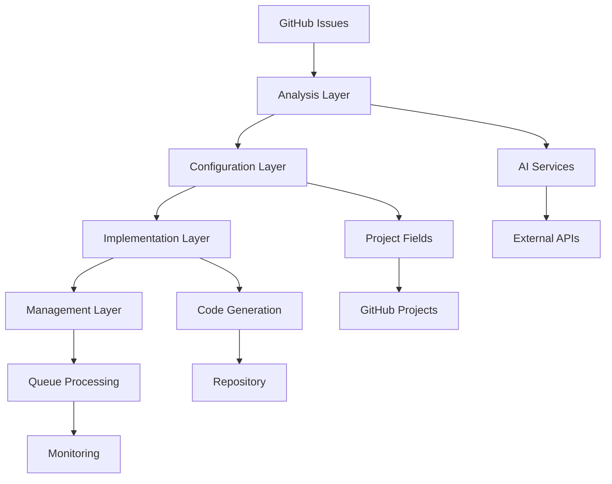

# Issue Management System - Enterprise Developer Guide

## 📋 Table of Contents

1. [Overview](#overview)
2. [Architecture](#architecture)
3. [Script Categories](#script-categories)
4. [Development Environment Setup](#development-environment-setup)
5. [Script Development Guidelines](#script-development-guidelines)
6. [Testing & Quality Assurance](#testing--quality-assurance)
7. [Deployment & Operations](#deployment--operations)
8. [Troubleshooting](#troubleshooting)
9. [Contributing Guidelines](#contributing-guidelines)
10. [API Reference](#api-reference)

---

## 🎯 Overview

The Issue Management System is a comprehensive PowerShell-based automation suite designed for enterprise-scale GitHub issue management within the Portfolio OS project. It provides intelligent issue analysis, automated configuration, implementation workflows, and queue management capabilities.

### Key Features
- **AI-Powered Analysis**: Intelligent issue requirements extraction and analysis
- **Automated Configuration**: Smart issue property configuration with presets
- **Implementation Workflows**: Complete issue-to-code implementation pipelines
- **Queue Management**: Prioritized issue processing with intelligent scheduling
- **Enterprise Integration**: GitHub Projects, CLI, and webhook integration

---

## 🏗️ Architecture

### System Components



### Data Flow

1. **Issue Creation** → GitHub Issues
2. **Analysis** → AI-powered requirements extraction
3. **Configuration** → Automated project field assignment
4. **Implementation** → Code generation and testing
5. **Management** → Queue processing and monitoring

---

## 📁 Script Categories

### 🔍 Analysis Layer (`analysis/`)

#### `analyze-issues.ps1`
**Purpose**: Comprehensive issue analysis with AI-powered requirements extraction

**Key Functions**:
- Issue requirements parsing
- Acceptance criteria extraction
- Technical requirements identification
- File modification mapping
- Priority and complexity assessment

**Parameters**:
```powershell
param(
    [Parameter(Mandatory=$true)]
    [string]$IssueNumber,
    
    [switch]$GeneratePlan,
    [string]$ExportTo
)
```

**Usage Examples**:
```powershell
# Basic analysis
.\analysis\analyze-issues.ps1 -IssueNumber 250

# Generate implementation plan
.\analysis\analyze-issues.ps1 -IssueNumber 250 -GeneratePlan

# Export analysis to file
.\analysis\analyze-issues.ps1 -IssueNumber 250 -ExportTo "analysis-250.json"
```

#### `analyze-stale-issues.ps1`
**Purpose**: Identifies stale, old, or inactive issues

**Analysis Categories**:
- Very old issues (60+ days)
- Old issues (30-60 days)
- Inactive issues (30+ days since update)
- Unassigned issues
- Low priority with no recent activity

---

### ⚙️ Configuration Layer (`configuration/`)

#### `configure-issue-auto.ps1`
**Purpose**: Automated issue configuration with comprehensive field management

**Features**:
- Priority assignment (P0-P2)
- Size estimation (XS-XL)
- App categorization (Portfolio Site, Dashboard, Docs, Infra)
- Area specification (Frontend, Backend, Infra, Content, Design)
- Milestone assignment
- Label management

**Parameters**:
```powershell
param(
    [Parameter(Mandatory=$true)]
    [int]$IssueNumber,
    
    [string]$Priority = "P1",
    [string]$Size = "M",
    [string]$App = "Portfolio Site",
    [string]$Area = "Frontend",
    [int]$Estimate = 3,
    [string]$Milestone = "",
    [string]$Labels = ""
)
```

#### `configure-issues-unified.ps1`
**Purpose**: Unified configuration system with presets and AI recommendations

**Presets**:
- `blog`: Blog-related issues
- `dashboard`: Dashboard functionality
- `docs`: Documentation tasks
- `infra`: Infrastructure changes
- `custom`: Manual configuration

---

### 🚀 Implementation Layer (`implementation/`)

#### `implement-issues.ps1`
**Purpose**: Complete issue implementation system with full workflow automation

**Workflow Phases**:
1. **Analysis & Setup** (15-30 minutes)
   - Review requirements
   - Environment setup
   - Feature branch creation
   - Codebase analysis

2. **Core Implementation** (Variable duration)
   - Core functionality implementation
   - Error handling
   - Accessibility compliance
   - Pattern adherence

3. **Testing & Quality** (30-60 minutes)
   - Linting and type checks
   - Manual testing
   - Responsive design verification
   - Accessibility compliance

4. **Documentation & Deployment** (15-30 minutes)
   - Documentation updates
   - Commit with descriptive messages
   - Repository push
   - Issue commenting

**Modes**:
- `analyze`: Issue analysis only
- `plan`: Generate implementation plan
- `implement`: Execute implementation
- `validate`: Validate implementation
- `complete`: Complete workflow
- `auto`: Full automated flow

---

### 📊 Management Layer (`management/`)

#### `manage-issue-queue.ps1`
**Purpose**: Intelligent queue management system for prioritized issue processing

**Queue Types**:
- **High Priority**: P0 and P1 issues
- **Standard**: P2 issues
- **Low Priority**: P3 issues
- **Features**: Feature development issues
- **Bugs**: Bug fix issues

**Features**:
- Concurrent processing limits
- Priority scoring algorithms
- AI-powered queue recommendations
- Real-time monitoring
- Automatic retry mechanisms

#### `run-issue-pipeline.ps1`
**Purpose**: Continuous issue pipeline for automated processing

**Pipeline Steps**:
1. Issue filtering and selection
2. Status update to "In progress"
3. Branch creation from develop
4. AI-powered analysis
5. Implementation execution
6. Status update to "Ready"
7. PR monitoring and completion

---

## 🛠️ Development Environment Setup

### Prerequisites

#### Required Software
```bash
# PowerShell 7+
winget install Microsoft.PowerShell

# GitHub CLI
winget install GitHub.cli

# Git (if not already installed)
winget install Git.Git
```

#### Authentication Setup
```powershell
# GitHub CLI authentication
gh auth login

# Verify authentication
gh auth status

# Test GitHub API access
gh api user
```

#### Project Configuration
```powershell
# Clone repository
git clone https://github.com/jschibelli/portfolio-os.git
cd portfolio-os

# Verify project structure
Test-Path "scripts/issue-management"
```

### Environment Variables

Create a `.env` file in the project root:
```bash
# GitHub Configuration
GITHUB_TOKEN=your_personal_access_token
GITHUB_OWNER=jschibelli
GITHUB_REPO=portfolio-os
GITHUB_PROJECT_ID=PVT_kwHOAEnMVc4BCu-c

# AI Services (Optional)
OPENAI_API_KEY=your_openai_key
ANTHROPIC_API_KEY=your_anthropic_key

# Database Configuration
DATABASE_URL=your_database_url
REDIS_URL=your_redis_url
```

### PowerShell Profile Setup

Add to your PowerShell profile (`$PROFILE`):
```powershell
# Portfolio OS Issue Management Functions
function Get-IssueAnalysis {
    param([int]$IssueNumber)
    & ".\scripts\issue-management\analysis\analyze-issues.ps1" -IssueNumber $IssueNumber
}

function Set-IssueConfig {
    param([int]$IssueNumber, [string]$Priority = "P1", [string]$Size = "M")
    & ".\scripts\issue-management\configuration\configure-issue-auto.ps1" -IssueNumber $IssueNumber -Priority $Priority -Size $Size
}

function Start-IssueImplementation {
    param([int]$IssueNumber, [string]$Mode = "auto")
    & ".\scripts\issue-management\implementation\implement-issues.ps1" -IssueNumber $IssueNumber -Mode $Mode
}

# Aliases for quick access
Set-Alias -Name gia -Value Get-IssueAnalysis
Set-Alias -Name sic -Value Set-IssueConfig
Set-Alias -Name sii -Value Start-IssueImplementation
```

---

## 📝 Script Development Guidelines

### PowerShell Best Practices

#### 1. Parameter Validation
```powershell
param(
    [Parameter(Mandatory=$true)]
    [ValidateRange(1, 9999)]
    [int]$IssueNumber,
    
    [Parameter(Mandatory=$false)]
    [ValidateSet("P0", "P1", "P2", "P3")]
    [string]$Priority = "P1"
)
```

#### 2. Error Handling
```powershell
try {
    $result = Invoke-GitHubAPI -Endpoint "issues/$IssueNumber"
    if (-not $result) {
        throw "Failed to retrieve issue data"
    }
}
catch {
    Write-Error "Error processing issue #$IssueNumber`: $($_.Exception.Message)"
    return $false
}
```

#### 3. Logging and Output
```powershell
function Write-ColorOutput {
    param(
        [string]$Message,
        [string]$Color = "White",
        [string]$Level = "INFO"
    )
    
    $timestamp = Get-Date -Format "yyyy-MM-dd HH:mm:ss"
    $logMessage = "[$timestamp] [$Level] $Message"
    
    Write-Host $logMessage -ForegroundColor $Color
    
    # Also log to file
    Add-Content -Path "logs/issue-management.log" -Value $logMessage
}
```

#### 4. Configuration Management
```powershell
# Load configuration from JSON
$configPath = "scripts/issue-management/config.json"
if (Test-Path $configPath) {
    $config = Get-Content $configPath | ConvertFrom-Json
} else {
    # Use default configuration
    $config = @{
        GitHubProjectId = "PVT_kwHOAEnMVc4BCu-c"
        DefaultPriority = "P1"
        DefaultSize = "M"
        MaxConcurrentIssues = 3
    }
}
```

### Code Organization

#### 1. Function Structure
```powershell
function Get-IssueData {
    <#
    .SYNOPSIS
    Retrieves comprehensive issue data including project fields
    
    .DESCRIPTION
    This function fetches issue data from GitHub API and enriches it with
    project field information for complete issue context.
    
    .PARAMETER IssueNumber
    The GitHub issue number to retrieve
    
    .EXAMPLE
    Get-IssueData -IssueNumber 250
    
    .OUTPUTS
    PSCustomObject containing issue data
    #>
    param(
        [Parameter(Mandatory=$true)]
        [int]$IssueNumber
    )
    
    # Implementation here
}
```

#### 2. Module Structure
```powershell
# IssueManagement.psm1
[CmdletBinding()]
param()

# Export functions
Export-ModuleMember -Function @(
    'Get-IssueData',
    'Set-IssueConfiguration',
    'Start-Implementation'
)

# Private helper functions
function Invoke-GitHubAPI {
    # Implementation
}
```

### Testing Framework

#### 1. Unit Tests with Pester
```powershell
# tests/IssueManagement.Tests.ps1
Describe "Issue Analysis Functions" {
    BeforeAll {
        Import-Module ".\scripts\issue-management\IssueManagement.psm1"
    }
    
    Context "Get-IssueData" {
        It "Should retrieve issue data for valid issue number" {
            $result = Get-IssueData -IssueNumber 250
            $result | Should -Not -BeNullOrEmpty
            $result.Number | Should -Be 250
        }
        
        It "Should throw error for invalid issue number" {
            { Get-IssueData -IssueNumber 99999 } | Should -Throw
        }
    }
}
```

#### 2. Integration Tests
```powershell
Describe "End-to-End Issue Processing" {
    It "Should complete full issue workflow" {
        # Create test issue
        $testIssue = New-TestIssue
        
        # Process issue
        $result = Start-IssueImplementation -IssueNumber $testIssue.Number -Mode "auto"
        
        # Verify results
        $result | Should -Be $true
        
        # Cleanup
        Remove-TestIssue -IssueNumber $testIssue.Number
    }
}
```

---

## 🧪 Testing & Quality Assurance

### Test Categories

#### 1. Unit Tests
- Individual function testing
- Parameter validation
- Error handling verification
- Output format validation

#### 2. Integration Tests
- GitHub API integration
- Project field updates
- Workflow completion
- Cross-script communication

#### 3. Performance Tests
- Large issue processing
- Concurrent operation handling
- Memory usage monitoring
- Response time measurement

#### 4. Security Tests
- Token handling verification
- Input sanitization
- API rate limiting
- Error message security

### Continuous Integration

#### GitHub Actions Workflow
```yaml
name: Issue Management Tests

on:
  push:
    paths:
      - 'scripts/issue-management/**'
  pull_request:
    paths:
      - 'scripts/issue-management/**'

jobs:
  test:
    runs-on: ubuntu-latest
    
    steps:
    - uses: actions/checkout@v3
    
    - name: Setup PowerShell
      uses: actions/setup-powershell@v1
      
    - name: Install Pester
      run: Install-Module -Name Pester -Force -SkipPublisherCheck
      
    - name: Run Tests
      run: Invoke-Pester -Path "scripts/issue-management/tests" -OutputFile "test-results.xml" -OutputFormat NUnitXml
      
    - name: Publish Test Results
      uses: dorny/test-reporter@v1
      if: always()
      with:
        name: PowerShell Tests
        path: test-results.xml
        reporter: java-junit
```

### Code Quality Tools

#### 1. PSScriptAnalyzer
```powershell
# Install and run static analysis
Install-Module -Name PSScriptAnalyzer -Force
Invoke-ScriptAnalyzer -Path "scripts/issue-management" -Recurse
```

#### 2. Custom Quality Checks
```powershell
function Test-ScriptQuality {
    param([string]$ScriptPath)
    
    $issues = @()
    
    # Check for proper error handling
    $content = Get-Content $ScriptPath -Raw
    if ($content -notmatch "try\s*\{") {
        $issues += "Missing try-catch error handling"
    }
    
    # Check for parameter validation
    if ($content -notmatch "\[Parameter\(Mandatory=") {
        $issues += "Missing parameter validation"
    }
    
    # Check for help documentation
    if ($content -notmatch "\.SYNOPSIS") {
        $issues += "Missing function documentation"
    }
    
    return $issues
}
```

---

## 🚀 Deployment & Operations

### Deployment Strategy

#### 1. Staging Environment
```powershell
# Deploy to staging
.\scripts\deployment\deploy-staging.ps1 -Environment "staging" -Version "1.0.0"
```

#### 2. Production Deployment
```powershell
# Deploy to production with validation
.\scripts\deployment\deploy-production.ps1 -Environment "production" -Version "1.0.0" -Validate
```

### Monitoring & Observability

#### 1. Logging Configuration
```powershell
# Configure structured logging
$logConfig = @{
    LogLevel = "Information"
    LogFormat = "Structured"
    LogDestination = @("File", "ApplicationInsights")
    LogRetention = "30d"
}
```

#### 2. Metrics Collection
```powershell
function Write-Metrics {
    param(
        [string]$MetricName,
        [double]$Value,
        [hashtable]$Tags = @{}
    )
    
    $metric = @{
        Name = $MetricName
        Value = $Value
        Timestamp = Get-Date
        Tags = $Tags
    }
    
    # Send to monitoring system
    Invoke-RestMethod -Uri $env:METRICS_ENDPOINT -Method Post -Body ($metric | ConvertTo-Json)
}
```

#### 3. Health Checks
```powershell
function Test-SystemHealth {
    $health = @{
        Status = "Healthy"
        Checks = @{}
        Timestamp = Get-Date
    }
    
    # Check GitHub API connectivity
    try {
        $response = gh api user
        $health.Checks.GitHubAPI = "Healthy"
    }
    catch {
        $health.Checks.GitHubAPI = "Unhealthy"
        $health.Status = "Degraded"
    }
    
    # Check database connectivity
    # Check Redis connectivity
    # Check file system access
    
    return $health
}
```

### Backup & Recovery

#### 1. Configuration Backup
```powershell
function Backup-Configuration {
    $backupPath = "backups/config-$(Get-Date -Format 'yyyyMMdd-HHmmss').json"
    
    $config = @{
        Scripts = Get-ChildItem "scripts/issue-management" -Recurse
        Configuration = Get-Content "config.json" | ConvertFrom-Json
        Environment = @{
            PowerShellVersion = $PSVersionTable.PSVersion
            GitHubCLIVersion = gh --version
            LastBackup = Get-Date
        }
    }
    
    $config | ConvertTo-Json -Depth 10 | Out-File $backupPath
}
```

---

## 🔧 Troubleshooting

### Common Issues

#### 1. GitHub API Rate Limiting
**Symptoms**: 403 Forbidden errors, "API rate limit exceeded"

**Solutions**:
```powershell
# Check rate limit status
gh api rate_limit

# Implement exponential backoff
function Invoke-WithRetry {
    param(
        [scriptblock]$ScriptBlock,
        [int]$MaxRetries = 3,
        [int]$BaseDelay = 1
    )
    
    for ($i = 0; $i -lt $MaxRetries; $i++) {
        try {
            return & $ScriptBlock
        }
        catch {
            if ($i -eq $MaxRetries - 1) { throw }
            
            $delay = $BaseDelay * [Math]::Pow(2, $i)
            Write-Warning "Retry $($i + 1) in $delay seconds..."
            Start-Sleep -Seconds $delay
        }
    }
}
```

#### 2. PowerShell Execution Policy
**Symptoms**: "execution of scripts is disabled on this system"

**Solutions**:
```powershell
# Check current policy
Get-ExecutionPolicy

# Set policy for current user
Set-ExecutionPolicy -ExecutionPolicy RemoteSigned -Scope CurrentUser

# Or bypass for single execution
powershell -ExecutionPolicy Bypass -File "script.ps1"
```

#### 3. Authentication Issues
**Symptoms**: 401 Unauthorized errors, "not authenticated"

**Solutions**:
```powershell
# Re-authenticate GitHub CLI
gh auth login

# Verify authentication
gh auth status

# Refresh token if needed
gh auth refresh
```

### Debug Mode

#### Enable Verbose Logging
```powershell
# Run scripts with verbose output
.\analysis\analyze-issues.ps1 -IssueNumber 250 -Verbose

# Enable debug mode
$DebugPreference = "Continue"
$VerbosePreference = "Continue"
```

#### Log Analysis
```powershell
function Get-LogAnalysis {
    param([string]$LogPath = "logs/issue-management.log")
    
    $logs = Get-Content $LogPath
    
    $analysis = @{
        TotalEntries = $logs.Count
        ErrorCount = ($logs | Where-Object { $_ -match "ERROR" }).Count
        WarningCount = ($logs | Where-Object { $_ -match "WARN" }).Count
        CommonErrors = $logs | Where-Object { $_ -match "ERROR" } | Group-Object | Sort-Object Count -Descending | Select-Object -First 5
    }
    
    return $analysis
}
```

---

## 🤝 Contributing Guidelines

### Development Workflow

#### 1. Branch Strategy
```bash
# Create feature branch
git checkout -b feature/issue-queue-enhancement

# Make changes and commit
git add .
git commit -m "feat: enhance issue queue with priority scoring"

# Push and create PR
git push origin feature/issue-queue-enhancement
```

#### 2. Code Review Process
- All changes require peer review
- Automated tests must pass
- Code quality checks must pass
- Documentation must be updated

#### 3. Commit Message Convention
```
type(scope): description

feat(analysis): add AI-powered issue classification
fix(config): resolve project field mapping issue
docs(readme): update installation instructions
test(integration): add end-to-end workflow tests
```

### Pull Request Template

```markdown
## Description
Brief description of changes

## Type of Change
- [ ] Bug fix
- [ ] New feature
- [ ] Breaking change
- [ ] Documentation update

## Testing
- [ ] Unit tests pass
- [ ] Integration tests pass
- [ ] Manual testing completed

## Checklist
- [ ] Code follows style guidelines
- [ ] Self-review completed
- [ ] Documentation updated
- [ ] No breaking changes (or documented)
```

---

## 📚 API Reference

### GitHub API Integration

#### Issue Operations
```powershell
# Get issue details
function Get-IssueDetails {
    param([int]$IssueNumber)
    
    return gh issue view $IssueNumber --json number,title,body,labels,assignees,state,createdAt,updatedAt
}

# Update issue
function Update-Issue {
    param(
        [int]$IssueNumber,
        [string]$Title,
        [string]$Body,
        [string[]]$Labels
    )
    
    $params = @()
    if ($Title) { $params += "--title", $Title }
    if ($Body) { $params += "--body", $Body }
    if ($Labels) { $params += "--add-label", ($Labels -join ",") }
    
    gh issue edit $IssueNumber @params
}
```

#### Project Operations
```powershell
# Get project items
function Get-ProjectItems {
    param([string]$ProjectId = "PVT_kwHOAEnMVc4BCu-c")
    
    return gh project item-list $ProjectId --owner jschibelli --format json
}

# Update project field
function Update-ProjectField {
    param(
        [string]$ItemId,
        [string]$FieldId,
        [string]$Value,
        [string]$ProjectId = "PVT_kwHOAEnMVc4BCu-c"
    )
    
    gh project item-edit --id $ItemId --project-id $ProjectId --field-id $FieldId --single-select-option-id $Value
}
```

### Configuration Schema

#### Project Field IDs
```json
{
  "fields": {
    "Status": "PVTSSF_lAHOAEnMVc4BCu-czg028oM",
    "Priority": "PVTSSF_lAHOAEnMVc4BCu-czg028qQ",
    "Size": "PVTSSF_lAHOAEnMVc4BCu-czg028qU",
    "App": "PVTSSF_lAHOAEnMVc4BCu-czg156-s",
    "Area": "PVTSSF_lAHOAEnMVc4BCu-czg156_Y",
    "Estimate": "PVTF_lAHOAEnMVc4BCu-czg028qY"
  },
  "options": {
    "Priority": {
      "P0": "79628723",
      "P1": "0a877460",
      "P2": "da944a9c"
    },
    "Size": {
      "XS": "911790be",
      "S": "b277fb01",
      "M": "86db8eb3",
      "L": "853c8207",
      "XL": "2d0801e2"
    }
  }
}
```

---

## 📞 Support & Contact

### Getting Help
- **Documentation**: Check this guide and README.md
- **Issues**: Create GitHub issues for bugs or feature requests
- **Discussions**: Use GitHub Discussions for questions
- **Slack**: #portfolio-os-dev channel for real-time help

### Team Contacts
- **Lead Developer**: [Your Name] - your.email@domain.com
- **DevOps**: [DevOps Contact] - devops@domain.com
- **Product Owner**: [Product Owner] - product@domain.com

---

*Last Updated: 2025-10-06*
*Version: 1.0.0*
*Documentation Version: 1.0.0*
