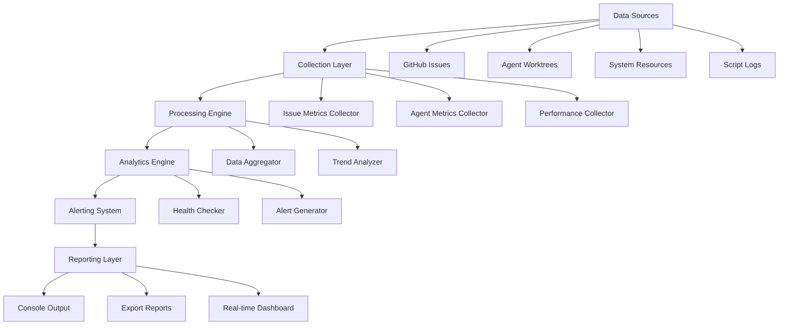

# Monitoring System - Enterprise Developer Guide

## 📋 Table of Contents

1. [Overview](#overview)
2. [Architecture](#architecture)
3. [Core Components](#core-components)
4. [Development Setup](#development-setup)
5. [API Reference](#api-reference)
6. [Tutorials](#tutorials)
7. [Best Practices](#best-practices)
8. [Troubleshooting](#troubleshooting)

---

## 🎯 Overview

The Portfolio OS Monitoring System is an enterprise-grade analytics and monitoring solution designed to provide comprehensive insights into automation performance, issue management, agent activities, and system health across the entire Portfolio OS ecosystem.

### Key Features
- **Real-time Analytics**: Live monitoring of system performance and health
- **Historical Tracking**: Long-term trend analysis and pattern recognition
- **Multi-dimensional Metrics**: Issues, agents, performance, and automation tracking
- **Intelligent Alerts**: Proactive notification system with severity levels
- **Export Capabilities**: Comprehensive reporting and data export
- **Enterprise Integration**: GitHub API, system resources, and automation workflows

---

## 🏗️ Architecture

### System Components



### Data Flow

1. **Collection** → Gather metrics from multiple sources
2. **Processing** → Aggregate and analyze collected data
3. **Analysis** → Generate insights and trends
4. **Alerting** → Create notifications for critical conditions
5. **Reporting** → Output results and export data

---

## 📁 Core Components

### 🔍 `automation-metrics.ps1`
**Purpose**: Comprehensive analytics and monitoring system

**Key Operations**:
- `overview`: Complete system overview dashboard
- `performance`: Detailed performance metrics
- `issues`: Issue tracking and analysis
- `agents`: Agent activity monitoring
- `trends`: Historical trend analysis
- `health`: System health assessment
- `alerts`: Active alert management

**Parameters**:
```powershell
param(
    [ValidateSet("overview", "performance", "issues", "agents", "trends", "health", "alerts")]
    [string]$Operation = "overview",
    
    [string]$ExportTo,
    [int]$TimeRange = 30,
    [switch]$RealTime,
    [switch]$Detailed
)
```

---

## 🛠️ Development Setup

### Prerequisites

#### Required Software
```bash
# PowerShell 7+
winget install Microsoft.PowerShell

# GitHub CLI
winget install GitHub.cli

# Git
winget install Git.Git
```

#### Authentication Setup
```powershell
# GitHub CLI authentication
gh auth login

# Verify authentication
gh auth status

# Test API access
gh api user
```

#### Environment Configuration
```powershell
# Set up monitoring environment
$env:MONITORING_DATA_PATH = "scripts/monitoring/data"
$env:MONITORING_LOG_LEVEL = "Information"
$env:GITHUB_PROJECT_ID = "PVT_kwHOAEnMVc4BCu-c"
```

### Project Structure
```
scripts/monitoring/
├── automation-metrics.ps1    # Main monitoring script
├── data/                     # Metrics storage
│   ├── historical-metrics.json
│   └── real-time-metrics.json
├── logs/                     # Monitoring logs
├── exports/                  # Report exports
└── DEVELOPER_GUIDE.md        # This guide
```

---

## 📚 API Reference

### Core Functions

#### `Initialize-MetricsSystem`
Initializes the monitoring system and creates necessary directories.

```powershell
function Initialize-MetricsSystem {
    # Creates data directories
    # Loads historical metrics
    # Sets up global metrics storage
}
```

#### `Collect-IssueMetrics`
Collects comprehensive issue metrics from GitHub.

```powershell
function Collect-IssueMetrics {
    # Fetches issues from GitHub API
    # Analyzes priority, labels, assignees
    # Calculates resolution times
    # Tracks daily creation/closure rates
}
```

#### `Collect-AgentMetrics`
Monitors agent worktree states and activities.

```powershell
function Collect-AgentMetrics {
    # Analyzes agent worktree states
    # Tracks agent workloads
    # Monitors last activity
    # Calculates agent performance
}
```

#### `Collect-PerformanceMetrics`
Gathers system performance and resource usage data.

```powershell
function Collect-PerformanceMetrics {
    # Monitors CPU, memory, disk usage
    # Analyzes script execution times
    # Tracks API response times
    # Calculates error/success rates
}
```

#### `Analyze-Trends`
Performs trend analysis on collected metrics.

```powershell
function Analyze-Trends {
    # Calculates issue velocity
    # Analyzes resolution trends
    # Tracks agent efficiency
    # Monitors automation adoption
}
```

#### `Check-SystemHealth`
Assesses overall system health and generates recommendations.

```powershell
function Check-SystemHealth {
    # Evaluates system status
    # Identifies issues and warnings
    # Generates recommendations
    # Determines overall health level
}
```

#### `Generate-Alerts`
Creates alerts based on system conditions.

```powershell
function Generate-Alerts {
    # Analyzes health metrics
    # Creates severity-based alerts
    # Generates actionable notifications
    # Tracks alert history
}
```

---

## 🎓 Tutorials

### Tutorial 1: Basic System Overview

**Objective**: Get a comprehensive overview of the entire Portfolio OS automation system.

**Steps**:
1. **Navigate to monitoring directory**:
   ```powershell
   cd scripts/monitoring
   ```

2. **Run basic overview**:
   ```powershell
   .\automation-metrics.ps1 -Operation overview
   ```

3. **Expected Output**:
   - Total issues (open/closed)
   - Agent status (total/active)
   - Performance metrics (CPU/memory/disk)
   - System health status
   - Active alerts

**Key Insights**:
- System health status (Healthy/Warning/Critical)
- Issue velocity trends
- Agent utilization rates
- Resource consumption patterns

### Tutorial 2: Performance Monitoring

**Objective**: Monitor system performance and identify bottlenecks.

**Steps**:
1. **Run performance analysis**:
   ```powershell
   .\automation-metrics.ps1 -Operation performance -Detailed
   ```

2. **Analyze specific time range**:
   ```powershell
   .\automation-metrics.ps1 -Operation performance -TimeRange 7
   ```

3. **Monitor real-time performance**:
   ```powershell
   .\automation-metrics.ps1 -Operation performance -RealTime
   ```

**Key Metrics**:
- CPU usage percentage
- Memory consumption (MB)
- Disk space availability (GB)
- Script execution times
- API response times
- Error/success rates

### Tutorial 3: Issue Analytics

**Objective**: Analyze issue patterns and resolution efficiency.

**Steps**:
1. **Get comprehensive issue metrics**:
   ```powershell
   .\automation-metrics.ps1 -Operation issues -TimeRange 14
   ```

2. **Export issue analysis**:
   ```powershell
   .\automation-metrics.ps1 -Operation issues -ExportTo "issue-report.json"
   ```

**Analysis Areas**:
- Issue distribution by priority
- Label usage patterns
- Assignee workload distribution
- Resolution time analysis
- Daily creation/closure rates

### Tutorial 4: Agent Monitoring

**Objective**: Monitor agent activities and performance.

**Steps**:
1. **Check agent status**:
   ```powershell
   .\automation-metrics.ps1 -Operation agents
   ```

2. **Detailed agent analysis**:
   ```powershell
   .\automation-metrics.ps1 -Operation agents -Detailed
   ```

**Agent Metrics**:
- Total vs active agents
- Current workloads
- Locked issues per agent
- Last activity timestamps
- Performance indicators

### Tutorial 5: Trend Analysis

**Objective**: Understand long-term patterns and trends.

**Steps**:
1. **Analyze trends over 30 days**:
   ```powershell
   .\automation-metrics.ps1 -Operation trends -TimeRange 30
   ```

2. **Export trend report**:
   ```powershell
   .\automation-metrics.ps1 -Operation trends -ExportTo "trends-report.md"
   ```

**Trend Categories**:
- Issue velocity (issues/day)
- Resolution time trends
- Agent efficiency patterns
- Automation adoption rates
- System performance trends

### Tutorial 6: Health Monitoring

**Objective**: Assess system health and get recommendations.

**Steps**:
1. **Run health check**:
   ```powershell
   .\automation-metrics.ps1 -Operation health
   ```

2. **Detailed health analysis**:
   ```powershell
   .\automation-metrics.ps1 -Operation health -Detailed
   ```

**Health Indicators**:
- Overall system status
- Identified issues
- Warning conditions
- Actionable recommendations
- Resource utilization alerts

### Tutorial 7: Alert Management

**Objective**: Monitor and manage system alerts.

**Steps**:
1. **View active alerts**:
   ```powershell
   .\automation-metrics.ps1 -Operation alerts
   ```

2. **Export alert report**:
   ```powershell
   .\automation-metrics.ps1 -Operation alerts -ExportTo "alerts-report.json"
   ```

**Alert Types**:
- **Critical**: System-critical issues requiring immediate attention
- **Warning**: Performance or health concerns
- **Info**: Informational notifications and trends

### Tutorial 8: Automated Reporting

**Objective**: Set up automated monitoring and reporting.

**Steps**:
1. **Create scheduled monitoring**:
   ```powershell
   # Add to Windows Task Scheduler
   schtasks /create /tn "PortfolioOS-Monitoring" /tr "powershell -File scripts\monitoring\automation-metrics.ps1 -Operation overview -ExportTo reports\daily-report.json" /sc daily /st 09:00
   ```

2. **Generate comprehensive report**:
   ```powershell
   .\automation-metrics.ps1 -Operation overview -ExportTo "comprehensive-report.md"
   ```

3. **Set up real-time monitoring**:
   ```powershell
   # Continuous monitoring loop
   while ($true) {
       .\automation-metrics.ps1 -Operation health -RealTime
       Start-Sleep -Seconds 300  # Check every 5 minutes
   }
   ```

---

## 📝 Best Practices

### 1. Monitoring Strategy

#### Regular Monitoring Schedule
- **Daily**: Overview and health checks
- **Weekly**: Performance and trend analysis
- **Monthly**: Comprehensive reporting and optimization

#### Alert Thresholds
```powershell
# Define alert thresholds
$alertThresholds = @{
    CPUUsage = 80        # Percentage
    MemoryUsage = 1000   # MB
    OpenIssues = 10      # Count
    ResolutionTime = 72  # Hours
}
```

### 2. Data Management

#### Historical Data Retention
```powershell
# Configure data retention
$retentionConfig = @{
    MetricsData = "90d"     # Keep 90 days of metrics
    LogData = "30d"         # Keep 30 days of logs
    AlertData = "180d"      # Keep 180 days of alerts
}
```

#### Backup Strategy
```powershell
# Backup monitoring data
function Backup-MonitoringData {
    $backupPath = "backups/monitoring-$(Get-Date -Format 'yyyyMMdd').zip"
    Compress-Archive -Path "scripts/monitoring/data/*" -DestinationPath $backupPath
}
```

### 3. Performance Optimization

#### Efficient Data Collection
- Use appropriate time ranges for analysis
- Implement data caching for frequently accessed metrics
- Optimize API calls with batching

#### Resource Management
- Monitor script execution times
- Implement timeout handling
- Use background processing for heavy operations

### 4. Security Considerations

#### API Token Management
```powershell
# Secure token handling
$secureToken = ConvertTo-SecureString $env:GITHUB_TOKEN -AsPlainText -Force
$credential = New-Object System.Management.Automation.PSCredential("token", $secureToken)
```

#### Data Privacy
- Sanitize sensitive data in logs
- Implement access controls for monitoring data
- Regular security audits of monitoring system

---

## 🔧 Troubleshooting

### Common Issues

#### 1. GitHub API Rate Limiting
**Symptoms**: 403 Forbidden errors, API rate limit exceeded

**Solutions**:
```powershell
# Check rate limit status
gh api rate_limit

# Implement exponential backoff
function Invoke-WithRetry {
    param([scriptblock]$ScriptBlock, [int]$MaxRetries = 3)
    
    for ($i = 0; $i -lt $MaxRetries; $i++) {
        try {
            return & $ScriptBlock
        }
        catch {
            if ($i -eq $MaxRetries - 1) { throw }
            Start-Sleep -Seconds ([Math]::Pow(2, $i))
        }
    }
}
```

#### 2. Missing Dependencies
**Symptoms**: Module import errors, missing utilities

**Solutions**:
```powershell
# Check for required modules
Test-Path "scripts/core-utilities/github-utils.ps1"

# Install missing dependencies
Install-Module -Name PSScriptAnalyzer -Force
```

#### 3. Data Collection Failures
**Symptoms**: Empty metrics, collection timeouts

**Solutions**:
```powershell
# Verify data sources
gh api user
git status

# Check system resources
Get-Counter '\Processor(_Total)\% Processor Time'
```

#### 4. Export Issues
**Symptoms**: Export failures, corrupted reports

**Solutions**:
```powershell
# Verify export directory
Test-Path "exports"

# Check file permissions
Get-Acl "exports" | Format-List

# Validate JSON output
$json | ConvertFrom-Json | Out-Null
```

### Debug Mode

#### Enable Verbose Logging
```powershell
# Run with detailed output
.\automation-metrics.ps1 -Operation overview -Detailed -Verbose

# Enable debug mode
$DebugPreference = "Continue"
$VerbosePreference = "Continue"
```

#### Log Analysis
```powershell
function Get-MonitoringLogs {
    param([string]$LogPath = "logs/monitoring.log")
    
    $logs = Get-Content $LogPath
    return @{
        TotalEntries = $logs.Count
        ErrorCount = ($logs | Where-Object { $_ -match "ERROR" }).Count
        WarningCount = ($logs | Where-Object { $_ -match "WARN" }).Count
        RecentErrors = $logs | Where-Object { $_ -match "ERROR" } | Select-Object -Last 10
    }
}
```

---

## 📞 Support & Contact

### Getting Help
- **Documentation**: Check this guide and README.md
- **Issues**: Create GitHub issues for bugs or feature requests
- **Discussions**: Use GitHub Discussions for questions

### Team Contacts
- **Lead Developer**: John Schibelli - john@schibelli.dev
- **DevOps**: [DevOps Contact] - devops@domain.com
- **System Admin**: [Admin Contact] - admin@domain.com

---

*Last Updated: 2025-10-06*
*Version: 1.0.0*
*Documentation Version: 1.0.0*
