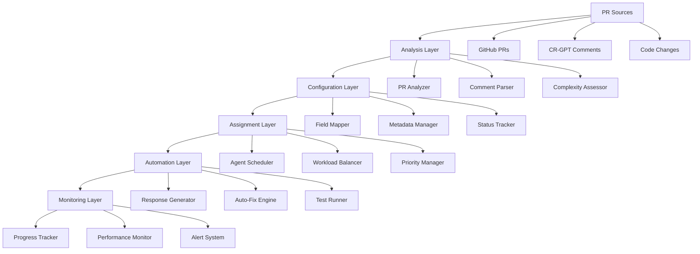

# PR Management System - Enterprise Developer Guide

## 📋 Table of Contents

1. [Overview](#overview)
2. [Architecture](#architecture)
3. [Core Components](#core-components)
4. [Development Setup](#development-setup)
5. [API Reference](#api-reference)
6. [Tutorials](#tutorials)
7. [Best Practices](#best-practices)
8. [Troubleshooting](#troubleshooting)

---

## 🎯 Overview

The Portfolio OS PR Management System is an enterprise-grade automation suite designed to streamline pull request workflows, automate code review processes, manage CR-GPT bot interactions, and optimize development team productivity. It provides intelligent PR analysis, automated configuration, agent assignment, and comprehensive monitoring capabilities.

### Key Features
- **AI-Powered PR Analysis**: Intelligent analysis of PR content and CR-GPT feedback
- **Automated Configuration**: Smart PR field assignment and metadata management
- **Agent Assignment**: Intelligent distribution of PRs across development agents
- **CR-GPT Integration**: Automated handling of code review bot comments
- **Sprint Management**: Automated sprint estimation and planning
- **Quality Assurance**: Automated testing and validation workflows

---

## 🏗️ Architecture

### System Components



### Data Flow

1. **PR Detection** → Monitor GitHub for new/updated PRs
2. **Analysis** → AI-powered analysis of PR content and feedback
3. **Configuration** → Automated field assignment and metadata setup
4. **Assignment** → Intelligent agent distribution and workload balancing
5. **Automation** → Automated responses, fixes, and testing
6. **Monitoring** → Progress tracking and performance analysis

---

## 📁 Core Components

### 🔍 `automate-pr-unified.ps1`
**Purpose**: Comprehensive PR automation with AI-powered analysis and response generation

**Key Actions**:
- `analyze`: AI-powered PR analysis and CR-GPT comment processing
- `respond`: Automated response generation to feedback
- `monitor`: Continuous PR monitoring and status updates
- `all`: Complete end-to-end PR automation workflow

**Parameters**:
```powershell
param(
    [Parameter(Mandatory=$true)]
    [string]$PRNumber,
    
    [ValidateSet("analyze", "respond", "monitor", "all")]
    [string]$Action = "all",
    
    [switch]$AutoFix,
    [switch]$AutoCommit,
    [switch]$DryRun,
    [int]$MaxRetries = 3,
    [int]$RetryDelay = 1000,
    [switch]$Detailed
)
```

### ⚙️ `configure-pr-auto.ps1`
**Purpose**: Automated PR configuration with comprehensive field management

**Features**:
- Status assignment (Todo, In progress, Ready, Done)
- Priority classification (P0-P3)
- Size estimation (XS-XL)
- App categorization (Portfolio Site, Dashboard, Docs, Infra)
- Area specification (Frontend, Backend, Infra, Content, Design)
- Assignee management
- Sprint estimation

### 🤖 `assign-pr-agents.ps1`
**Purpose**: Intelligent PR assignment and agent workload management

**Features**:
- PR complexity analysis
- CR-GPT comment categorization
- Agent workload balancing
- Priority-based assignment
- Performance tracking

### 📊 `configure-sprint-estimate.ps1`
**Purpose**: Automated sprint estimation and planning

**Features**:
- Story point calculation
- Sprint capacity planning
- Velocity tracking
- Burn-down analysis

### 🔧 `get-pr-aliases.ps1`
**Purpose**: PR alias management and quick access

**Features**:
- PR number to alias mapping
- Quick PR lookup
- Alias validation
- Bulk alias operations

### 🧪 `test-pr-identification.ps1`
**Purpose**: PR identification and validation testing

**Features**:
- PR validation testing
- Branch analysis
- Commit verification
- Integration testing

---

## 🛠️ Development Setup

### Prerequisites

#### Required Software
```bash
# PowerShell 7+
winget install Microsoft.PowerShell

# GitHub CLI
winget install GitHub.cli

# Git
winget install Git.Git
```

#### Authentication Setup
```powershell
# GitHub CLI authentication
gh auth login

# Verify authentication
gh auth status

# Test API access
gh api user
```

#### Environment Configuration
```powershell
# Set up PR management environment
$env:PR_MANAGEMENT_DATA_PATH = "scripts/pr-management/data"
$env:PR_MANAGEMENT_LOG_LEVEL = "Information"
$env:GITHUB_PROJECT_ID = "PVT_kwHOAEnMVc4BCu-c"
$env:DEFAULT_ASSIGNEE = "jschibelli"
```

### Project Structure
```
scripts/pr-management/
├── automate-pr-unified.ps1     # Main PR automation script
├── configure-pr-auto.ps1       # PR configuration automation
├── assign-pr-agents.ps1        # Agent assignment system
├── configure-sprint-estimate.ps1 # Sprint estimation tools
├── get-pr-aliases.ps1          # PR alias management
├── test-pr-identification.ps1  # PR testing utilities
├── data/                       # PR data storage
├── logs/                       # PR management logs
├── exports/                    # Report exports
└── DEVELOPER_GUIDE.md          # This guide
```

---

## 📚 API Reference

### Core Functions

#### `Invoke-PRAnalysis`
Performs AI-powered analysis of PR content and CR-GPT comments.

```powershell
function Invoke-PRAnalysis {
    param([string]$PRNumber)
    
    # Get PR information
    # Analyze CR-GPT comments
    # Extract issues and recommendations
    # Generate analysis report
}
```

#### `Configure-PRAuto`
Automatically configures PR fields and metadata.

```powershell
function Configure-PRAuto {
    param(
        [string]$PRNumber,
        [string]$Status = "In progress",
        [string]$Priority = "P1",
        [string]$Size = "M",
        [string]$App = "Portfolio Site",
        [string]$Area = "Frontend"
    )
    
    # Configure PR project fields
    # Set status, priority, size
    # Assign to appropriate agent
    # Update metadata
}
```

#### `Assign-PRAgents`
Intelligently assigns PRs to available agents.

```powershell
function Assign-PRAgents {
    param([string]$ProjectNumber, [string]$Owner)
    
    # Analyze PR complexity
    # Check agent availability
    # Balance workload
    # Assign optimal agent
}
```

#### `Generate-PRResponse`
Creates automated responses to CR-GPT feedback.

```powershell
function Generate-PRResponse {
    param([string]$PRNumber, [string]$CommentId)
    
    # Analyze feedback type
    # Generate appropriate response
    # Implement suggested fixes
    # Post response comment
}
```

#### `Monitor-PRProgress`
Tracks PR progress and performance metrics.

```powershell
function Monitor-PRProgress {
    param([string]$PRNumber)
    
    # Track status changes
    # Monitor review progress
    # Calculate metrics
    # Generate reports
}
```

#### `Estimate-SprintCapacity`
Calculates sprint capacity and story points.

```powershell
function Estimate-SprintCapacity {
    param([string]$SprintName)
    
    # Calculate team capacity
    # Estimate story points
    # Plan sprint scope
    # Track velocity
}
```

---

## 🎓 Tutorials

### Tutorial 1: Basic PR Analysis

**Objective**: Perform comprehensive analysis of a pull request including CR-GPT feedback.

**Steps**:
1. **Navigate to PR management directory**:
   ```powershell
   cd scripts/pr-management
   ```

2. **Run PR analysis**:
   ```powershell
   .\automate-pr-unified.ps1 -PRNumber 150 -Action analyze -Detailed
   ```

3. **Expected Output**:
   - PR information and metadata
   - CR-GPT comment analysis
   - Identified issues and recommendations
   - Complexity assessment
   - Priority classification

**Key Insights**:
- Issue categorization (Critical/High/Medium/Low)
- Recommendation types and priorities
- Code complexity metrics
- Review status and progress

### Tutorial 2: Automated PR Configuration

**Objective**: Automatically configure PR fields and assign to appropriate agents.

**Steps**:
1. **Configure PR with default settings**:
   ```powershell
   .\configure-pr-auto.ps1 -PRNumber 150
   ```

2. **Configure with specific parameters**:
   ```powershell
   .\configure-pr-auto.ps1 -PRNumber 150 -Priority P0 -Size L -App "Dashboard" -Area "Backend"
   ```

3. **Dry run to preview changes**:
   ```powershell
   .\configure-pr-auto.ps1 -PRNumber 150 -DryRun
   ```

**Configuration Options**:
- Status: Todo, In progress, Ready, Done
- Priority: P0 (Critical), P1 (High), P2 (Medium), P3 (Low)
- Size: XS, S, M, L, XL
- App: Portfolio Site, Dashboard, Docs, Infra
- Area: Frontend, Backend, Infra, Content, Design

### Tutorial 3: Agent Assignment

**Objective**: Intelligently assign PRs to available agents based on workload and complexity.

**Steps**:
1. **Assign PRs to agents**:
   ```powershell
   .\assign-pr-agents.ps1 -ProjectNumber "20" -Owner "jschibelli"
   ```

2. **Dry run to preview assignments**:
   ```powershell
   .\assign-pr-agents.ps1 -ProjectNumber "20" -DryRun
   ```

3. **Export assignment report**:
   ```powershell
   .\assign-pr-agents.ps1 -ProjectNumber "20" -ExportTo "assignment-report.md"
   ```

**Assignment Logic**:
- PR complexity analysis
- Agent workload balancing
- Priority-based distribution
- Skill matching

### Tutorial 4: CR-GPT Response Automation

**Objective**: Automatically respond to CR-GPT bot comments and implement suggested fixes.

**Steps**:
1. **Analyze and respond to CR-GPT comments**:
   ```powershell
   .\automate-pr-unified.ps1 -PRNumber 150 -Action respond -AutoFix
   ```

2. **Generate responses without auto-fixing**:
   ```powershell
   .\automate-pr-unified.ps1 -PRNumber 150 -Action respond
   ```

3. **Monitor PR for new comments**:
   ```powershell
   .\automate-pr-unified.ps1 -PRNumber 150 -Action monitor
   ```

**Response Types**:
- Acknowledgment responses
- Implementation confirmations
- Question clarifications
- Fix implementations

### Tutorial 5: Sprint Estimation

**Objective**: Automatically estimate sprint capacity and story points.

**Steps**:
1. **Estimate current sprint**:
   ```powershell
   .\configure-sprint-estimate.ps1 -SprintName "Sprint 2024.1"
   ```

2. **Calculate team capacity**:
   ```powershell
   .\configure-sprint-estimate.ps1 -SprintName "Sprint 2024.1" -CalculateCapacity
   ```

3. **Plan sprint scope**:
   ```powershell
   .\configure-sprint-estimate.ps1 -SprintName "Sprint 2024.1" -PlanScope
   ```

**Estimation Features**:
- Story point calculation
- Team capacity analysis
- Velocity tracking
- Scope planning

### Tutorial 6: PR Alias Management

**Objective**: Manage PR aliases for quick access and reference.

**Steps**:
1. **Get PR aliases**:
   ```powershell
   .\get-pr-aliases.ps1 -ListAll
   ```

2. **Find PR by alias**:
   ```powershell
   .\get-pr-aliases.ps1 -Alias "feature-auth"
   ```

3. **Create new alias**:
   ```powershell
   .\get-pr-aliases.ps1 -PRNumber 150 -Alias "bug-fix-login"
   ```

**Alias Operations**:
- Create, update, delete aliases
- Bulk alias operations
- Alias validation
- Quick PR lookup

### Tutorial 7: PR Testing and Validation

**Objective**: Test PR identification and validation processes.

**Steps**:
1. **Test PR identification**:
   ```powershell
   .\test-pr-identification.ps1 -PRNumber 150
   ```

2. **Validate PR data**:
   ```powershell
   .\test-pr-identification.ps1 -PRNumber 150 -ValidateData
   ```

3. **Run integration tests**:
   ```powershell
   .\test-pr-identification.ps1 -PRNumber 150 -IntegrationTest
   ```

**Test Categories**:
- PR existence validation
- Branch analysis
- Commit verification
- Integration testing

### Tutorial 8: Complete PR Workflow

**Objective**: Execute complete end-to-end PR automation workflow.

**Steps**:
1. **Run complete automation**:
   ```powershell
   .\automate-pr-unified.ps1 -PRNumber 150 -Action all -AutoFix -AutoCommit
   ```

2. **Monitor workflow progress**:
   ```powershell
   .\automate-pr-unified.ps1 -PRNumber 150 -Action monitor -Detailed
   ```

3. **Generate workflow report**:
   ```powershell
   .\automate-pr-unified.ps1 -PRNumber 150 -Action all -ExportTo "workflow-report.json"
   ```

**Workflow Steps**:
1. PR analysis and CR-GPT comment processing
2. Automated configuration and field assignment
3. Agent assignment and workload balancing
4. Automated response generation and fixes
5. Progress monitoring and reporting

---

## 📝 Best Practices

### 1. PR Management Strategy

#### Regular Workflow Schedule
- **Daily**: Monitor PR status and progress
- **Sprint Start**: Estimate capacity and plan scope
- **Sprint End**: Review velocity and performance
- **Continuous**: Respond to CR-GPT feedback

#### PR Classification Standards
```powershell
# Define PR classification standards
$prClassification = @{
    Priority = @{
        P0 = "Critical bugs, security issues"
        P1 = "High priority features, major bugs"
        P2 = "Medium priority features, minor bugs"
        P3 = "Low priority features, enhancements"
    }
    Size = @{
        XS = "1-2 story points"
        S = "3-5 story points"
        M = "6-8 story points"
        L = "9-13 story points"
        XL = "14+ story points"
    }
}
```

### 2. Agent Management

#### Workload Balancing
- Monitor agent capacity and current workload
- Distribute PRs based on complexity and agent skills
- Maintain balanced work distribution across agents
- Track agent performance and productivity

#### Assignment Rules
```powershell
# Define assignment rules
$assignmentRules = @{
    MaxPRsPerAgent = 3
    ComplexityMatching = $true
    SkillBasedAssignment = $true
    PriorityWeight = 2.0
}
```

### 3. CR-GPT Integration

#### Response Strategy
- Acknowledge all CR-GPT feedback promptly
- Implement suggested fixes when appropriate
- Provide clear explanations for decisions
- Maintain professional communication tone

#### Auto-Fix Guidelines
- Only auto-fix low-risk changes
- Always review auto-fixes before committing
- Test all automated changes thoroughly
- Document automated fix decisions

### 4. Quality Assurance

#### Testing Requirements
- Run automated tests before merging
- Validate all code changes
- Check for security vulnerabilities
- Ensure documentation updates

#### Review Process
- Require at least one human review
- Address all CR-GPT feedback
- Verify fix implementations
- Confirm acceptance criteria

---

## 🔧 Troubleshooting

### Common Issues

#### 1. GitHub API Rate Limiting
**Symptoms**: 403 Forbidden errors, API rate limit exceeded

**Solutions**:
```powershell
# Check rate limit status
gh api rate_limit

# Implement exponential backoff
function Invoke-WithRetry {
    param([scriptblock]$ScriptBlock, [int]$MaxRetries = 3)
    
    for ($i = 0; $i -lt $MaxRetries; $i++) {
        try {
            return & $ScriptBlock
        }
        catch {
            if ($i -eq $MaxRetries - 1) { throw }
            Start-Sleep -Seconds ([Math]::Pow(2, $i))
        }
    }
}
```

#### 2. PR Not Found
**Symptoms**: PR number not found, invalid PR reference

**Solutions**:
```powershell
# Verify PR exists
gh pr view $PRNumber

# Check PR status
gh pr list --state all | Where-Object { $_ -match $PRNumber }

# Validate PR number format
if ($PRNumber -notmatch '^\d+$') {
    Write-Error "Invalid PR number format: $PRNumber"
}
```

#### 3. CR-GPT Comments Not Found
**Symptoms**: No CR-GPT comments detected, analysis fails

**Solutions**:
```powershell
# Check for CR-GPT bot comments
$comments = gh pr view $PRNumber --json comments
$crgptComments = $comments.comments | Where-Object { $_.author.login -eq "cr-gpt" }

# Verify bot permissions
gh api repos/$owner/$repo/issues/$PRNumber/comments
```

#### 4. Agent Assignment Failures
**Symptoms**: Agents not assigned, assignment errors

**Solutions**:
```powershell
# Check agent availability
Get-AgentStatus

# Verify project permissions
gh project view $ProjectNumber

# Check assignment rules
$assignmentRules = Get-AssignmentRules
```

#### 5. Auto-Fix Failures
**Symptoms**: Automated fixes not applied, fix errors

**Solutions**:
```powershell
# Enable dry run mode
.\automate-pr-unified.ps1 -PRNumber $PRNumber -AutoFix -DryRun

# Check fix permissions
Test-FixPermissions -PRNumber $PRNumber

# Validate fix logic
Test-FixLogic -FixType $FixType
```

### Debug Mode

#### Enable Verbose Logging
```powershell
# Run with detailed output
.\automate-pr-unified.ps1 -PRNumber 150 -Action analyze -Detailed -Verbose

# Enable debug mode
$DebugPreference = "Continue"
$VerbosePreference = "Continue"
```

#### Log Analysis
```powershell
function Get-PRManagementLogs {
    param([string]$LogPath = "logs/pr-management.log")
    
    $logs = Get-Content $LogPath
    return @{
        TotalEntries = $logs.Count
        ErrorCount = ($logs | Where-Object { $_ -match "ERROR" }).Count
        WarningCount = ($logs | Where-Object { $_ -match "WARN" }).Count
        RecentErrors = $logs | Where-Object { $_ -match "ERROR" } | Select-Object -Last 10
    }
}
```

---

## 📞 Support & Contact

### Getting Help
- **Documentation**: Check this guide and README.md
- **Issues**: Create GitHub issues for bugs or feature requests
- **Discussions**: Use GitHub Discussions for questions

### Team Contacts
- **Lead Developer**: John Schibelli - john@schibelli.dev

---

*Last Updated: 2025-10-06*
*Version: 1.0.0*
*Documentation Version: 1.0.0*
