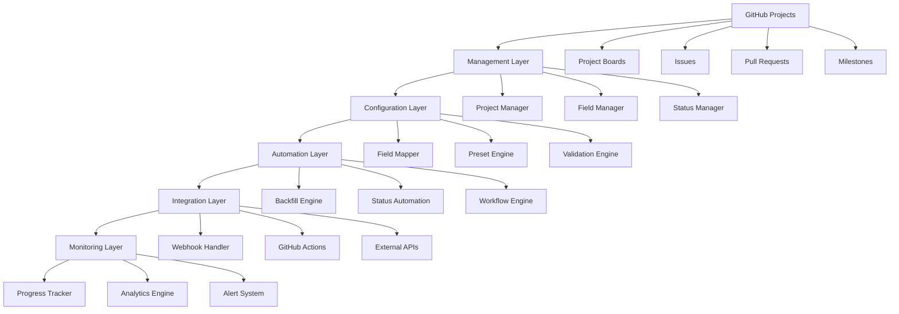

# Project Management System - Enterprise Developer Guide

## 📋 Table of Contents

1. [Overview](#overview)
2. [Architecture](#architecture)
3. [Core Components](#core-components)
4. [Development Setup](#development-setup)
5. [API Reference](#api-reference)
6. [Tutorials](#tutorials)
7. [Best Practices](#best-practices)
8. [Troubleshooting](#troubleshooting)

---

## 🎯 Overview

The Portfolio OS Project Management System is an enterprise-grade automation suite designed to streamline GitHub project management, automate issue configuration, manage project boards, and optimize development workflows. It provides intelligent project field management, automated status updates, webhook integrations, and comprehensive project analytics.

### Key Features
- **Automated Project Field Management**: Intelligent field population and standardization
- **Project Board Management**: Complete GitHub project board automation
- **Status Workflow Automation**: Automated status transitions and updates
- **Webhook Integration**: Real-time project status updates and notifications
- **Field Backfill System**: Bulk field standardization and correction
- **Preset Management**: Predefined configurations for different project types

---

## 🏗️ Architecture

### System Components



### Data Flow

1. **Project Detection** → Monitor GitHub projects and boards
2. **Field Analysis** → Analyze current field states and requirements
3. **Configuration** → Apply field mappings and presets
4. **Automation** → Execute automated workflows and updates
5. **Integration** → Sync with external systems and webhooks
6. **Monitoring** → Track progress and generate analytics

---

## 📁 Core Components

### 🔧 `manage-projects.ps1`
**Purpose**: Comprehensive project management with automated field configuration

**Key Operations**:
- `add`: Add issues to project boards
- `configure`: Configure project fields and metadata
- `status`: Update project status and workflow states
- `labels`: Manage issue labels and categorization
- `milestone`: Handle milestone assignments and tracking
- `all`: Complete project management workflow

**Parameters**:
```powershell
param(
    [ValidateSet("add", "configure", "status", "labels", "milestone", "all")]
    [string]$Operation,
    
    [string[]]$Issues = @(),
    [ValidateSet("blog", "dashboard", "docs", "infra", "custom")]
    [string]$Preset = "custom",
    
    [string]$Priority = "P1",
    [ValidateSet("XS", "S", "M", "L", "XL")]
    [string]$Size = "M",
    
    [string]$App = "Portfolio Site",
    [string]$Area = "Frontend",
    [string]$Milestone = "",
    [string[]]$Labels = @(),
    
    [ValidateSet("Backlog", "In progress", "In review", "Ready", "Ready for Merge", "Done")]
    [string]$Status = "Ready",
    
    [string]$ProjectId = "PVT_kwHOAEnMVc4BCu-c",
    [switch]$DryRun
)
```

### 🔄 `backfill-project-fields.ps1`
**Purpose**: Automated project field backfill and standardization

**Features**:
- Bulk field standardization
- Field mapping and correction
- Preset-based field population
- Validation and error handling
- Progress tracking and reporting

### 🔗 `update-project-status-webhook.ps1`
**Purpose**: Webhook integration for real-time project status updates

**Actions**:
- `start`: Issue work start notification
- `complete`: Issue completion notification
- `create-pr`: Pull request creation notification
- `merge-pr`: Pull request merge notification

---

## 🛠️ Development Setup

### Prerequisites

#### Required Software
```bash
# PowerShell 7+
winget install Microsoft.PowerShell

# GitHub CLI
winget install GitHub.cli

# Git
winget install Git.Git
```

#### Authentication Setup
```powershell
# GitHub CLI authentication
gh auth login

# Verify authentication
gh auth status

# Test API access
gh api user
```

#### Environment Configuration
```powershell
# Set up project management environment
$env:PROJECT_MANAGEMENT_DATA_PATH = "scripts/project-management/data"
$env:PROJECT_MANAGEMENT_LOG_LEVEL = "Information"
$env:GITHUB_PROJECT_ID = "PVT_kwHOAEnMVc4BCu-c"
$env:DEFAULT_PROJECT_OWNER = "jschibelli"
```

### Project Structure
```
scripts/project-management/
├── manage-projects.ps1              # Main project management script
├── backfill-project-fields.ps1      # Field backfill automation
├── update-project-status-webhook.ps1 # Webhook integration
├── data/                            # Project data storage
├── logs/                            # Project management logs
├── exports/                         # Report exports
└── DEVELOPER_GUIDE.md               # This guide
```

---

## 📚 API Reference

### Core Functions

#### `Manage-ProjectFields`
Manages project field configuration and updates.

```powershell
function Manage-ProjectFields {
    param(
        [string]$Operation,
        [string[]]$Issues,
        [string]$Preset,
        [hashtable]$FieldMappings
    )
    
    # Configure project fields
    # Apply presets and mappings
    # Validate field assignments
    # Update project board
}
```

#### `Backfill-ProjectFields`
Performs bulk field backfill and standardization.

```powershell
function Backfill-ProjectFields {
    param(
        [string]$ProjectNumber,
        [string]$Owner,
        [hashtable]$FieldMappings
    )
    
    # Fetch project items
    # Analyze current field states
    # Apply standard field mappings
    # Update project fields
    # Generate backfill report
}
```

#### `Update-ProjectStatus`
Updates project status and workflow states.

```powershell
function Update-ProjectStatus {
    param(
        [int]$IssueNumber,
        [string]$Action,
        [string]$AgentName,
        [string]$NewStatus
    )
    
    # Update issue status
    # Trigger webhook notifications
    # Sync with project board
    # Log status changes
}
```

#### `Configure-ProjectPresets`
Applies predefined project configurations.

```powershell
function Configure-ProjectPresets {
    param(
        [string]$PresetName,
        [string[]]$Issues,
        [hashtable]$PresetConfig
    )
    
    # Load preset configuration
    # Apply preset mappings
    # Configure project fields
    # Validate configuration
}
```

#### `Trigger-ProjectWebhook`
Triggers webhook notifications for project updates.

```powershell
function Trigger-ProjectWebhook {
    param(
        [int]$IssueNumber,
        [string]$Action,
        [string]$AgentName,
        [hashtable]$Payload
    )
    
    # Prepare webhook payload
    # Send webhook notification
    # Handle webhook responses
    # Log webhook activity
}
```

---

## 🎓 Tutorials

### Tutorial 1: Basic Project Management

**Objective**: Set up and manage a basic GitHub project with automated field configuration.

**Steps**:
1. **Navigate to project management directory**:
   ```powershell
   cd scripts/project-management
   ```

2. **Add issues to project with preset configuration**:
   ```powershell
   .\manage-projects.ps1 -Operation add -Preset "blog" -Issues @(196, 197, 198)
   ```

3. **Configure project fields**:
   ```powershell
   .\manage-projects.ps1 -Operation configure -Preset "blog" -Priority P1 -Size M
   ```

4. **Update project status**:
   ```powershell
   .\manage-projects.ps1 -Operation status -Issues @(196, 197) -Status "In progress"
   ```

**Expected Results**:
- Issues added to project board
- Fields configured according to preset
- Status updated to specified state
- Project board synchronized

### Tutorial 2: Field Backfill and Standardization

**Objective**: Standardize project fields across all issues using the backfill system.

**Steps**:
1. **Run field backfill for specific project**:
   ```powershell
   .\backfill-project-fields.ps1 -ProjectNumber "20" -Owner "jschibelli"
   ```

2. **Monitor backfill progress**:
   ```powershell
   # Check backfill logs
   Get-Content "logs/backfill-report.log"
   ```

3. **Verify field standardization**:
   ```powershell
   gh project view 20 --owner jschibelli
   ```

**Backfill Features**:
- Automatic field mapping
- Preset-based configuration
- Error handling and validation
- Progress tracking and reporting

### Tutorial 3: Webhook Integration

**Objective**: Set up real-time project status updates using webhooks.

**Steps**:
1. **Trigger issue start webhook**:
   ```powershell
   .\update-project-status-webhook.ps1 -IssueNumber 250 -Action "start" -AgentName "agent-1"
   ```

2. **Update issue completion status**:
   ```powershell
   .\update-project-status-webhook.ps1 -IssueNumber 250 -Action "complete" -AgentName "agent-1"
   ```

3. **Handle PR creation notification**:
   ```powershell
   .\update-project-status-webhook.ps1 -IssueNumber 250 -Action "create-pr" -AgentName "agent-1"
   ```

4. **Process PR merge notification**:
   ```powershell
   .\update-project-status-webhook.ps1 -IssueNumber 250 -Action "merge-pr" -AgentName "agent-1"
   ```

**Webhook Actions**:
- `start`: Notify work start
- `complete`: Notify work completion
- `create-pr`: Notify PR creation
- `merge-pr`: Notify PR merge

### Tutorial 4: Preset Configuration

**Objective**: Use predefined presets for different project types.

**Steps**:
1. **Apply blog preset**:
   ```powershell
   .\manage-projects.ps1 -Operation all -Preset "blog" -Issues @(196, 197, 198, 199, 200)
   ```

2. **Apply dashboard preset**:
   ```powershell
   .\manage-projects.ps1 -Operation all -Preset "dashboard" -Issues @(150, 151, 152, 153, 154)
   ```

3. **Apply docs preset**:
   ```powershell
   .\manage-projects.ps1 -Operation all -Preset "docs" -Issues @(180, 181, 182, 183, 184)
   ```

4. **Apply infra preset**:
   ```powershell
   .\manage-projects.ps1 -Operation all -Preset "infra" -Issues @(170, 171, 172, 173, 174)
   ```

**Available Presets**:
- `blog`: Blog-related issues with content focus
- `dashboard`: Dashboard functionality with UI/UX focus
- `docs`: Documentation tasks with content management
- `infra`: Infrastructure changes with system focus
- `custom`: Manual configuration

### Tutorial 5: Advanced Field Management

**Objective**: Configure complex project fields with custom mappings.

**Steps**:
1. **Configure custom priority and size**:
   ```powershell
   .\manage-projects.ps1 -Operation configure -Issues @(250, 251) -Priority P0 -Size XL
   ```

2. **Set custom app and area**:
   ```powershell
   .\manage-projects.ps1 -Operation configure -Issues @(250, 251) -App "Dashboard" -Area "Backend"
   ```

3. **Apply custom labels**:
   ```powershell
   .\manage-projects.ps1 -Operation labels -Issues @(250, 251) -Labels @("urgent", "security", "performance")
   ```

4. **Set milestone**:
   ```powershell
   .\manage-projects.ps1 -Operation milestone -Issues @(250, 251) -Milestone "Sprint 2024.1"
   ```

**Field Options**:
- **Priority**: P0 (Critical), P1 (High), P2 (Medium), P3 (Low)
- **Size**: XS, S, M, L, XL
- **App**: Portfolio Site, Dashboard, Docs, Infra
- **Area**: Frontend, Backend, Infra, Content, Design
- **Status**: Backlog, In progress, In review, Ready, Ready for Merge, Done

### Tutorial 6: Bulk Operations

**Objective**: Perform bulk operations on multiple issues efficiently.

**Steps**:
1. **Bulk add issues to project**:
   ```powershell
   $issues = @(196, 197, 198, 199, 200, 201, 202, 203, 204, 205)
   .\manage-projects.ps1 -Operation add -Issues $issues -Preset "blog"
   ```

2. **Bulk configure fields**:
   ```powershell
   .\manage-projects.ps1 -Operation configure -Issues $issues -Priority P1 -Size M -App "Portfolio Site"
   ```

3. **Bulk status update**:
   ```powershell
   .\manage-projects.ps1 -Operation status -Issues $issues -Status "In progress"
   ```

4. **Bulk label application**:
   ```powershell
   .\manage-projects.ps1 -Operation labels -Issues $issues -Labels @("sprint-2024.1", "frontend")
   ```

**Bulk Operations**:
- Efficient batch processing
- Progress tracking
- Error handling and recovery
- Detailed operation logging

### Tutorial 7: Project Analytics and Reporting

**Objective**: Generate comprehensive project analytics and reports.

**Steps**:
1. **Generate project status report**:
   ```powershell
   .\manage-projects.ps1 -Operation status -Issues @() -ExportTo "project-status-report.json"
   ```

2. **Analyze field distribution**:
   ```powershell
   # Analyze priority distribution
   gh project view 20 --owner jschibelli --format json | ConvertFrom-Json | 
   Select-Object -ExpandProperty items | 
   Group-Object priority | 
   Select-Object Name, Count
   ```

3. **Track progress metrics**:
   ```powershell
   # Calculate completion rate
   $total = (gh project view 20 --owner jschibelli --format json | ConvertFrom-Json).items.Count
   $completed = (gh project view 20 --owner jschibelli --format json | ConvertFrom-Json).items | 
   Where-Object { $_.status -eq "Done" } | Measure-Object | Select-Object -ExpandProperty Count
   $completionRate = ($completed / $total) * 100
   Write-Host "Completion Rate: $([Math]::Round($completionRate, 2))%"
   ```

**Analytics Features**:
- Project status tracking
- Field distribution analysis
- Progress metrics calculation
- Performance reporting

### Tutorial 8: Integration with External Systems

**Objective**: Integrate project management with external tools and systems.

**Steps**:
1. **Set up webhook endpoints**:
   ```powershell
   # Configure webhook URL
   $webhookUrl = "https://your-webhook-endpoint.com/project-updates"
   ```

2. **Trigger external notifications**:
   ```powershell
   .\update-project-status-webhook.ps1 -IssueNumber 250 -Action "start" -AgentName "agent-1" -WebhookUrl $webhookUrl
   ```

3. **Sync with external project management tools**:
   ```powershell
   # Export project data for external sync
   gh project view 20 --owner jschibelli --format json | 
   ConvertTo-Json -Depth 5 | 
   Out-File "exports/project-sync-data.json"
   ```

4. **Monitor integration health**:
   ```powershell
   # Check webhook delivery status
   Get-Content "logs/webhook-delivery.log" | Select-Object -Last 10
   ```

**Integration Capabilities**:
- Webhook notifications
- External API synchronization
- Data export and import
- Health monitoring

---

## 📝 Best Practices

### 1. Project Organization

#### Field Standardization
```powershell
# Define standard field mappings
$standardFields = @{
    Priority = @{
        P0 = "Critical bugs, security issues"
        P1 = "High priority features, major bugs"
        P2 = "Medium priority features, minor bugs"
        P3 = "Low priority features, enhancements"
    }
    Size = @{
        XS = "1-2 story points"
        S = "3-5 story points"
        M = "6-8 story points"
        L = "9-13 story points"
        XL = "14+ story points"
    }
}
```

#### Preset Management
- Use predefined presets for consistency
- Customize presets for specific project needs
- Document preset configurations
- Regular preset validation and updates

### 2. Automation Strategy

#### Workflow Automation
- Automate repetitive field updates
- Use webhooks for real-time updates
- Implement bulk operations for efficiency
- Monitor automation health and performance

#### Error Handling
```powershell
# Implement robust error handling
try {
    $result = Manage-ProjectFields -Operation $Operation -Issues $Issues
    if (-not $result.Success) {
        throw "Field management failed: $($result.Error)"
    }
}
catch {
    Write-Error "Project management error: $($_.Exception.Message)"
    # Log error and continue processing
}
```

### 3. Data Management

#### Field Validation
- Validate field values before assignment
- Check for required fields
- Ensure field consistency across projects
- Regular field audit and cleanup

#### Backup Strategy
```powershell
# Backup project configuration
function Backup-ProjectConfig {
    $backupPath = "backups/project-config-$(Get-Date -Format 'yyyyMMdd').json"
    $config = @{
        FieldMappings = $fieldMappings
        Presets = $presets
        OptionIds = $optionIds
        LastBackup = Get-Date
    }
    $config | ConvertTo-Json -Depth 5 | Out-File $backupPath
}
```

### 4. Performance Optimization

#### Efficient Operations
- Use bulk operations for multiple issues
- Implement caching for frequently accessed data
- Optimize API calls with batching
- Monitor operation performance

#### Resource Management
- Limit concurrent operations
- Implement rate limiting
- Use appropriate timeouts
- Monitor resource usage

---

## 🔧 Troubleshooting

### Common Issues

#### 1. GitHub API Rate Limiting
**Symptoms**: 403 Forbidden errors, API rate limit exceeded

**Solutions**:
```powershell
# Check rate limit status
gh api rate_limit

# Implement exponential backoff
function Invoke-WithRetry {
    param([scriptblock]$ScriptBlock, [int]$MaxRetries = 3)
    
    for ($i = 0; $i -lt $MaxRetries; $i++) {
        try {
            return & $ScriptBlock
        }
        catch {
            if ($i -eq $MaxRetries - 1) { throw }
            Start-Sleep -Seconds ([Math]::Pow(2, $i))
        }
    }
}
```

#### 2. Project Field Mapping Errors
**Symptoms**: Invalid field IDs, mapping failures

**Solutions**:
```powershell
# Verify field IDs
gh project view 20 --owner jschibelli --format json | ConvertFrom-Json | 
Select-Object -ExpandProperty fields | 
Select-Object id, name, type

# Update field mappings
$fieldMappings = Get-UpdatedFieldMappings
```

#### 3. Webhook Delivery Failures
**Symptoms**: Webhook timeouts, delivery failures

**Solutions**:
```powershell
# Check webhook endpoint
Test-NetConnection -ComputerName "your-webhook-endpoint.com" -Port 443

# Verify webhook payload
$payload = Get-WebhookPayload -IssueNumber 250 -Action "start"
$payload | ConvertTo-Json -Depth 3
```

#### 4. Bulk Operation Failures
**Symptoms**: Partial failures, operation timeouts

**Solutions**:
```powershell
# Process in smaller batches
$batchSize = 10
$batches = $Issues | Group-Object -Property { [Math]::Floor($_.Count / $batchSize) }
foreach ($batch in $batches) {
    Manage-ProjectFields -Operation $Operation -Issues $batch.Group
    Start-Sleep -Seconds 1
}
```

### Debug Mode

#### Enable Verbose Logging
```powershell
# Run with detailed output
.\manage-projects.ps1 -Operation configure -Issues @(250) -Verbose

# Enable debug mode
$DebugPreference = "Continue"
$VerbosePreference = "Continue"
```

#### Log Analysis
```powershell
function Get-ProjectManagementLogs {
    param([string]$LogPath = "logs/project-management.log")
    
    $logs = Get-Content $LogPath
    return @{
        TotalEntries = $logs.Count
        ErrorCount = ($logs | Where-Object { $_ -match "ERROR" }).Count
        WarningCount = ($logs | Where-Object { $_ -match "WARN" }).Count
        RecentErrors = $logs | Where-Object { $_ -match "ERROR" } | Select-Object -Last 10
    }
}
```

---

## 📞 Support & Contact

### Getting Help
- **Documentation**: Check this guide and README.md
- **Issues**: Create GitHub issues for bugs or feature requests
- **Discussions**: Use GitHub Discussions for questions

### Team Contacts
- **Lead Developer**: John Schibelli - john@schibelli.dev

---

*Last Updated: 2025-10-06*
*Version: 1.0.0*
*Documentation Version: 1.0.0*
